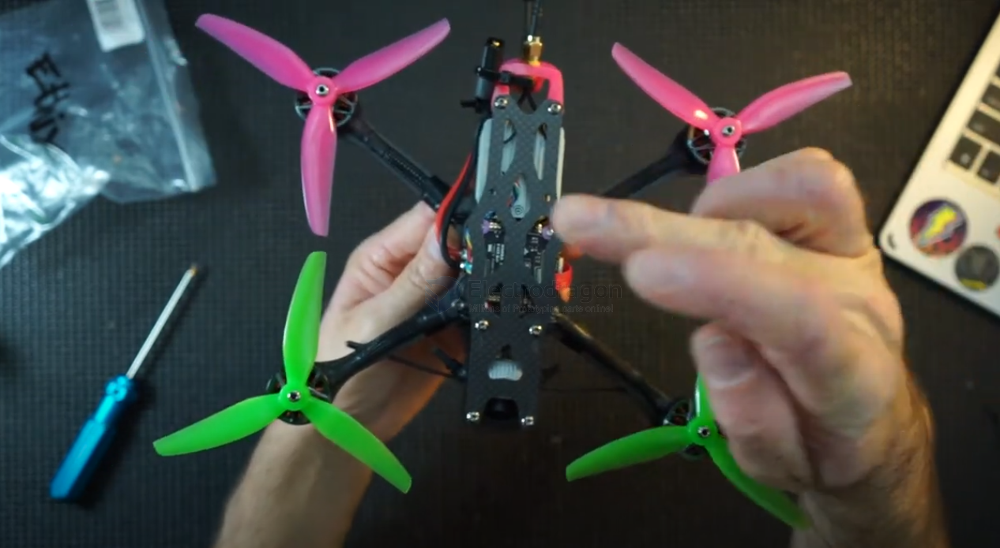
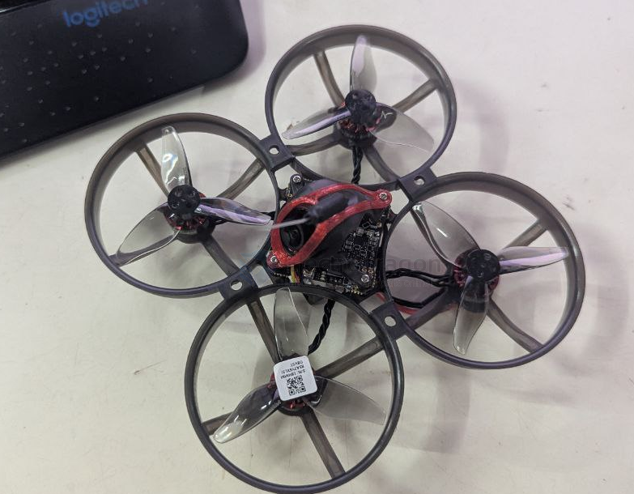

# propeller-FPV-dat

- [[propeller-dat]] - [[propeller-FPV-dat]]

- [[FPV-build-dat]] - [[FPV-frame-dat]] - [[flight-controller-dat]] - [[motor-FPV-dat]] - [[propeller-FPV-dat]] - [[camera-FPV-dat]]

- [[fixed-wing-dat]]

- [[propeller-tractor-dat]] - [[propeller-pusher-dat]] - [[propeller-dat]] - [[propeller-FPV-dat]]

- [[ESC-dat]] - [[motor-FPV-dat]] - [[propeller-FPV-dat]]

乾丰 1219S-3B = 31mm（1.2 寸）三叶桨，螺距 1.9in，孔径 1.0mm，0.74g/套——正是 BetaFPV Air65 的花飞版原厂桨。 型号里的"1219"= 直径 1.2 寸 + 螺距 1.9 寸。

## 8'' 

8×6 = 8寸直径 + 6寸螺距

螺距 6 → 每转一圈前进 6 寸 → 高速桨（竞速用）

8×4.5 = 8寸 + 4.5 螺距 → 慢速桨（巡航用）

## 9'' ~ 10'' 

适配桨 - [[motor-brushless-dat]]

• 2204: 8-9 寸
• 2212: 9-11 寸

## 2.0'' 2023 == 乾丰2023三叶（4对）

- Type(型号)2023
- Blades(桨叶数)3
- Pitch(螺距)2.3in
- Material (材质)PC
- Weight / g(重量/G)0.88g
- Center Hole Inner diameter(中心子内径)1.5mm、1mm
- Prop DiskDiameter(桨盘直径)52.2mm
- CenterThickness(中心厚度)5mm
- MaxProp Width(最大桨叶宽度)8.94mm
- Adaptive Motor(适配马达)1105-1108

型号命名： 航模桨常见的命名规则中，型号里的前两位数字通常代表直径。这款型号为 2023，其中 “20” 就代表它的直径约为 2 英寸。

EX1103 KV11000【CW黑线带红点】

## 2.9'' HQProp DT2925 五叶桨 DJI AVATA穿越机FPV无人机桨叶螺旋桨

- 型号：2.9X2.5X5
- 长度:2.9英寸
- 螺距：2.5英寸
- 叶片：5片
- 材质:PC
- 重量：2.2G
- 桨盘直径:10.6mm
- 桨盘厚度：5.3mm
- 轴：2.3/2/2.3mm
- 适配器：无

## 2.9'' Gemfan 乾丰2925 5叶 FPV穿越机螺旋桨3寸桨叶 适配大疆AVATA机子

- Gemfan2925-5
- 尺寸：2.9 in螺距：2.5in
- 材质：pc重量：2.4g（单支）
- 中心安装孔径：2mm螺丝固定孔距：5mm
- 颜色：透灰，猛男粉，荧光黄
- 推荐电机：DJIAVATA/1507/2004
- 起飞重量：400g
- 包装方式：2CW+2CCW

## Correct setup 

## WRONG SETUP 

## ref 

