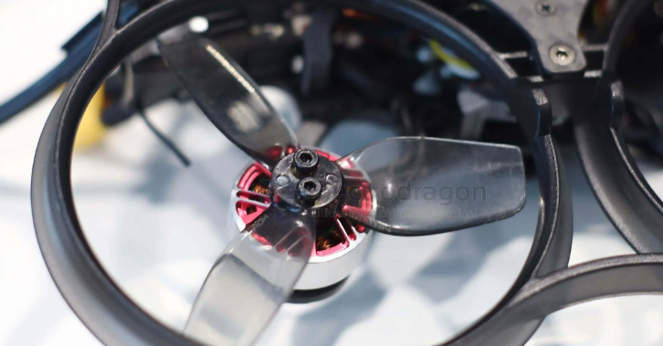
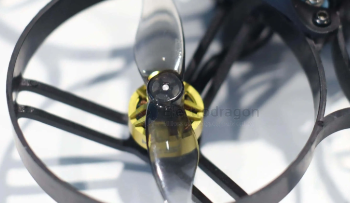
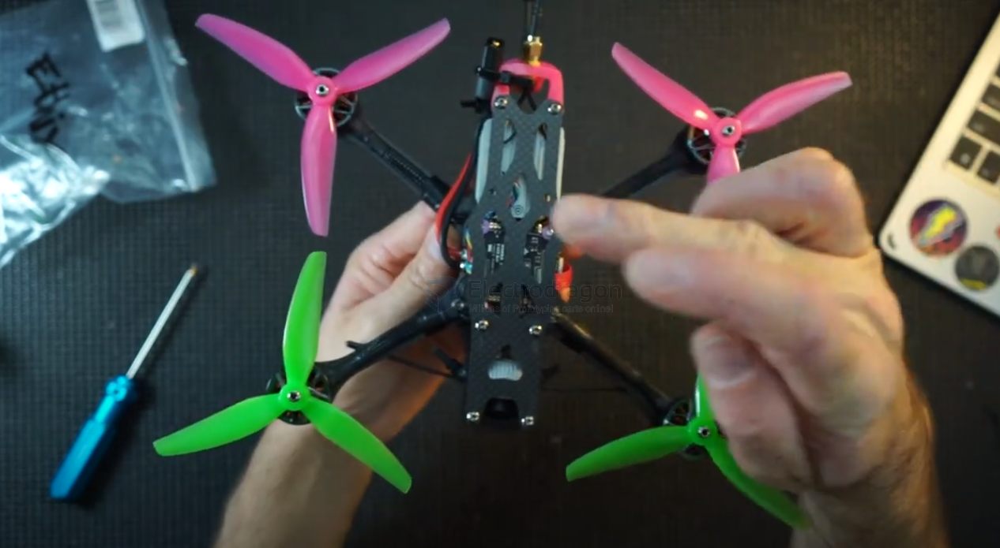
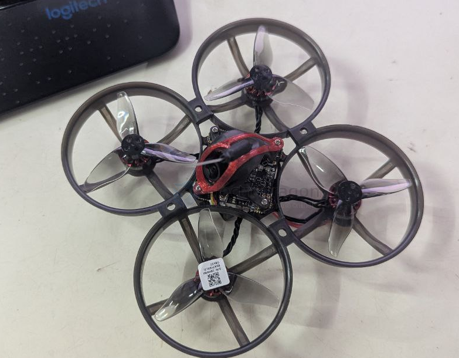

# propeller-FPV-dat

- [[propeller-FPV-dat]] - [[motor-fan-ducted-dat]]

- [[propeller-dat]] - [[propeller-FPV-dat]]

- [[FPV-build-dat]] - [[FPV-frame-dat]] - [[flight-controller-dat]] - [[motor-FPV-dat]] - [[propeller-FPV-dat]] - [[camera-FPV-dat]]

- [[fixed-wing-dat]]

- [[propeller-tractor-dat]] - [[propeller-pusher-dat]] - [[propeller-dat]] - [[propeller-FPV-dat]]

- [[ESC-dat]] - [[motor-FPV-dat]] - [[propeller-FPV-dat]]

- [[motor-FPV-dat]]

## measurement

from end to the center of one blade 

- 半径 12.7mm → 直径 25.4mm → 1 寸
- 半径 19.05mm → 直径 38.1mm → 1.5 寸
- 半径 25.4mm → 直径 50.8mm → 2 寸
- 半径 31.75mm → 直径 63.5mm → 2.5 寸
- 半径 38.1mm → 直径 76.2mm → ⭐️ 3 寸
- 半径 44.45mm → 直径 88.9mm → 3.5 寸
- 半径 50.8mm → 直径 101.6mm → 4 寸
- 半径 63.5mm → 直径 127.0mm → ⭐️ 5 寸
- 半径 76.2mm → 直径 152.4mm → 6 寸
- 半径 88.9mm → 直径 177.8mm → 7 寸

## specs 

3" - [[battler-dat]]

推荐型号
• ⭐️ 3045（原厂规格）
• 3040 / 3050（同尺寸不同螺距）
• 3 寸 Bullnose（2 叶）

说明（1806 + 3 寸的"大电机小桨"）：
2016 年的设计思路（那时 3 寸机就用 1806）
→ 现在标准是 1404-1606
→ 你的配置：推力足、响应快，但效率不如现代 3 寸（耗电快，续航短）

2"

**2023**
• 含义: 基础型号
• 说明: 2 英寸（51mm）直径 · 2.3" 螺距

**2023R**
• 含义: 反桨
• 说明: 与"2023"配对（一正一反）

**2023S**
• 含义: 单孔版
• 说明: 尺寸相同，安装孔型不同（单孔直插，免螺丝）

1. 直径（Diameter） — 单位：英寸
- 例：2.5" / 3" / 5"
- 影响：推力上限（大桨推力大、效率高，但需要更强的电机）

2. 螺距（Pitch） — 单位：英寸
- 定义：桨叶旋转一圈的"理论前进距离"
- 大螺距 → 推力/速度高，但电流大、效率低
- 小螺距 → 省电、响应柔和

3. 叶数（Blade Count）
- 2 叶：效率最高、高速好（竞速/长航）
- 3 叶：平衡点（最主流）⭐️
- 4-5 叶：响应快、噪音低、低速抓地好（但耗电）
- 6+ 叶：涵道机/特殊用途

4. 轴孔（Bore / 孔径） ⚠️ 必须匹配电机轴
- 常见：1.0mm / 1.5mm / 2.0mm / 5mm
- 装不上的头号原因就是这个

2540-3（你的 X111 用桨）

    25 → 直径 2.5"
    40 → 螺距 4.0"
    -3 → 三叶

51466（5 寸竞速桨）

    51  → 直径 5.1"
    466 → 螺距 4.66"

### 其他参数

5. 材质
- PC（聚碳酸酯）：韧性好、耐摔 ⭐️ 主流
- 尼龙 / 玻纤增强：更硬更灵敏（但脆，炸机易碎）

6. 安装方式
- 螺母压桨（5mm 轴 + 螺母）
- 螺丝固定（M2 螺丝 ×2/3，小机常见）
- T-Mount（大机）

7. 旋转方向 ⚠️
- CW（正桨）/ CCW（反桨） → 成对使用（对角同向）
- 买时注意："1 对 = 正 1 + 反 1"

8. 重量（克）
- 轻 → 转动惯量小 → 响应快（竞速）
- 重 → 更稳（航拍）

9. 形状/翼型
- 涵道桨 vs 开放桨（X111 是涵道桨）
- 竞速型（窄叶高螺距）/ 平飞型（宽叶低螺距）

10. 颜色/包装
- 颜色区分（红/绿/半透明）
- 包装单位：单片 / 1 对 / 2 对 / 4 对（2 套机量）

## installation 

Prop Nuts

T-Mount

Fit by Pressing

## info 

乾丰 1219S-3B = 31mm（1.2 寸）三叶桨，螺距 1.9in，孔径 1.0mm，0.74g/套——正是 BetaFPV Air65 的花飞版原厂桨。 型号里的"1219"= 直径 1.2 寸 + 螺距 1.9 寸。

## size

| simplified | model   | match            | diameter     | pitch  | blades | weight/g | hole/mm |
| ---------- | ------- | ---------------- | ------------ | ------ | ------ | -------- | ------- |
| 2015       |         |                  |              |        |        |          |         |
| 2530       |         |                  |              | 3.0''  |        |          |         |
| 2540       | 2540-3  | [[FUS-X111-dat]] | 2.5'' / 63mm | 4.0''  | 3      | 0.74     | 1.0     |
| 5030       | 5030    |                  |              |        |        |          |         |
| 5146       | 51466-3 |                  | 5.1''        | 4.66'' | 2      | 3.0      | 5.0     |
| 5129       | 5129    |                  |              |        |        |          |         |
| 6035       | 6035    |                  |              |        |        |          |         |
| 6045       | 6045-3  |                  | 6.0''        | 4.5''  | 3      | 1.2      | 1.5     |
| 7035       | 7035    |                  |              |        |        |          |         |
| 8040       | 8040    |                  |              |        |        |          |         |
| 8060       |         |                  | 8''          | 6''    |        |          |         |
| 9060       |         |                  |              |        |        |          |         |
| 1060       |         |                  |              |        |        |          |         |

### 8'' 

8×6 = 8寸直径 + 6寸螺距

螺距 6 → 每转一圈前进 6 寸 → 高速桨（竞速用）

8×4.5 = 8寸 + 4.5 螺距 → 慢速桨（巡航用）

### 9'' ~ 10'' 

适配桨 - [[motor-brushless-dat]]

• 2204: 8-9 寸
• 2212: 9-11 寸

### 2.0'' 2023 == 乾丰2023三叶（4对）

- Type(型号)2023
- Blades(桨叶数)3
- Pitch(螺距)2.3in
- Material (材质)PC
- Weight / g(重量/G)0.88g
- Center Hole Inner diameter(中心子内径)1.5mm、1mm
- Prop DiskDiameter(桨盘直径)52.2mm
- CenterThickness(中心厚度)5mm
- MaxProp Width(最大桨叶宽度)8.94mm
- Adaptive Motor(适配马达)1105-1108

型号命名： 航模桨常见的命名规则中，型号里的前两位数字通常代表直径。这款型号为 2023，其中 “20” 就代表它的直径约为 2 英寸。

EX1103 KV11000【CW黑线带红点】

### 2.9'' HQProp DT2925 五叶桨 DJI AVATA穿越机FPV无人机桨叶螺旋桨

- 型号：2.9X2.5X5
- 长度:2.9英寸
- 螺距：2.5英寸
- 叶片：5片
- 材质:PC
- 重量：2.2G
- 桨盘直径:10.6mm
- 桨盘厚度：5.3mm
- 轴：2.3/2/2.3mm
- 适配器：无

### 2.9'' Gemfan 乾丰2925 5叶 FPV穿越机螺旋桨3寸桨叶 适配大疆AVATA机子

- Gemfan2925-5
- 尺寸：2.9 in螺距：2.5in
- 材质：pc重量：2.4g（单支）
- 中心安装孔径：2mm螺丝固定孔距：5mm
- 颜色：透灰，猛男粉，荧光黄
- 推荐电机：DJIAVATA/1507/2004
- 起飞重量：400g
- 包装方式：2CW+2CCW

## Correct setup 

## WRONG SETUP 

## ref 

