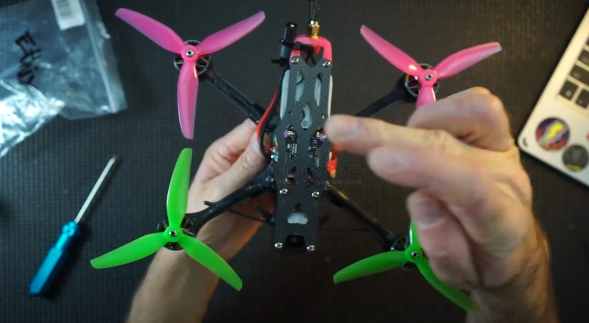
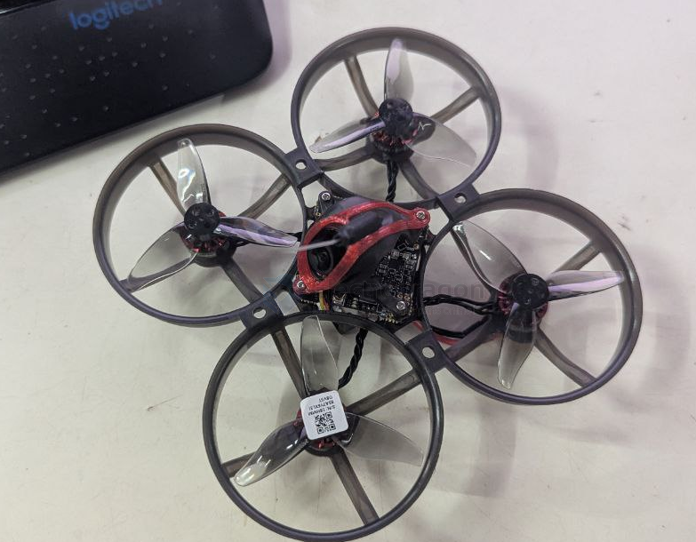

# propeller-dat

## 2023 

Type(型号)2023
Blades(桨叶数)3
Pitch(螺距)2.3in
Material (材质)PC
Weight / g(重量/G)0.88g
Center Hole Inner diameter(中心子内径)1.5mm、1mm
Prop DiskDiameter(桨盘直径)52.2mm
CenterThickness(中心厚度)5mm
MaxProp Width(最大桨叶宽度)8.94mm
Adaptive Motor(适配马达)1105-1108

乾丰2023三叶（4对）

## Correct setup 

## WRONG SETUP 

## ref 

- [[SCU1059-dat]]

- [[FPV-dat]]