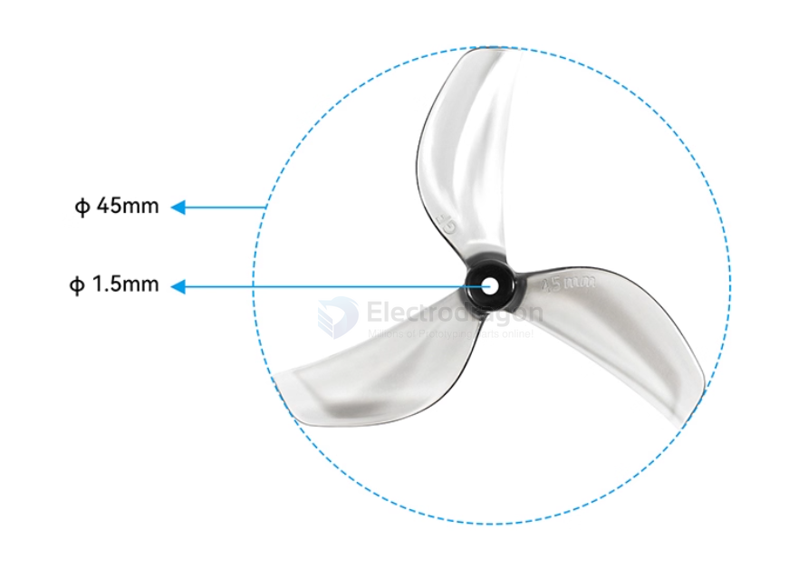
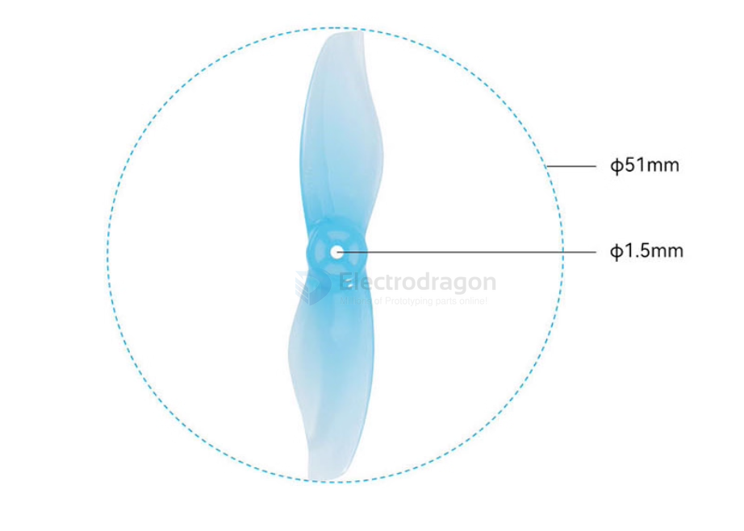
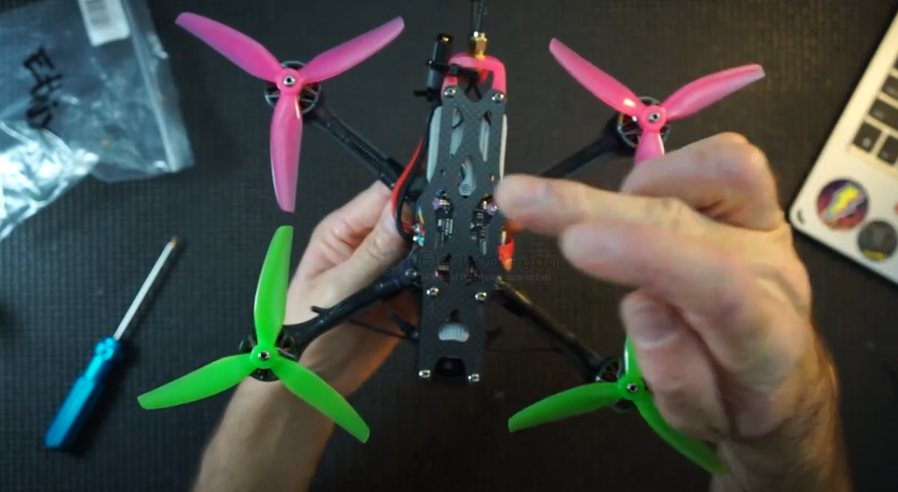
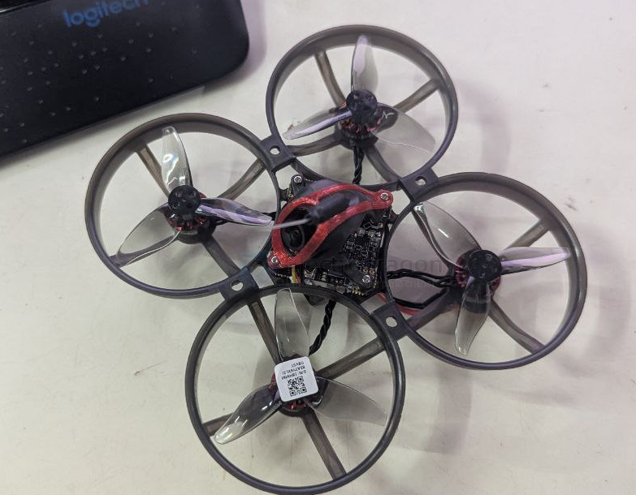
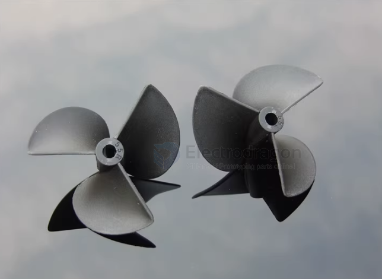

# propeller-dat

- [[propeller-toy-boat-dat]] - [[propeller-dat]] - [[rc-boat-dat]] - [[acturator-dat]] 

- [[RC-kits-dat]]

- [[pump-dat]] - [[pump-jet-dat]] - [[propeller-dat]]

## 共轴双桨

DZP30共轴双桨无刷电机30克无反扭对转马达F3P 送双桨厂

## propeller options 

## Ground Effect

- When quad is close to surface → prop wash bounces air → airflow becomes turbulent  
- Creates unstable lift → drift or wobble sideways  

→ **PID Sensitivity**  
- Too high P/D gains → overreact in turbulence  
- Too low I gain → can't hold position → drift  

→ **Throttle Resolution**  
- Small throttle change indoors = big lift difference  
- Harder to keep steady near ground  

## prop wash 

### 📌 What is Prop Wash?

- Prop wash is the **turbulent/dirty air** created by a drone’s propellers.
- When the drone flies into this disturbed airflow, the flight controller struggles to stabilize, causing:
  - Wobbles
  - Vibrations
  - Shaky footage

### 🔍 Typical Signs
- Shaking after a quick throttle drop → sudden throttle punch.
- Jitter when coming out of sharp turns.
- Visible oscillations in blackbox logs.

## the number of the propeller 

# Propeller Blade Count vs Flight Stability in FPV Drones

## 1. Two-Blade (2-blade)
- **Pros:** Very efficient, longer flight time, strong thrust  
- **Cons:** More vibration, noisier, less stable control  
- **Best for:** Outdoor speed, racing, long endurance

## 2. Three-Blade (3-blade)
- **Pros:** Good balance of thrust and efficiency, faster response, more stable than 2-blade  
- **Cons:** Slightly less efficient, shorter flight time than 2-blade  
- **Best for:** Freestyle, cinewhoop, general indoor/outdoor flying

## 3. Four-Blade (4-blade) / Five-Blade (5-blade)
- **Pros:** Very stable, smoother at low speed, softer noise, excellent control  
- **Cons:** Less efficient, drains battery faster, noticeably shorter flight time  
- **Best for:** Indoor FPV (Tiny Whoops), precise control, stable video shooting

---

# Indoor Recommendation
- **Best choice:** 3-blade or 4-blade props  
- **Why:**  
  - Indoor space is small → low speed stability and smooth control are more important  
  - 4-blade or 5-blade props give “stickier” control indoors, easier to hover and move slowly  
  - 3-blade is a good compromise between stability and efficiency  

👉 Summary:  
- **Indoor practice / fun:** Use **4-blade** (better stability & control)  
- **Mixed indoor/outdoor:** Use **3-blade** (balanced performance)  

## 2023 

Type(型号)2023
Blades(桨叶数)3
Pitch(螺距)2.3in
Material (材质)PC
Weight / g(重量/G)0.88g
Center Hole Inner diameter(中心子内径)1.5mm、1mm
Prop DiskDiameter(桨盘直径)52.2mm
CenterThickness(中心厚度)5mm
MaxProp Width(最大桨叶宽度)8.94mm
Adaptive Motor(适配马达)1105-1108

乾丰2023三叶（4对）

EX1103 KV11000【CW黑线带红点】

## HQProp DT2925 五叶桨 DJI AVATA穿越机FPV无人机桨叶螺旋桨

型号：2.9X2.5X5
长度:2.9英寸
螺距：2.5英寸
叶片：5片
材质:PC
重量：2.2G
桨盘直径:10.6mm
桨盘厚度：5.3mm
轴：2.3/2/2.3mm
适配器：无

## Gemfan 乾丰2925 5叶 FPV穿越机螺旋桨3寸桨叶 适配大疆AVATA机子

Gemfan2925-5
尺寸：2.9 in螺距：2.5in
材质：pc重量：2.4g（单支）
中心安装孔径：2mm螺丝固定孔距：5mm
颜色：透灰，猛男粉，荧光黄
推荐电机：DJIAVATA/1507/2004
起飞重量：400g
包装方式：2CW+2CCW

## Correct setup 

## WRONG SETUP 

## boat propeller

- [[rc-boat-dat]]

## ref 

- [[propeller]]

- [[SCU1059-dat]]

- [[FPV-dat]] 

- [[acturator]]