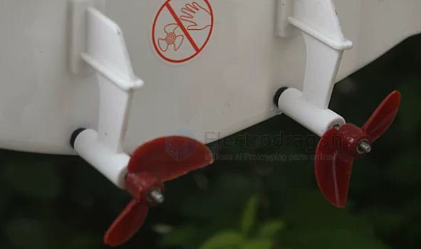
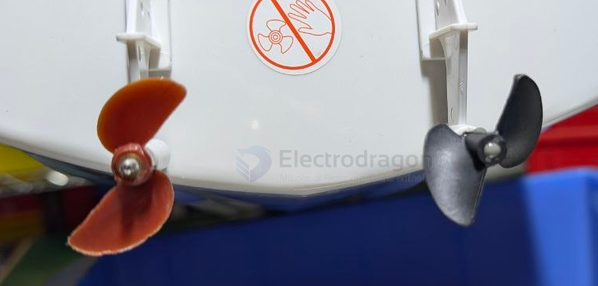
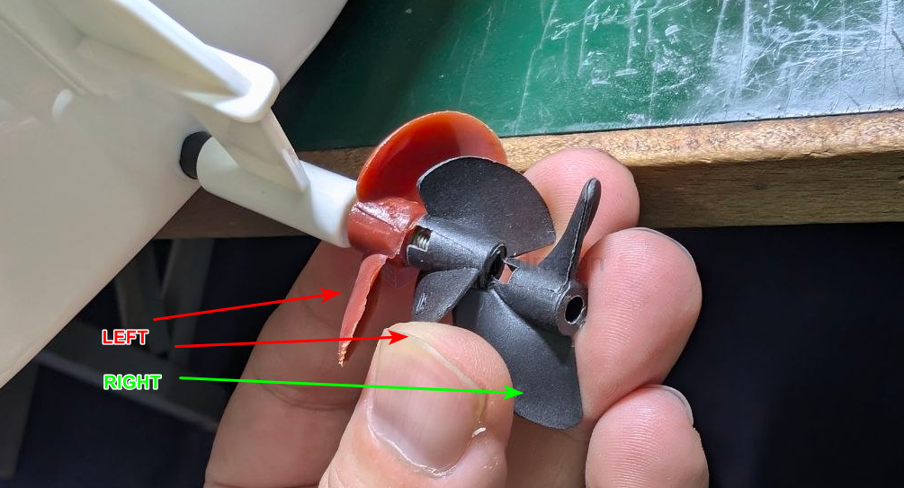

# propeller-toy-boat-dat

- [[propeller-toy-boat-dat]] - [[propeller-dat]] - [[rc-boat-dat]] - [[acturator-dat]] 

- [[propeller]]

- D47 x 4.8MM
- D45 x 4.8MM
- D36 x 4.0MM
  
- D27 x 3.17MM
- D30 x 3.17MM
- D32 x 3.17MM

- D30 x 3MM

- D30 x 3.17MM正反桨


| diameter | hole size | type          | note         |
| -------- | --------- | ------------- | ------------ |
| 27mm     | 3.18mm    | 正桨          |              |
| 30mm     | 3.18mm    | 正桨          |              |
| 32mm     | 3.18mm    | 正桨          |              |
| 35mm     | 3.18mm    | 正桨          |              |
| 35mm     | 4.0mm     | 正桨          |              |
| 38mm     | 4.76mm    | 正桨          |              |
| 40mm     | 4.76mm    | 正桨          |              |
| 42mm     | 4.76mm    | 正桨          | 1.2螺距/小叶 |  |
| 45mm     | 4.76mm    | 正桨          |              |
| 47mm     | 4.76mm    | 正桨          |              |
| 38mm     | 4.0mm     | 正桨/铜套转换 |              |
| 40mm     | 4.0mm     | 正桨/铜套转换 |              |
| 42mm     | 4.0mm     | 正桨/铜套转换 | 1.2螺距/小叶 |  |
| 45mm     | 4.0mm     | 正桨/铜套转换 |              |
| 47mm     | 4.0mm     | 正桨/铜套转换 |              |


## Can you mount a propeller backwards?

**No, absolutely not.** Mounting a propeller backwards or flipping it will result in severe mechanical failure and poor performance.

#### Why it fails:
* **Hydrodynamic Inefficiency:** Propellers use an **airfoil design** (curved surface on one side, flat on the other). If flipped, the blades cannot create proper thrust. Instead of moving water backward, the blades will create massive turbulence and cavitation, resulting in almost zero thrust and massive drag.
* **Self-Loosening Danger:** Most RC boat propellers use **self-tightening nuts**—the direction of rotation forces the nut to stay tight against the prop. If you reverse the motor to compensate for a flipped prop, the rotational force will effectively **unscrew the nut**, causing the propeller to fall off into the water within seconds.
* **Motor Overload:** Operating a propeller in reverse puts the motor and ESC under abnormal stress. They will overheat rapidly, often leading to hardware burnout before safety features can trigger.


## CW and CCW propeller 

Yes, **Right-hand (CW) and Left-hand (CCW) propellers** are very common configurations in RC boats (especially dual-motor setups) and RC aircraft.

The core difference lies in the **direction of rotation** and the **pitch angle of the blades**.

### 1. Why do we need Right-hand and Left-hand propellers?
In an RC boat with a dual-motor, dual-propeller setup, if both propellers rotate in the same direction, the boat will naturally pull to one side while cruising due to the **torque effect** (the rotational force of the props causes the hull to lean or turn).

Using a "counter-rotating" pair (one left-hand and one right-hand propeller) allows you to:
* **Cancel out Torque:** The lateral forces generated by the two propellers cancel each other out, making the hull much more stable in a straight line without needing constant rudder correction.
* **Balance Water Flow:** This creates symmetrical water flow across the rudder(s), leading to more predictable handling.








---

### 2. How to distinguish between them
The easiest way to distinguish them is to observe the **inclination angle of the blades**:

* **Right-Hand Propeller (CW - Clockwise):** When viewed from behind, it pushes water backward when rotated clockwise. The leading edge of the blade is angled towards the **right**.
* **Left-Hand Propeller (CCW - Counter-Clockwise):** When viewed from behind, it pushes water backward when rotated counter-clockwise. The leading edge of the blade is angled towards the **left**.

#### Quick Identification Tips:
1. **Observe the Blade Angle:** Lay the propeller flat on a table and look at the angle of the blades relative to the hub. If the blade slopes "up" towards the right, it is a Right-Hand prop. If it slopes "up" towards the left, it is a Left-Hand prop.
2. **The "Screw" Rule:** Think of the propeller as a screw. To move forward, a Right-Hand propeller must be turned like a standard screw (clockwise to tighten/advance).

---

### 3. Installation Precautions
When installing on a dual-prop boat, keep these rules in mind:
* **Outward-Rotating:** The propellers rotate so that the blades move away from the hull at the bottom. This is common in racing boats as it can increase stability during high-speed turns.
* **Inward-Rotating:** The propellers rotate so that the blades move toward the center of the hull at the bottom. This concentrates the wake and can sometimes slightly increase top speed on straightaways.

**Warning:** If you install the props on the wrong sides, the boat will not move forward—it will generate massive drag, and the abnormal load can cause the motors to overheat or potentially snap the propeller shafts.

If you are unsure during installation, the best method is to **secure the boat, briefly tap the throttle, and observe the direction of the water flow.** Regardless of whether it is left-hand or right-hand, the goal is always to **"push water toward the stern."** If you are unsure, simply ensure the water is being pushed backwards.

***

**Are you planning to upgrade a dual-prop boat?** If you are switching to a counter-rotating setup, remember to ensure your Electronic Speed Controllers (ESCs) are programmed for the correct direction, or simply swap any two of the three wires between the ESC and the motor to reverse the rotation of a brushless motor.

## **Fully Submerged Propellers** vs **Surface-Piercing Propellers**

In the design of RC boats and real watercraft, **Fully Submerged Propellers** and **Surface-Piercing Propellers** represent two fundamentally different power installation philosophies.

Simply put, the difference lies in **how much of the propeller is submerged in water when the boat is running at high speed**. This directly determines whether the boat is a "workhorse" (like a tugboat) or a "speed demon" (like a speedboat).

Here is a detailed comparison of the two:

### 1. Fully Submerged Propeller
**Definition:** Whether the boat is stationary or running at full speed, the propeller is **100% completely submerged underwater**. The drive shaft typically exits from the bottom of the hull.

* **Working Principle:** All the blades of the propeller push against the water, providing very stable and massive thrust.
* **Pros:**
    * **Exceptional Low-Speed Thrust:** Off-the-line acceleration is very direct because the water-gripping area is large.
    * **Excellent Handling:** Highly responsive in both forward and reverse (backing up).
* **Fatal Flaws (Why racing boats don't use it):**
    * **Massive Drag:** At high speeds, not only the propeller but also the drive shaft and strut are submerged, creating huge hydrodynamic drag.
    * **Cavitation:** When a fully submerged propeller spins at extreme RPMs, the sudden drop in water pressure causes the water to boil, creating bubbles. When these bubbles collapse on the blade surface, they not only destroy thrust but also severely corrode metal blades.
* **Best Applications:** Scale boats, tugboats, heavy freighters, submarines, and some beginner RC boats that prioritize low-speed stability.

---

### 2. Surface-Piercing Propeller
**Definition:** When the boat is stationary, the propeller may be fully underwater; but when the boat is running at high speed and planing, the stern lifts, and **only the lower half (about 50%) of the propeller is in the water, while the upper half rotates in the air**. The drive shaft usually exits directly from the transom (the back flat part of the boat).

* **Working Principle:** The blades alternate between slicing into the water and exiting into the air. Because half of it operates in the air, it effectively "breathes," completely breaking the physical limits of a fully submerged propeller.
* **Pros (The soul of racing):**
    * **Breaks Top Speed Limits:** Because the propeller hub (center) and the drive shaft are above the waterline, hydrodynamic drag is reduced to the absolute minimum.
    * **Immune to Cavitation:** As the blades rotate through the air, they draw air into the water, perfectly solving the thrust-loss problem caused by high-speed cavitation. This allows the motor to reach terrifyingly high RPMs (e.g., 30,000 to 40,000 RPM).
    * **Maximum Visual Appeal:** When expelling water at high speeds, a surface-piercing prop kicks up a high spray of water at the stern, commonly known as a **"Rooster Tail,"** which looks incredible.
* **Cons:**
    * **Sluggish Low-Speed Startup:** When starting from a dead stop, the blades churn up a lot of water but generate little thrust. It takes some distance to push the hull onto the top of the water to start planing.
    * **Prop Walk:** Because only the lower half is generating force, it creates a lateral side-force on the stern, requiring rudder adjustments or weight distribution to counteract.
* **Best Applications:** High-speed racing RC boats (like hydroplanes, catamarans, deep-Vs), and real high-performance yachts and powerboats.

---

### Core Comparison Summary

| Feature | Fully Submerged | Surface-Piercing |
| :--- | :--- | :--- |
| **Water Level State** | 100% Submerged | ~50% Submerged at high speed |
| **Top Speed Potential** | Lower (limited by drag and cavitation) | **Extremely High** (Essential for racing) |
| **Low-Speed Startup** | Strong, direct | Weaker, lots of spray, low thrust |
| **Motor Load** | Very High (churning water at full load) | Lower (half idling in the air) |
| **Wake Appearance** | Undercurrents and vortexes only | Towering "Rooster Tail" |

To help you intuitively understand how the submersion depth of the propeller changes its physical characteristics, here is an interactive dynamic simulator. You can adjust the slider to see how it affects thrust and speed:

```json?chameleon
{
  "component": "LlmGeneratedComponent",
  "props": {
    "height": "650px",
    "prompt": "Objective: Create an interactive visualization comparing Fully Submerged and Surface-Piercing propeller setups for RC boats.\n\nData State:\ninitialValues: {\n  submersionDepth: 50\n}\n\nStrategy: Standard Layout.\n\nInputs:\n1. Slider for 'Propeller Submersion %' ranging from 30% to 100%.\n\nBehavior:\n- Display a bold text classification based on the slider: If 100%, show 'Status: Fully Submerged - Ideal for scale/tugboats'. If between 40% and 60%, show 'Status: Surface-Piercing - Ideal for racing speedboats'.\n- Display four dynamic horizontal bar charts (0-100 scale) that react to the slider:\n  1. 'Top Speed Potential': Maximizes around 45-55% (Surface piercing), drops significantly as it approaches 100% due to drag.\n  2. 'Low-Speed Thrust': Maximizes at 100% (fully submerged), drops to low levels at 30-40%.\n  3. 'Motor Load': Highest at 100%, scales down proportionally as submersion decreases.\n  4. 'Rooster Tail Visual Effect': Peaks drastically at 50% (creating the classic water tail), drops to 0 at 100%.\n- Ensure the layout clearly contrasts the trade-offs. All text and labels must be in English."
  }
}

## specs 

The propellers for Remote Control (RC) toy boats are primarily determined by two core parameters: **Diameter** and **Pitch**. Understanding these two parameters is crucial for optimizing the boat's speed and protecting the electronics.

When designing or modifying a boat's power system, it's much like calculating gear ratios and wheel diameters for a wheeled vehicle—the propeller size must perfectly match the motor's KV rating and the Electronic Speed Controller's (ESC) power capacity. Otherwise, it is very easy to burn out the hardware due to excessive load and current spikes.

Here is a detailed breakdown of the relationship between size and speed:

### 1. Common Propeller Sizes
Propeller sizes are usually denoted by "Diameter" or "Pitch Ratio × Diameter" (e.g., 35mm or 1.4×35).

* **Micro toy boats:** Diameter usually ranges from 15mm - 25mm.
* **Common racing boats (e.g., tens of centimeters long):** Diameter is mostly 30mm - 45mm.
* **Large/Custom power boats:** Diameter can reach 50mm - 70mm or more.
* **Shaft Diameter:** When purchasing, you also need to note the diameter of the center hole. Common motor shaft/drive shaft diameters are 3mm, 3.18mm (1/8 inch), 4mm, and 4.76mm (3/16 inch).

### 2. How Does Size Affect Speed?

The impact of the propeller on speed is a physical process that requires balancing **thrust, speed, and motor load**.

**1. Impact of Diameter**

Diameter refers to the width of the circle drawn by the propeller when it rotates.
* **Speed and Thrust:** The larger the diameter, the more water is displaced per revolution, providing greater thrust (water grip). Assuming the motor has sufficient performance, a larger diameter means a higher top speed and better acceleration.
* **Side Effects (Load):** For every slight increase in diameter, the demand for motor torque rises exponentially. If you forcefully put a large prop on a small motor (commonly known as "overloading"), the motor's RPM will be severely dragged down, leading to a massive increase in heat, which may eventually burn out the motor or the ESC.

**2. Impact of Pitch**

Pitch refers to the theoretical distance the propeller would advance forward in one revolution under ideal conditions (no slip). It is often expressed as a "Pitch Ratio" (Pitch / Diameter), with common ratios ranging from 1.2 to 1.6.
* **High Pitch (e.g., 1.6):** Yields a higher theoretical top speed. However, it struggles to "grip" the water at low speeds, resulting in slower off-the-line acceleration. It also significantly increases the current load on the motor.
* **Low Pitch (e.g., 1.2):** Provides great off-the-line explosive power, fast acceleration, lighter motor load, and lower heat generation, but the ultimate top speed is lower.

**3. Number of Blades: Two-Blade vs. Three-Blade Propellers**

* **Two-Blade Propellers:** Lowest resistance and highest efficiency. They typically achieve the highest top speed and are the standard setup for racing boats.
* **Three-Blade Propellers:** Smoother operation, better off-the-line acceleration, and stronger water grip due to the extra blade. However, water drag is slightly higher at high speeds, so the top speed is usually slightly inferior to a two-blade prop of the exact same size.

---

To help you visualize how these parameters interact, here is the interactive simulator code to calculate the theoretical speed and motor load based on your inputs:

```json?chameleon
{"component":"LlmGeneratedComponent","props":{"height":"600px","prompt":"Objective: Create an interactive RC boat propeller simulator to visualize the relationship between diameter, pitch, motor RPM, and the resulting speed and motor load.\n\nData State:\ninitialValues: {\n  diameter: 35,\n  pitchRatio: 1.4,\n  motorRpm: 25000\n}\n\nStrategy: Standard Layout.\n\nInputs:\n1. Slider for 'Propeller Diameter' ranging from 20 to 60 mm.\n2. Slider for 'Pitch Ratio' ranging from 1.0 to 1.8.\n3. Slider for 'Motor RPM' ranging from 10000 to 50000 RPM.\n\nBehavior:\n- Calculate 'Theoretical Speed': Speed (km/h) is roughly (Diameter * Pitch Ratio * Motor RPM * 60) / 1000000. Display this prominently.\n- Calculate 'Motor Load': Load is proportional to (Diameter^3 * Pitch Ratio * Motor RPM^2). Normalize this to a 0-100% scale based on the maximum possible slider values.\n- Display a visual gauge or progress bar for 'Motor Load'. As the load exceeds 75%, change the visual indicator to warn of 'Overheating Risk'.\n- Display a bar for 'Hole-shot Acceleration': Higher diameter and lower pitch ratio yield better acceleration. Higher pitch ratio decreases this score.\n- Ensure all text, labels, and warnings are in English.","id":"im_c21c8d50ea5cccb3"}}


## ref 

