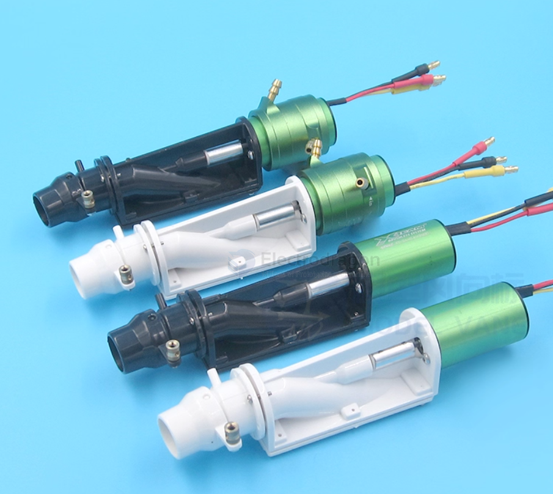

# pump-jet-dat

## 1. Fully Submerged Jet Pump
- A jet pump’s **impeller and inlet** can be fully underwater.  
- Often used in **RC boats, small submarines, or pump systems** where the pump is submerged in a tank or body of water.  
- The **motor itself** may or may not be underwater depending on design:
  - **Waterproof motor / sealed housing:** Required if the motor is submerged.  
  - **Above-water motor:** Only the impeller/water intake is submerged (common in shallow-water RC boats).

## Definition
A **jet pump** is a type of pump that uses a **high-speed jet of fluid** (usually water or steam) to **entrain and move another fluid**.  
It has **no moving parts in the pumping chamber itself**; the energy comes from a motive fluid.

---

## How It Works
1. A high-pressure fluid (motive fluid) is ejected through a **nozzle**, creating a high-velocity jet.
2. The jet creates a **low-pressure zone** (suction) that draws in the surrounding fluid.
3. The mixed fluid enters a **diffuser** or mixing chamber where velocity is converted into pressure.
4. The combined fluid exits the pump at a higher flow rate.

**Diagram Concept (simplified):**

Motive fluid → Nozzle → Suction fluid drawn in → Mixing chamber → Outlet

## Features
- No moving parts in the main pump (simple and reliable).  
- Can pump liquids, gases, or even slurries.  
- Can lift water from deep wells or create suction in fluid systems.  

---

## Applications
- Water wells (deep well jet pumps)  
- Marine bilge pumping  
- Boiler feed systems  
- Chemical and industrial processes  

## ref 

- [[pump]] - [[pump-jet]]