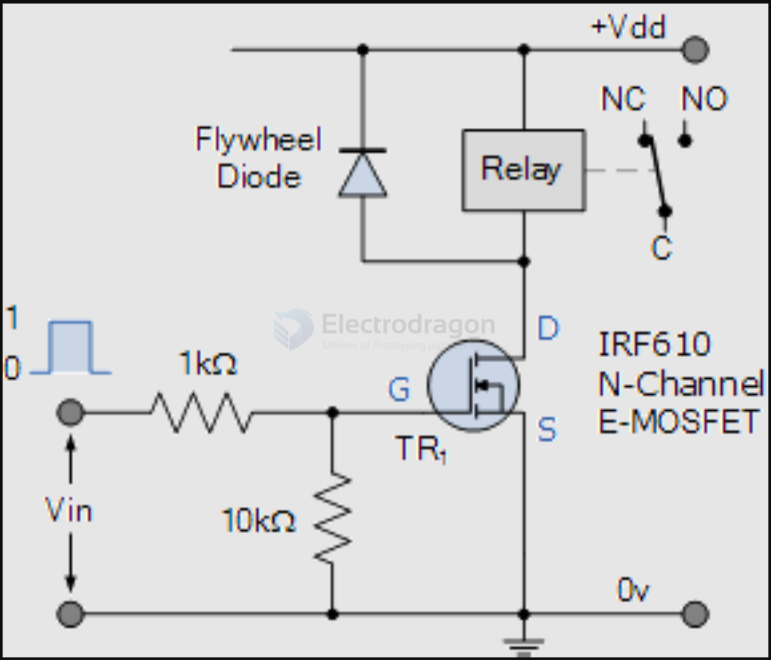
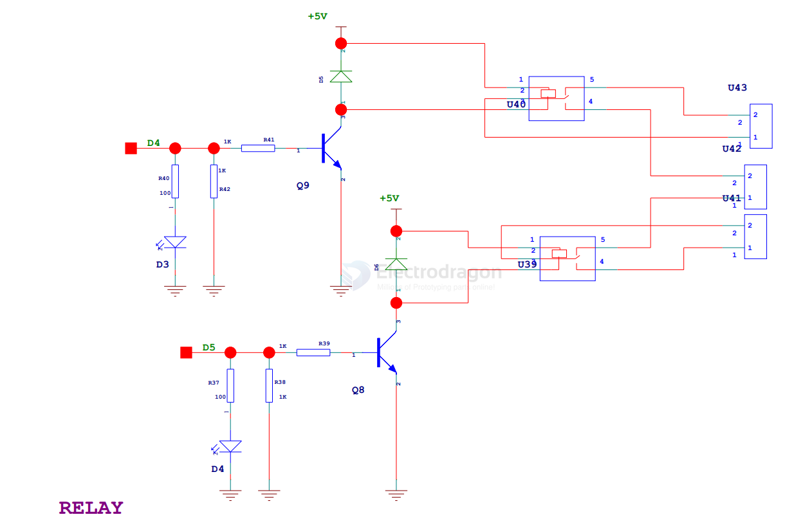

# relay-dat 

- legacy wiki page - https://w.electrodragon.com/w/Category:Relay

## relays 

- [[OPM1041-dat]]

## relay modules 

- [[relay-modules-dat]]

- [[OPM1046-dat]] - [[OPM1047-dat]] - [[OPM1048-dat]] - [[OPM1049-dat]]

### SPST relay 

HF32F-G-5-HS
- Common - open,
- 10A
- 250VAC or 30VDC

### Relay types and vendors 

- [[songle-dat]] - [[hongfa-dat]] - [[omron-dat]]

- [[SSR-relay-dat]]

## relay control schematic 

- isolation by [[Optical-Coupler-DAT]]

- sell modules - [[relay-modules-dat]] using PNP transitor drive relay - [[transistor-dat]]

### using N-mos mosfet control 

- [[mosfet-dat]] - [[n-mosfet-control-dat]]

### using NPN transistor drive 

- [[transistor-dat]]

### fly back diode 

A flyback diode (also known as a freewheeling diode or reverse protection diode) is used to protect a relay or other inductive loads. When the relay coil is de-energized, it generates a high voltage reverse current (called back EMF) due to its inductive nature. This reverse current can damage other components in the control circuit.

To prevent this, a flyback diode is typically placed in parallel with the relay coil. The diode allows normal current to flow through the coil when the relay is energized, but when the relay is turned off, the diode provides a low-resistance path for the stored energy to dissipate, preventing the high voltage spike from damaging the circuit.

#### how to choose fly back diode 

- [[diode-dat]]

Choosing the right flyback diode involves considering the following key factors:

1. Diode Type:
Standard diodes like 1N4007 are commonly used for slower switching relays.
Fast recovery diodes like 1N5819 or Schottky diodes may be necessary if the relay is switching quickly or if you need fast recovery times.

2. Voltage Rating:
The reverse voltage rating of the diode should be at least twice the supply voltage to ensure the diode can handle the reverse voltage spikes from the inductive load. For example, if the relay operates on a 12V supply, a diode with a voltage rating of at least 24V is recommended.

3. Current Rating:
The current rating of the diode should be equal to or greater than the current flowing through the relay coil. To determine the required current rating, check the current drawn by the relay's coil (usually provided in the relay datasheet). Choose a diode that can handle this current continuously.

4. Switching Speed:
If the relay operates at high switching frequencies, you may need a diode with fast recovery characteristics. Schottky diodes, for instance, have lower forward voltage drop and faster switching times, making them ideal for high-speed applications.

5. Power Dissipation:
Ensure that the diode can handle the power dissipation, which is a function of the voltage drop across the diode and the current passing through it. Diodes with low forward voltage (like Schottky diodes) can help minimize power loss.

6. Package Type:
Choose a package type (e.g., through-hole or surface-mount) based on your circuit design and the space available on the PCB.

Example Selection:

For a 12V relay drawing 0.5A, a 1N4007 diode (rated for 1000V, 1A) would be a suitable and cost-effective choice for general applications.
For fast-switching applications, a 1N5819 Schottky diode (rated 40V, 1A) might be a better option due to its fast recovery time and lower forward voltage.

## ref 

- [[transistor-dat]]

- [[relay]]