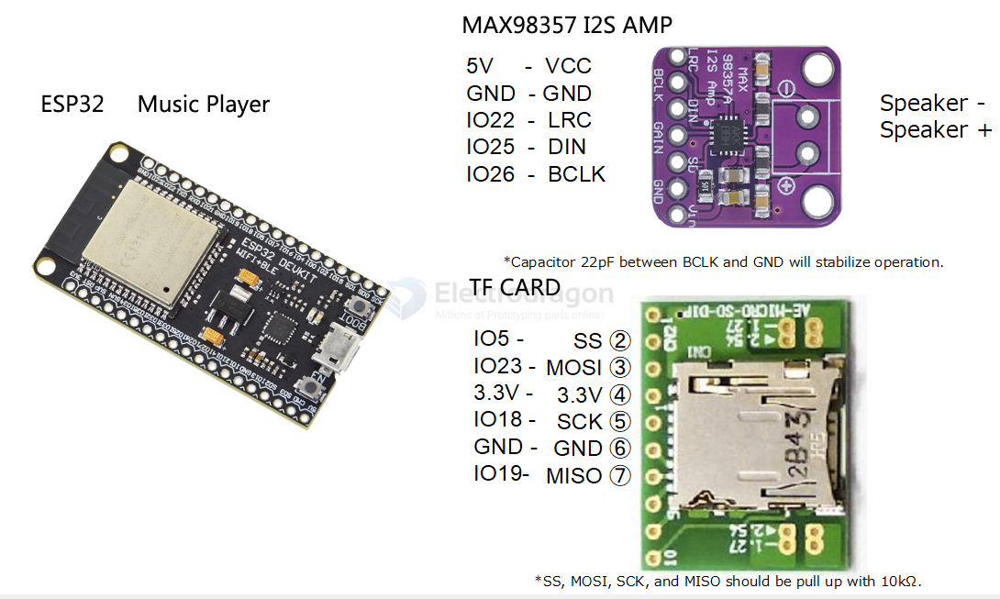

# speaker-I2S-dat

- [[speaker-dat]] - [[speaker-I2S-dat]] - [[I2S-dat]]

- [[amplifier-dat]]

- [[I2S-dat]] - [[speaker-I2S-dat]] - [[sensor-microphone-I2S-dat]] - [[sensor-microphone-dat]] - [[I2S-speaker-microphone-dat]] 

## chip 

- [[NS4168-dat]] - [[NSIway-dat]] - [[amplifier-audio-dat]] - [[Speaker-I2S-dat]] - [[I2S-dat]]

I2S DAC Decoder speaker 

- [[PCM5122-dat]] - [[MPC1083-dat]] 

- [[PCM5102-dat]] - [[AMP1006-dat]] 

- [[MAX98357-dat]] 

- [[UDA1334-dat]] - [[AMP1013-dat]] - [[NXP-dat]]

- [[HT517-dat]] - [[heroic-dat]] - [[speaker-I2S-dat]]

- [[WM8960-dat]]

## Common Microphone, Speaker Wiring 

## Pin 

| Name | default ESP32 | also Name    | func                               | RPI GPIO | RPI pin |
| ---- | ------------- | ------------ | ---------------------------------- | -------- | ------- |
| SCK  | 26            | BCLK         | Serial Data Clock / Bit clock line | G18      | PIN 12  |
| WS   | 25            | LRCK / LRC   | Serial Data-Word select line       | G19      | PIN 35  |
| SD   | 22            | SDIN / SDOUT | At least one multiplexed data line | G21      | PIN 40  |

I2S Circuit:

* Arduino/Genuino Zero, MKR family and Nano 33 IoT
* MAX98357:
  * GND connected GND
  * VIN connected 5V
  * LRC connected to pin 0 (Zero) or 3 (MKR), A2 (Nano) or 25 (ESP32)
  * BCLK connected to pin 1 (Zero) or 2 (MKR), A3 (Nano) or 5 (ESP32)
  * DIN connected to pin 9 (Zero) or A6 (MKR), 4 (Nano) or 26 (ESP32)
 
 DAC Circuit:
 * ESP32 or ESP32-S2
 * Audio amplifier
   - Note:
     - ESP32 has DAC on GPIO pins 25 and 26.
     - ESP32-S2 has DAC on GPIO pins 17 and 18.
  - Connect speaker(s) or headphones.

- [[MAX98357-dat]]

## general test code 

- [[I2S-speaker-general-1.ino]]

### I2S Demo Code for ESP32-S3 (I2S-speaker-general-1.ino)

Simple I2S audio output demo for ESP32-S3 → I2S amplifier (MAX98357 / PCM5102 / etc.).

#### Pinout (ESP32-S3 → I2S Amplifier)

| Signal               | GPIO                      | Amplifier Pin    |
| -------------------- | ------------------------- | ---------------- |
| I2S_BCK (Bit Clock)  | GPIO 4                    | BCK / BCLK / SCK |
| I2S_WS (Word Select) | GPIO 5                    | WS / LRCK / FS   |
| I2S_DATA             | GPIO 6                    | DIN / DATA / SD  |
| I2S_MCLK (Optional)  | GPIO 7 (or -1 to disable) | MCLK             |

#### Features

| Parameter     | Value                                                    |
| ------------- | -------------------------------------------------------- |
| Protocol      | Standard Philips I2S                                     |
| Sample Rate   | 44100 Hz                                                 |
| Bit Depth     | 16-bit                                                   |
| Channels      | Stereo (left = right)                                    |
| Audio Source  | Sine wave generator (no external file needed)            |
| Note Sequence | C4 → D4 → E4 → F4 → G4 → A4 → B4 → C5, changing every 2s |

#### Code Structure

| Function         | Description                                             |
| ---------------- | ------------------------------------------------------- |
| `setupI2S()`     | Initializes I2S driver with DMA, configures pins        |
| `generateSine()` | Fills buffer with sine wave samples at given frequency  |
| `setup()`        | Serial init + I2S setup                                 |
| `loop()`         | Generates audio and writes to I2S, cycles through notes |

#### Configuration Macros

| Macro             | Default     | Description                        |
| ----------------- | ----------- | ---------------------------------- |
| `SAMPLE_RATE`     | 44100       | Audio sample rate in Hz            |
| `BITS_PER_SAMPLE` | 16          | Audio bit depth                    |
| `I2S_PORT`        | `I2S_NUM_0` | I2S controller number              |
| `I2S_BCK`         | 4           | Bit Clock GPIO                     |
| `I2S_WS`          | 5           | Word Select GPIO                   |
| `I2S_DATA`        | 6           | Data out GPIO                      |
| `I2S_MCLK`        | -1          | Master Clock GPIO (-1 = disabled)  |
| `BUF_LEN`         | 256         | Samples per channel per DMA buffer |

#### Compatible Amplifiers

- [[MAX98357-dat]] - no MCLK required
- [[PCM5102-dat]]
- [[NS4168-dat]]
- [[UDA1334-dat]]
- Any I2S DAC with standard Philips I2S input

#### Usage

1. Wire ESP32-S3 to amplifier per pinout table above
2. Upload `I2S-speaker-general-1.ino` to ESP32-S3 (select board: ESP32S3 Dev Module)
3. Open Serial Monitor at **115200 baud** to see note change logs
4. Connect speaker to amplifier output — you should hear a repeating scale

#### Customization

- Change pins by editing `I2S_BCK`, `I2S_WS`, `I2S_DATA` macros
- Enable MCLK by setting `I2S_MCLK` to a GPIO number (required by some DACs)
- Adjust sample rate / bit depth via `SAMPLE_RATE` / `BITS_PER_SAMPLE`
- Replace sine wave with WAV data by filling buffer directly

## demo 

- [[HT517-dat]] == https://t.me/electrodragon3/458

## ref 