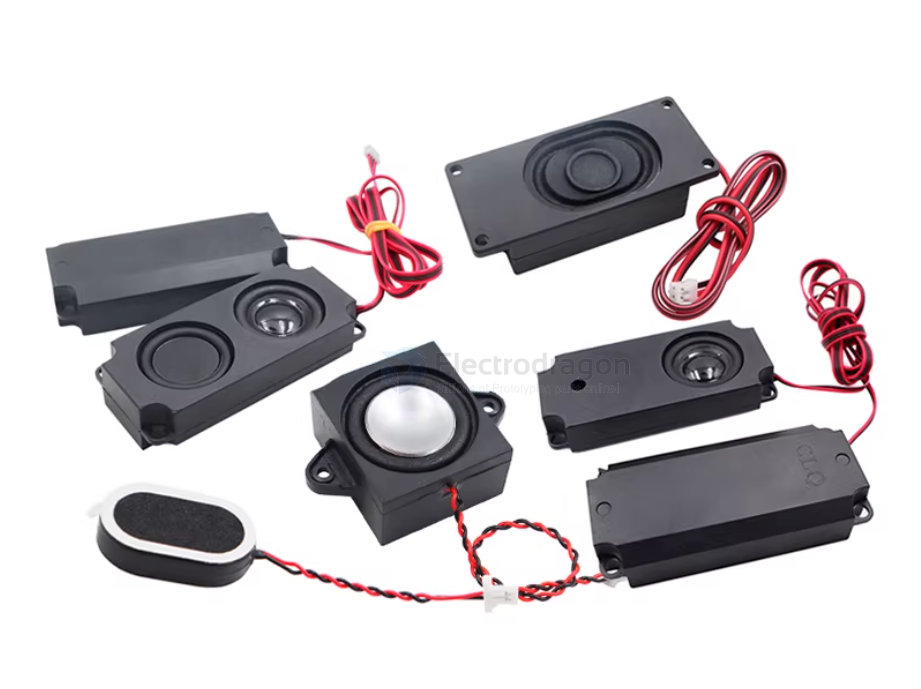

# speaker-dat

- [[speaker-dat]] - [[buzzer-dat]] 

- [[max98357-dat]]

- [[I2S-dat]] - [[speaker-I2S-dat]] - [[sensor-microphone-I2S-dat]] - [[PDM-dat]]

- [[amplifier-audio-dat]] - [[8002-dat]] - [[speaker-dat]] - [[bt-audio-dat]]

[legacy wiki page](https://www.electrodragon.com/w/Speaker)

## boards 

- [[SSL1030-dat]] - [[SSL1031-dat]]

## apps 

- [[alarm-dat]]

## Cavity Speakers (Box Speakers)

A **Cavity Speaker** (often called a "Box Speaker" in electronics) is not a different type of speaker driver, but rather a **complete acoustic system**. It consists of a standard speaker driver pre-installed into a precisely engineered, sealed plastic or metal enclosure (the "cavity").

Think of it as a professional, miniature version of a bookshelf speaker designed to fit inside compact devices like smartphones, laptops, or your DIY projects.

---

### 1. The Anatomy of a Cavity Speaker
A typical unit includes three main parts:
* **The Driver:** The diaphragm and magnet that create vibration.
* **The Enclosure (Cavity):** A sealed box that manages the air pressure behind the driver.
* **The Port/Outlet:** A specific opening that directs the sound toward the user.

---

### 2. Why Use a Cavity Instead of a Bare Speaker?
If you hold a "bare" speaker in your hand and play music, it will sound "tinny" and weak. This is because of **Acoustic Cancellation**.

* **The Problem:** When the speaker membrane moves forward, it creates high pressure in front and low pressure behind. Without a cavity, these two waves meet at the edge and cancel each other out—especially the **bass (low frequencies)**.
* **The Solution:** The cavity traps the rear sound wave, preventing it from canceling the front wave. This results in much deeper, louder, and clearer audio.

### 3. Application in Projects

For an outdoor adventure or robotics project, a cavity speaker is almost always the better choice over a bare driver.

| Feature           | Bare Speaker Driver                      | Cavity/Box Speaker                     |
| :---------------- | :--------------------------------------- | :------------------------------------- |
| **Audio Quality** | Thin, high-pitched, quiet                | Full-bodied, louder, better bass       |
| **Installation**  | Requires custom 3D printed housing       | Plug-and-play (usually has adhesive)   |
| **Protection**    | Membrane is exposed to dust/damage       | Fully protected inside the box         |
| **Complexity**    | You must calculate "air volume" yourself | Acoustic tuning is done by the factory |

## cavity speaker types 

- 商品型号：3718腔体喇叭_8欧2瓦_带线2P_2.0
- 产品类型：腔体喇叭
- 封装尺寸：3718带线2P_2.0
- 阻抗：8欧
- 功率：2瓦
- 工作频率：0-20KHz
- 输出声压：95±3dB

more 

| Model | diaphragm | Size (mm) | Impedance | Power | Connector       |
| ----- | --------- | --------- | --------- | ----- | --------------- |
| 2415  |           | 24x15     | 8Ω        | 1W    | Wired 2P 1.25mm |
| 3020  |           | 30x20     | 4Ω        | 3W    | Wired 2P 1.25mm |
| 3020  |           | 30x20     | 8Ω        | 2W    | Wired 2P 1.25mm |
| 3525  |           | 35x25     | 4Ω        | 3W    | Wired 2P 1.25mm |
| 3525  |           | 35x25     | 8Ω        | 2W    | Wired 2P 1.25mm |
| 3020  |           | 30x20     | 4Ω        | 3W    | Wired 2P 2.0mm  |
| 3020  |           | 30x20     | 8Ω        | 2W    | Wired 2P 2.0mm  |
| 3525  |           | 35x25     | 4Ω        | 3W    | Wired 2P 2.0mm  |
| 3525  |           | 35x25     | 8Ω        | 2W    | Wired 2P 2.0mm  |
| 2828  |           | 28x28     | 4Ω        | 2W    | Wired 2P 1.25mm |
| 2828  |           | 28x28     | 4Ω        | 2W    | Wired 2P 2.0mm  |
| 2828  |           | 28x28     | 4Ω        | 3W    | Wired 2P 1.25mm |
| 2828  |           | 28x28     | 4Ω        | 3W    | Wired 2P 2.0mm  |
| 2831  |           | 28x31     | 4Ω        | 3W    | Wired 2P 1.25mm |
| 2831  |           | 28x31     | 4Ω        | 3W    | Wired 2P 2.0mm  |
| 2831  |           | 28x31     | 4Ω        | 3W    | Wired 2P Dupont |
| 4014  |           | 40x14     | 4Ω        | 2W    | Wired 2P 2.54mm |
| 4014  |           | 40x14     | 8Ω        | 2W    | Wired 2P 2.54mm |
| 3718  |           | 37x18     | 8Ω        | 2W    | Wired 2P 2.0mm  |
| 5318  |           | 53x18     | 8Ω        | 2W    | Wired 2P 2.0mm  |
| 3070  |           | 30x70     | 8Ω        | 3W    | Wired 2P 2.0mm  |
| 3370  |           | 33x70     | 8Ω        | 3W    | Wired 2P 2.0mm  |
| 3080  |           | 30x80     | 8Ω        | 3W    | Wired 2P 2.0mm  |
| 6423  |           | 64x23     | 8Ω        | 2W    | Wired 2P 2.0mm  |
| 45100 |           | 45x100    | 8Ω        | 5W    | Wired 2P 2.0mm  |
| 45100 | dual      | 45x100    | 8Ω        | 5W    | Wired 2P 2.0mm  |
| 3718  |           | 37x18     | 8Ω        | 2W    | Wired 4P 2.0mm  |
| 5318  |           | 53x18     | 8Ω        | 2W    | Wired 4P 2.0mm  |
| 3070  |           | 30x70     | 8Ω        | 3W    | Wired 4P 2.0mm  |
| 3370  |           | 33x70     | 8Ω        | 3W    | Wired 4P 2.0mm  |
| 3080  |           | 30x80     | 8Ω        | 3W    | Wired 4P 2.0mm  |
| 6423  |           | 64x23     | 8Ω        | 2W    | Wired 4P 2.0mm  |
| 45100 |           | 45x100    | 8Ω        | 5W    | Wired 4P 2.0mm  |
| 45100 | dual      | 45x100    | 8Ω        | 5W    | Wired 4P 2.0mm  |

## audio impedance 

Impedance (Z)?

In electronics, **Impedance** (symbol: $Z$) is the total opposition that a circuit presents to alternating current (AC). It combines basic resistance ($R$) with "reactance" ($X$), which depends on the frequency of the signal.

For your ESP32-S3 and robotics projects, impedance plays four critical roles:

---

### 1. Power Transfer & Efficiency
In audio systems, matching the impedance of your **amplifier** to your **speaker** is vital.

* **The Rule:** Your MAX98357A amplifier is rated for specific loads (usually $4\Omega$ or $8\Omega$).
* **Low Impedance ($4\Omega$):** Draws more current. The speaker will be louder, but the amplifier will run hotter and consume more battery.
* **High Impedance ($8\Omega$):** Draws less current. The system is more stable and produces less heat, but the maximum volume is lower.

---

### 2. Circuit Protection (Current Limiting)
Impedance acts like a "throttle" for electricity.
* If you connect a device with **$0\Omega$ impedance** (a short circuit) to an ESP32 GPIO, the current will spike instantly and burn the internal transistors.
* By choosing components with the correct impedance (or adding resistors), you ensure the current stays within the ESP32's safe limit of **20mA to 40mA**.

## 4-ohm and 8-ohm

The terms 4-ohm and 8-ohm refer to the impedance of the speaker. Impedance is a measure of the resistance the speaker provides to the electrical current coming from the amplifier. It is measured in ohms (Ω) and directly impacts how the speaker interacts with an amplifier.

Key Points about 4-Ohm and 8-Ohm Speakers:

Electrical Resistance:

- 4-ohm speakers offer less resistance to electrical current, meaning they allow more current to flow through.
- 8-ohm speakers offer more resistance, meaning they draw less current from the amplifier.

Power Requirements:

- A 4-ohm speaker generally requires an amplifier that can deliver more current because of the lower resistance.
- An 8-ohm speaker is less demanding on the amplifier, so it is compatible with a wider range of amplifiers.

Compatibility with Amplifiers:

- Amplifiers must be rated to handle the speaker's impedance. For example:
- An amplifier rated for 4–8 ohms can drive both 4-ohm and 8-ohm speakers safely.
- Using a 4-ohm speaker with an amplifier not designed for such low impedance may overheat the amplifier or cause it to shut down.
Sound Performance:

There is no inherent sound quality difference between 4-ohm and 8-ohm speakers. However:

- A 4-ohm speaker may be slightly louder if the amplifier can handle it because it draws more power from the amplifier.
- Matching the amplifier's power output with the speaker's impedance ensures optimal sound quality and avoids distortion or damage.

## tech 

- [[amplifier-dat]] - [[amplifier-audio-dat]]

- [[signal-dat]] - [[signal-differential-dat]]

- [[I2S-dat]] 

- [[speaker-dat]] - [[headphone-dat]]

## ref 

