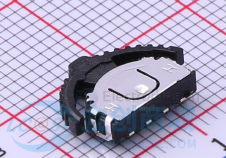

# switching-dat

- [[switch-dat]]

[[ACDC-dat]] + [[speed-controller-dat]] + [[dc-gear-motor-dat]]

- [[mosfet-dat]]

## chip switch 

- [[PE4259-dat]] - [[UPG2179-dat]]

## switching ICs 

MC14053BCPG - IC SWITCH SPDT X 3 280OHM 16DIP

- [[analog-device-dat]]

- [[ti-dat]]

ADG636YRUZ

- switching chips: 

## load switch 

TPS22916CYFPR == TPS22916xx 1-V–5.5-V, 2-A, 60-mΩ Ultra-Low Leakage Load Switch

## methods - DC 

✅ Recommended Method by Use Case

| Use Case                           | Recommended Method          |
|------------------------------------|-----------------------------|
| Battery disconnect / high power    | DC contactor or SSR         |
| Motor speed control (PWM)          | MOSFETs with gate drivers   |
| General-purpose switching (<10A)   | Mechanical relay or SSR     |
| High-speed switching               | MOSFETs or IGBTs            |
| Silent, wear-free switching        | Solid-State Relay (SSR)     |

- [[motor-driver-dat]]

## ref 

- [[tech-dat]] 

- [[switching]]