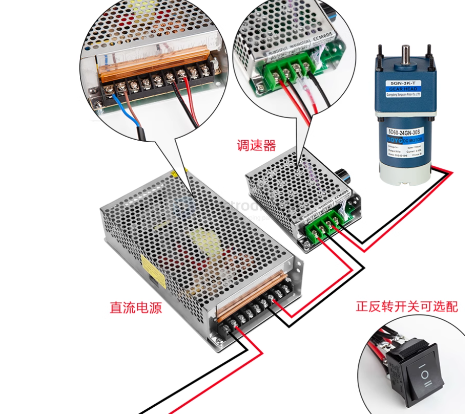
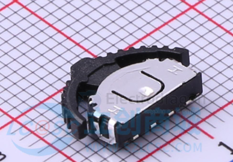

# switching-dat

- [[switch-dat]]

[[ACDC-dat]] + [[speed-controller-dat]] + [[dc-gear-motor-dat]]

- [[switching-rf-dat]]

- [[mosfet-dat]]

## chip switch 

## load switch 

TPS22916CYFPR == TPS22916xx 1-V–5.5-V, 2-A, 60-mΩ Ultra-Low Leakage Load Switch

## methods - DC 

✅ Recommended Method by Use Case

| Use Case                           | Recommended Method          |
|------------------------------------|-----------------------------|
| Battery disconnect / high power    | DC contactor or SSR         |
| Motor speed control (PWM)          | MOSFETs with gate drivers   |
| General-purpose switching (<10A)   | Mechanical relay or SSR     |
| High-speed switching               | MOSFETs or IGBTs            |
| Silent, wear-free switching        | Solid-State Relay (SSR)     |

- [[motor-driver-dat]]

## Applications

- Analog signal switching and multiplexing:signal gating, modulators, squelch controls,demodulators, choppers, commutating switches 
- Digital signal switching and multiplexing
- Analog-to-digital and digital-to-analog conversions 
- Digital control of frequency, impedance, phase,and analog-signal gain
- Building automation

## switching ICs 

`CD4066B` CMOS Quad Bilateral Switch - The CD4066B device is a quad bilateral switch intended for the transmission or multiplexing of analog or digital signals. 

It is pin-for-pin compatible with the CD4016B device, but exhibits a much lower onstate resistance. In addition, the on-state resistance is relatively constant over the full signal-input range.

`SN74CB3Q3244` - 8-BIT FET BUS SWITCH - 2.5-V/3.3-V LOW-VOLTAGE HIGH-BANDWIDTH BUS SWITCH

switching IC - `SN75451BDR` - `SN5545xB`, `SN7545xB` Dual-Peripheral Drivers for High-Current, High-Speed Switching

- [[PE4259-dat]] - [[UPG2179-dat]]

MC14053BCPG - IC SWITCH SPDT X 3 280OHM 16DIP

- [[analog-device-dat]]

- [[ti-dat]]

ADG636YRUZ

ADG734BRUZ

ADG936BRUZ

HMC232ALP4E

ADRF5019BCPZN

HMC349AMS8GE

ADG436 - Dual SPDT Switch

`TMUX1111`, TMUX1112, TMUX1113 - TMUX111x 5V, Low-Leakage-Current, 1:1 (SPST), 4-Channel Precision Switches

## ref 

- [[tech-dat]] 

- [[switching]]