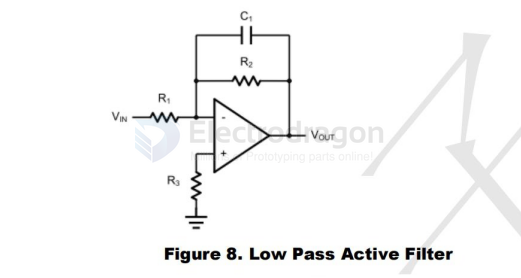
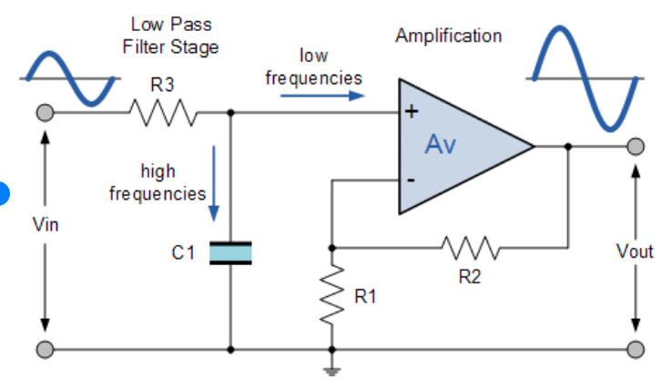

# amplifier-dat

- [[I2S-daC-dat]]

- ISL3283EFHZ - Miniature Broadband Gain Stage 70 - 3000 MHz

M/A-COM’s MAALSS0034 broadband gain stage is a GaAs MMIC amplifier in a lead-free SOT-89 surface mount plastic package. It can be operated from a single 3 to 5 volt supply.

## operational amplifiers (op-amps)

| Feature               | LM387                           | MCP6002                      |
| --------------------- | ------------------------------- | ---------------------------- |
| **Type**              | Low-noise audio op-amp          | General-purpose CMOS op-amp  |
| **Voltage Supply**    | ±3V to ±18V                     | 1.8V to 6V (single supply)   |
| **Bandwidth**         | ~4.5 MHz                        | ~1 MHz                       |
| **Noise Performance** | Low noise (optimized for audio) | Higher noise than LM387      |
| **Power Consumption** | Higher                          | Lower (low-power design)     |
| **Rail-to-Rail I/O**  | No                              | Yes                          |
| **Input Impedance**   | High (audio optimized)          | High                         |
| **Best for**          | Audio applications              | Battery-powered, general use |

- [[Audio-amplifier-dat]]

| Alternative Chip | Key Differences/Advantages                         |
|-----------------|----------------------------------------------------|
| **MCP6022**     | Higher bandwidth (10 MHz vs. 1 MHz), lower noise  |
| **TLV2372**     | Similar specs, slightly better bandwidth (3 MHz)  |
| **TLV9002**     | Lower power consumption, similar bandwidth (1 MHz) |
| **OPA2333**     | Higher precision, lower offset voltage            |
| [[LM358-dat]]   | Similar voltage range but not rail-to-rail        |
| **TSV912**      | Lower voltage noise, better for precision applications |

## Solutions 

- [[OP07-dat]] - [[LM386-dat]]

- [[MS6002-dat]] - [[LM358-DAT]] 

- [[NS4150-dat]] 
  
- [[MCP6002-dat]]

- [[OPA1641-dat]] - [[NE5532-dat]] - [[AD828-dat]] - [[TL072-dat]]

- [[PAM-dat]] - [[diodes-dat]] - [[PAM8302-dat]]

## Voltage Reference

LM258, LM358, LM358A, LM358E, LM2904, LM2904A, LM2904E, LM2904V, NCV2904

## Noninverting Amplifier

## rail to rail 

### Rail-to-Rail Input & Output (RRIO)

Both the input and output can swing close to both power rails (VCC & VEE).

Example: MCP6002, TLV9002, OPA2333

### Non-Rail-to-Rail Op-Amps

Neither input nor output reaches the full supply range.

Example: 741 op-amp (Needs at least ±12V to operate properly).

## Driver 

- [[ESP32-DAC-dat]]

## LM139 

## APPs 

- read more at [[LM358-dat]]

### Low Pass Active Filter

The low pass active filter is shown in Figure 8.The DC gain is defined by -R2/R1.The filter hasa -20dB/decade roll-off after its corner frequency fc=1/(2πR3C1).

online simuation - https://www.circuitlab.com/editor/#?id=z84zq5

- [[circuit-lab-dat]] - [[EDA-simulation-dat]]

Active Low Pass filter with Amplification

## tuto 

- [Application of Rail-to-Rail Operational Amplifiers](https://www.ti.com/lit/an/sloa039a/sloa039a.pdf)

## read more 

- [Op-Amps – Analog Building Blocks](https://dronebotworkshop.com/op-amps/)

## more chips 

- TL071CP

- TL082 == Wide Bandwidth Dual JFET Input Operational Amplifier

- [[TI-signal-dat]] - [[TI-AMP-dat]]

- [[Analog-device-dat]]

## ref 

- [[tech-dat]] - [[DAC-dat]] - [[audio-dat]]

