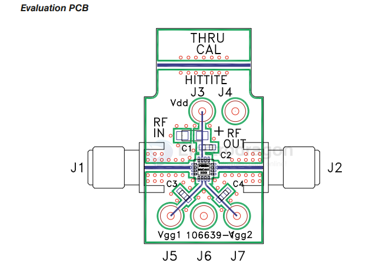

# amplifier-power-dat

HMC441LP3 / 441LP3E == GaAs pHEMT MMIC MEDIUM POWER AMPLIFIER, 6.5 - 13.5 GHz

The HMC441LP3 & HMC441LP3E are broadband GaAs PHEMT MMIC Medium Power Amplifiers which operate between 6.5 and 13.5 GHz. The leadless plastic QFN surface mount packaged amplifier provides 14 dB of gain, +20 dBm saturated power at 20% PAE from a +5V supply voltage. An optional gate bias is provided to allow adjustment of gain, RF output power, and DC power dissipation. This 50 Ohm matched amplifier does not require any external components making it an ideal linear gain block or driver for HMC SMT mixers.

https://www.analog.com/media/en/technical-documentation/data-sheets/hmc441lp3.pdf

## EVM PCB 

## ref 

