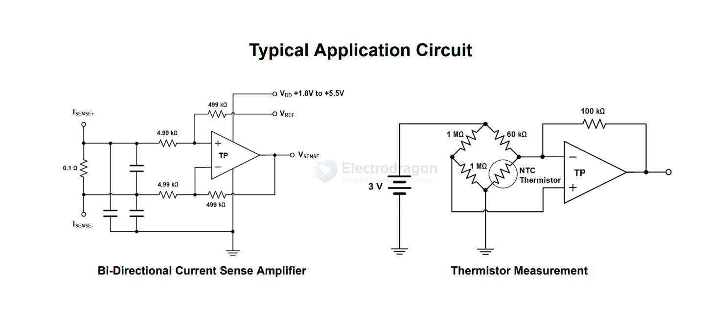

# op-amp-dat

- output to - [[ADC-dat]]

- [[3peak-dat]] - TP5551

- [[LM324-dat]]

- inverting amplifier 
- non-inverting amplifier 
- instrumentation amplifier 
- class A amplifier 
- class B amplifier 
- class AB amplifier

## APPs 

- [[sensor-current-dat]] - [[thermistor-dat]]

- [[ph-tester-dat]]

- IN+ IN- 
- VS- VS+ 
- OUT

- Out A Out B
- −In A +In A
- +Vs −Vs
- −In B +In B

## unsort 

- [[LM358-dat]] - LM158

- OPA244
- OPA340
- OPA340

AD811 - High Performance Video Op Amp - A wideband current feedback operational amplifier, the AD811
is optimized for broadcast-quality video systems. 

AD8310 - Fast, Voltage-Out, DC to 440 MHz, 95 dB Logarithmic Amplifier

AD8313 ARMZ - 0.1 GHz to 2.5 GHz 70 dB Logarithmic Detector/Controller

ADL8150ACPZN - 	IC AMPLIFIER 6-14GHz 6LFCSP

OP27 - Low Noise, Precision Operational Amplifier

LM6142 - Series Operational Amplifiers - Op Amps

- [[3peak-dat]] - [[3peak]]

## ref 

- [[logic-dat]]

- [[amplifier-dat]]