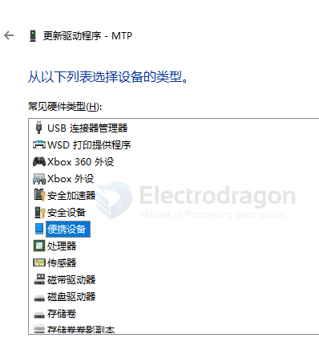

# adb-dat

- [[android-bootloader-dat]]

https://developer.android.google.cn/studio/releases/platform-tools.html?hl=zh-cn

ADB工具安装要手动去设备管理器安装。操作方法为：连接电脑----电脑打开设备管理器----找到手机的选项----属性----驱动程序----更新驱动程序----手动查找驱动程序----选择下载好的ADB驱动安装即可

When your Pixel 2 is recognized strictly as an ADB interface rather than a storage device, Windows attaches the Android Composite ADB Interface driver to the USB device composite parent instead of mounting the MTP (Media Transfer Protocol) storage driver.

- [[android-dat]] - [[ADB-dat]] - [[phone-dat]]

- [[android-root-dat]]

- [[ADB.7z]] - unzip and get to windows system environment path == 7446 KB 

adb devices

    C:\Users\Administrator>adb devices
    List of devices attached
    * daemon not running; starting now at tcp:5037
    * daemon started successfully

Optional: Check connection status

    C:\Users\Administrator>adb devices -l
    List of devices attached

## Can You Use ADB (Android Debug Bridge)?

ADB works only if the device runs Android (or a compatible system) with the following in place:

- Android OS (or equivalent) installed on the device.
- ADB daemon (adbd) running on the device.
- USB gadget mode set up (e.g., g_android, g_ether) to expose the ADB interface over USB.

## logs 

may not be able to connect to the following devices.

- [[F133-dat]] 

- [[D1-S-dat]] 

- [[sigmaster-dat]] - D210 

## ref 

- [[SDK-dat]]