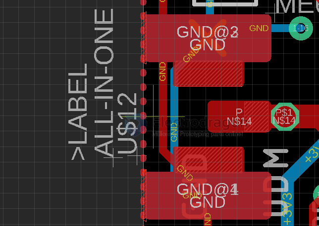

# 3in1-antenna-dat

a combination footprint to support three types of antenna: [[IPEX-dat]], [[SMA-dat]], single-pole antenna. 

- [[IPEX-dat]] == for limited physical size to fit in
- [[SMA-dat]] == robust connection 
- single-pole antenna == single cheap solution

The default populated antenna socket by us will be IPEX

## ref 

- [[antenna-dat]]