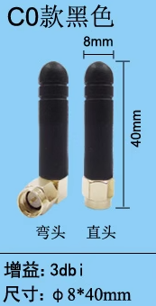
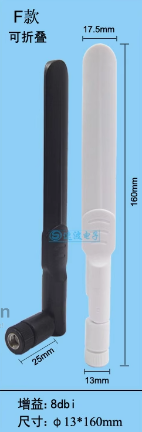

# antenna-dat

表 28：GNSS 频率

| type             | frequencies     | units |
| ---------------- | --------------- | ----- |
| GPS/Galileo/QZSS | 1575.42 ±1.023  | MHz   |
| GLONASS          | 1597.5~1605.8   | MHz   |
| BeiDou           | 1561.098 ±2.046 | MHz   |

GPS 
- [[NAN1001-dat]] 

GSM
- [[NAN1003-dat]] - [[NAN1008-dat]]

SMA to IPEX converter cable 
- [[NAN1005-dat]]
  

- [[antenna-design-dat]]

## antenna shape, size and gain 

| type     | rod                          | paddle                       |
| -------- | ---------------------------- | ---------------------------- |
| style    |  |  |
| gain     | 2dbi                         | 8dbi                         |
| Features | -                            | foldable                     |

## GNSS recommanded antenna specifications 

passive 

- Frequency Range: 1559–1609 MHz 
- Polarization: RHCP 
- VSWR: < 2 (Typ.) 
- Passive Antenna Gain: > 0 dBi

active 

- Frequency Range: 1559–1609 MHz 
- Polarization: RHCP 
- VSWR: < 2 (Typ.) 
- Passive Antenna Gain: > 0 dBi 
- Active Antenna Noise Figure: < 1.5 dB 
- Active Antenna Total Gain: < 18 d

## Connection Type 

- Wire or Pin Soldering
- u.FL IPEX  - [[ipex-dat]]
- SMA inner-hole or inner-pin

### 2.4 antenna: wifi, bluetooth

for sticking inside of enclosure
https://www.electrodragon.com/product/2-4g-soft-fpc-pcb-antenna-ipx-rohs/

for remote-control toys
https://www.electrodragon.com/product/5pcs-2-4g-cable-type-antenna/

### GSM antenna

https://www.electrodragon.com/product/pcb-build-antenna-4g-gsm-3g-wcdma-gprs/

SMA antenna 3 Meters
https://www.electrodragon.com/product/gps-magenatic-active-external-antenna-3m/

SMA small-size antenna - 2PCs Quad-band Cellular GSM Antenna SMA 2Dbi
https://www.electrodragon.com/product/quad-band-cellular-duck-antenna-sma/

### RF antenna:

- common apps: LORA, NBIOT
- common bands: 315Mhz, 433MHz, 470Mhz, 490Mhz, 868MHz, 915MHz

spring coil antenna
https://www.electrodragon.com/product/spring-coil-antenna-433-mhz/

### GPS antenna

- [[antenna-dat]]

ceramic mini antenna
https://www.electrodragon.com/product/gps-ceramic-antenna-build/

large outdoor antenna
https://www.electrodragon.com/product/gsm-magenatic-external-antenan-3m-5dbi/

## tech 

### Bias-T (Bias Tee)

A Bias-T (Bias Tee) is an electronic component used in radio frequency (RF) applications, like antennas, to supply DC power to devices while allowing RF signals to pass through. It's typically used to power active antenna components, such as low-noise amplifiers (LNAs), without the need for separate power cables.

A Bias-T consists of three ports:

- RF port: Where the radio signal passes without DC.
- DC port: Where the power supply is connected.
- RF+DC port: Where the combined signal (RF and DC) is outputted or inputted.

It works by using inductors and capacitors. The inductor blocks the RF signal but allows DC to pass, while the capacitor blocks DC but allows the RF signal to pass. This way, the antenna can operate without interference from the power supply.

## ref

- [[antenna]]
