# antenna-dat

选天线的原则：如果产品空间够的情况下，尽量选面积大的天线；研发前期，建议多拿一些款式做对比测试，从而可以选出匹配效果最佳的款式

Antenna selection principles: If product space allows, choose an antenna with the largest possible area; in the early stages of R&D, it is recommended to conduct comparative tests on multiple models to select the one with the best matching performance.

- [[VSWR-dat]] - [[bands-dat]] - [[frequency-dat]]

- [[antenna-type-dat]] - [[antenna-design-dat]] - [[antenna-HDK-dat]]

type of antennas by shape == [[antenna-type-dat]] - [[antenna-T-dat]] - [[antenna-Whip-dat]] - [[antenna-spring-dat]] - [[antenna-FPC-dat]]

- [[antenna-SMD-dat]] - [[antenna-PCB-dat]] - [[antenna-ceramic-dat]]

type of antennas by power == [[antenna-active-dat]] - [[antenna-passive-dat]]

type of antennas by connector == - [[CONN-dat]] - [[CONN-SMA-dat]] - [[CONN-IPEX-dat]] - [[antenna-UFL-dat]]

connector convert cable [[IPEX-to-SMA-dat]]

IPEX-1st-gen or IPEX-4th-gen or cable bare end 

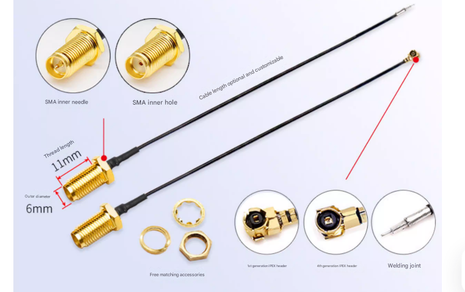

- 线材 RG0.81/1.13/ 178线
- 线长 50-1000mm(可定制)
- 接口型号 SMA内针/内孔
- 配套配件 花片、弹片、螺母
- 产品名称 IPEX/焊接头转SMA转接线
- 适用频段 0-6G
- 阻抗 - 500
- 天线接口 - 1代IPEX/4代IPEX/焊接头

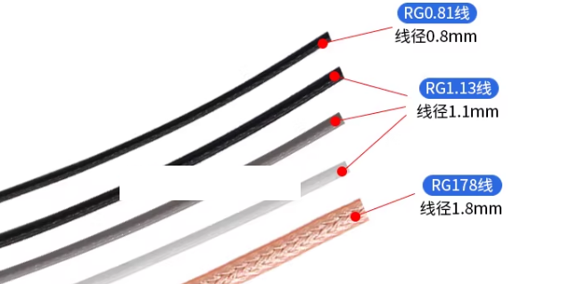

- [[3in1-antenna-dat]]

- [[antenna-lolipop-dat]]

- [[impedance-dat]] - [[antenna-dat]] - [[antenna-HDK-dat]]

- [[antenna-wifi-dat]] - [[antenna-dat]]

type of antennas by frequency == [[antenna-location-dat]] - [[antenna-GNSS-dat]] - [[GSM-antenna-GPS-dat]] - [[antenna-RF-dat]] - [[antenna-2.4G-dat]]

- [[antenna-function-dat]] - [[antenna-location-dat]] - [[antenna-wifi-dat]] - [[antenna-NFC-dat]] - [[antenna-bluetooth-dat]]

- anntenna by installation - inside / outdoor 

## specs 

- 天线长度Leight: 5厘米   
- 频率Frequency:900-1800MHz   
- 增益Gain: 3dBi   
- 极化Polarization:垂直Vertical   
- 驻波比V.S.W.R: ≤1.6 (SMA)   
- 接头型号Connector: 标配SMA 弯头    
- 标称阻抗Output impedance: 50Ω 

### frequency 

# Antenna Theory: Center Frequency and Bandwidth

In antenna design and RF (Radio Frequency) communication, the **Center Frequency** and **Bandwidth** define the "operating window" of your hardware.

---

### 1. Center Frequency ($f_c$)
The **Center Frequency** is the specific frequency point where the antenna is designed to be most efficient.

* **Resonance:** At this frequency, the antenna is "in sync" with the radio waves. Its electrical impedance is typically matched to **50Ω**, resulting in the lowest possible **VSWR**.
* **Physical Dimension:** The center frequency is directly tied to the physical length of the antenna. For a standard dipole antenna, the length is approximately **1/2 of the wavelength ($\lambda$)** of the center frequency.
* **Performance:** This is the "sweet spot." At $f_c$, the antenna radiates the maximum amount of power and reflects the minimum amount back to the transmitter.

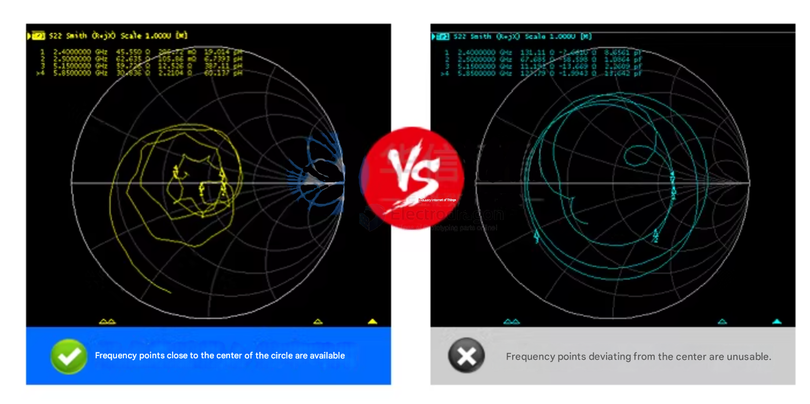

---

### 2. Frequency Bandwidth (BW)
The **Bandwidth** is the range of frequencies over which the antenna maintains "acceptable" performance.

* **The Threshold:** Bandwidth is usually defined by the frequency points where the **VSWR rises above 2.0** (or where the return loss drops below -10dB). 
* **Calculation:** * **Absolute Bandwidth:** $BW = f_{high} - f_{low}$
    * **Fractional Bandwidth:** $\frac{BW}{f_c} \times 100\%$
* **Significance:** * **Wideband:** Necessary for high-speed data (like Wi-Fi) which hops across many channels.
    * **Narrowband:** Common in long-range, low-power telemetry where you stay on one specific frequency.

---

### 3. The Relationship: Q Factor
The relationship between Center Frequency and Bandwidth is described by the **Quality Factor (Q)**:

$$Q = \frac{f_c}{BW}$$

| Q-Factor | Bandwidth Type | Characteristics |
| :--- | :--- | :--- |
| **High Q** | Narrowband | Highly selective; prone to "detuning" if placed near metal or carbon fiber. |
| **Low Q** | Wideband/Broadband | More "forgiving" of environmental changes; covers more channels. |

---

### Summary for Robotics Applications

| Parameter | Focus | Why it matters |
| :--- | :--- | :--- |
| **Center Frequency** | Physical Length | If your antenna is for 433MHz but you use it for 2.4GHz, you risk burning out your ESP32/Radio. |
| **Bandwidth** | Channel Coverage | Ensures your signal stays strong even if your radio hops to a different channel within the band. |

### VSWR 

- 1.0:1 (读作 One to one)：理想状态，无反射。
- 1.5:1：非常好的状态。
- 2.0:1：通常被认为是许多天线系统的可接受上限。

VSWR stands for Voltage Standing Wave Ratio. It is a numerical measurement that describes how efficiently radio frequency (RF) power is transmitted from a power source (like a radio or transmitter) through a transmission line (like a coaxial cable) into a load (the antenna).

In simple terms, it measures impedance matching.

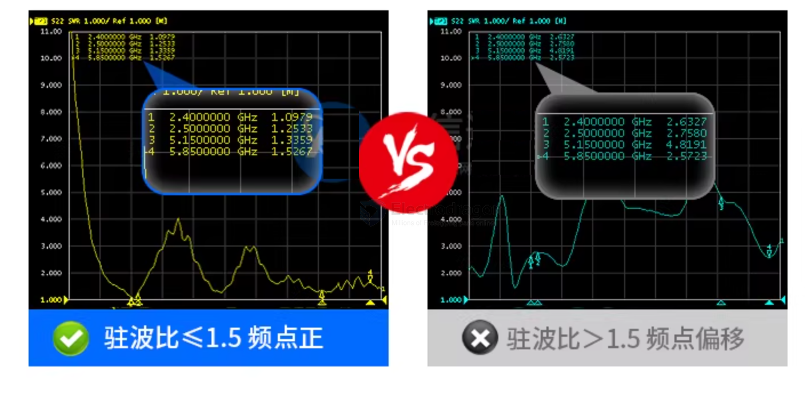

### Polarization and Radiation Pattern

#### 1. Antenna Polarization

**Polarization** refers to the orientation of the **Electric Field (E-plane)** of the radio wave as it propagates through space.

* **Linear Polarization:** The most common type.
    * **Vertical:** The antenna stands upright (perpendicular to the ground).
    * **Horizontal:** The antenna lies flat (parallel to the ground).
* **Circular Polarization:** The electric field rotates as it travels (LHCP or RHCP). Common in FPV drones because it handles signal reflections and banking turns better.
* **The "Golden Rule":** To get the best signal, the transmitting and receiving antennas **must have the same polarization**.
    * *Loss:* If one antenna is vertical and the other is horizontal, you can lose up to **20dB (99%)** of your signal power.

---

#### 2. Radiation Pattern
The **Radiation Pattern** is a graphical representation of the strength of the radio waves emitted by the antenna in different directions.

* **Omnidirectional (The "Donut"):**
    * **Shape:** Most standard "rubber duck" antennas radiate in a 360-degree circle around the shaft but have a **dead zone** at the very top and bottom.
    * **Usage:** Best for mobile robots where the transmitter and receiver are roughly on the same horizontal plane.
* **Directional (The "Flashlight"):**
    * **Shape:** Focuses energy into a narrow beam in one specific direction.
    * **Usage:** Best for long-range stationary setups or point-to-point links.
* **Gain (dBi):** High-gain antennas flatten the "donut" to push the signal further horizontally, but this makes the dead zones above and below the antenna much larger.

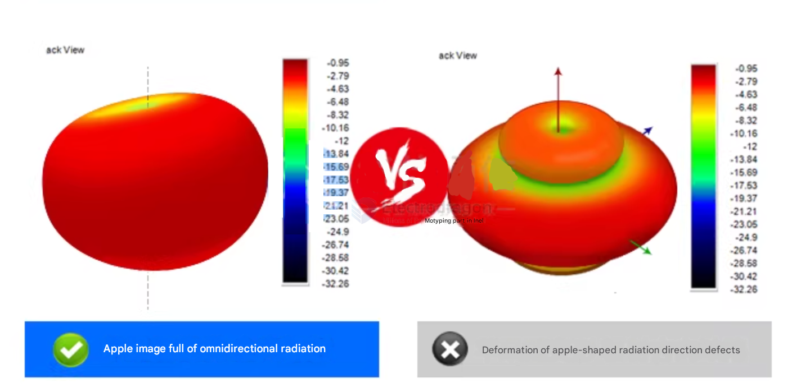

---

#### 3. Summary Comparison

| Parameter | Definition | Key Influence | Best Practice |
| :--- | :--- | :--- | :--- |
| **Polarization** | Vibration direction of the wave. | Signal alignment. | Keep both antennas parallel (e.g., both pointing straight up). |
| **Radiation Pattern** | Energy distribution in space. | Coverage area. | Don't point the "tip" of the antenna at the robot; use the "side" of the antenna. |

### Practical Tips for your Projects == rules 
1.  **Avoid the "Tip":** Since the radiation pattern of a standard antenna looks like a donut, the weakest signal is at the very tip. Never point the tip of your controller antenna directly at your Rover.
2.  **Mounting Matters:** If your robot dog is made of **carbon fiber or metal**, do not mount the antenna flush against the frame. These materials will distort the polarization and "shield" the radiation pattern.
3.  **Cross-Polarization:** If your Rover flips over or tilts significantly, your signal will drop because the polarization no longer matches your handheld controller.

## Antenna Comparison Table

| Feature                     | T-style Dipole Antenna                       | Whip Antenna (Monopole)                      |
|----------------------------|----------------------------------------------|---------------------------------------------|
| 📡 Type                    | Balanced dipole                              | Unbalanced monopole                         |
| 🔁 Radiation Pattern        | Omnidirectional in horizontal plane          | Omnidirectional but affected by mounting    |
| 📶 Signal Consistency       | More consistent in various orientations      | More directional; weaker at steep angles    |
| 📏 Range (Typical)          | Longer due to better polarization            | Shorter range in practice                   |
| ⚖️ Weight & Size           | Slightly heavier and bulkier                 | Lightweight and compact                     |
| 🔧 Installation             | Requires proper horizontal placement         | Very easy to install                        |
| 🛠️ Use Case Examples       | Ground/air modules, telemetry (RC, FPV)      | Tight spaces, onboard modules               |
| ⚡ Interference Resistance  | Better (less affected by ground plane)       | More sensitive to surrounding materials     |
| 🔌 Connector Type           | U.FL (same as whip)                          | U.FL                                        |

✅ Summary:
- Choose the **T-style Dipole** if you need better range and signal reliability across various orientations.
- Choose the **Whip Antenna** if space and weight are limited, and installation simplicity is a priority.

antenna connectors - [[ufl-dat]] - [[ipdex-dat]] - [[SMA-dat]]

SMA 

- Amphenol SMA6251A1-3GT50G-50

- [[antenna-location-dat]]

GSM
- [[NAN1003-dat]] - [[NAN1008-dat]]

SMA to IPEX converter cable 
- [[NAN1005-dat]]
  

- [[antenna-design-dat]]

## Connection Type 

- Wire or Pin Soldering
- u.FL IPEX  - [[CONN-ipex-dat]]
- SMA inner-hole or inner-pin

该SMT型同轴带开关连接器

swtich connector - ECT ECT818011998 - datasheet [[ECT-ECT818011998_C437250.pdf]]

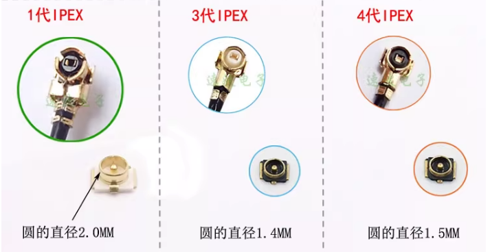

### 2.4 antenna: wifi, bluetooth

for sticking inside of enclosure
https://www.electrodragon.com/product/2-4g-soft-fpc-pcb-antenna-ipx-rohs/

for remote-control toys
https://www.electrodragon.com/product/5pcs-2-4g-cable-type-antenna/

### GSM antenna

https://www.electrodragon.com/product/pcb-build-antenna-4g-gsm-3g-wcdma-gprs/

SMA antenna 3 Meters
https://www.electrodragon.com/product/gps-magenatic-active-external-antenna-3m/

SMA small-size antenna - 2PCs Quad-band Cellular GSM Antenna SMA 2Dbi
https://www.electrodragon.com/product/quad-band-cellular-duck-antenna-sma/

### RF antenna:

- common apps: LORA, NBIOT
- common bands: 315Mhz, 433MHz, 470Mhz, 490Mhz, 868MHz, 915MHz

spring coil antenna
https://www.electrodragon.com/product/spring-coil-antenna-433-mhz/

### GPS antenna

- [[antenna-dat]]

- [[antenna-ceramic-dat]]

large outdoor antenna
https://www.electrodragon.com/product/gsm-magenatic-external-antenan-3m-5dbi/

## tech 

### Bias-T (Bias Tee)

A Bias-T (Bias Tee) is an electronic component used in radio frequency (RF) applications, like antennas, to supply DC power to devices while allowing RF signals to pass through. It's typically used to power active antenna components, such as low-noise amplifiers (LNAs), without the need for separate power cables.

A Bias-T consists of three ports:

- RF port: Where the radio signal passes without DC.
- DC port: Where the power supply is connected.
- RF+DC port: Where the combined signal (RF and DC) is outputted or inputted.

It works by using inductors and capacitors. The inductor blocks the RF signal but allows DC to pass, while the capacitor blocks DC but allows the RF signal to pass. This way, the antenna can operate without interference from the power supply.

## Antenna on PCB reference design 

Therefore, the layout of the module antenna location and routing is recommended as follows:
1. Place the antenna on the edge (corner) of the PCB. 
2. Make sure that there is no signal line or copper foil in each layer below the antenna. 
3. It is best to hollow out the antenna position in the following figure to ensure that the S11 of themoduleisminimally affected.

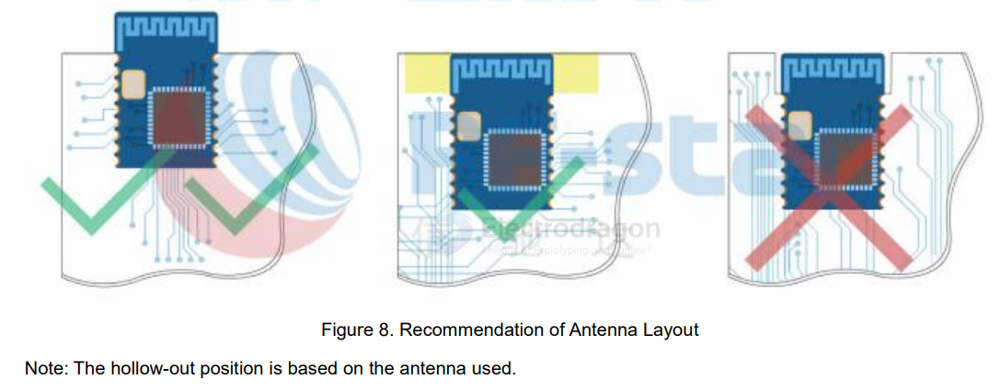

## impedence matching chipset 

BAL-NRF01D3

50 ohm balun transformer for 2G45 ISM matched Nordic’s chipset: nRF24LE1 QFN

- [[BAL-NRF01D3.PDF]]

## antanna installation 

- [[antenna-spring-dat]]

better NO PCB under the antenna 

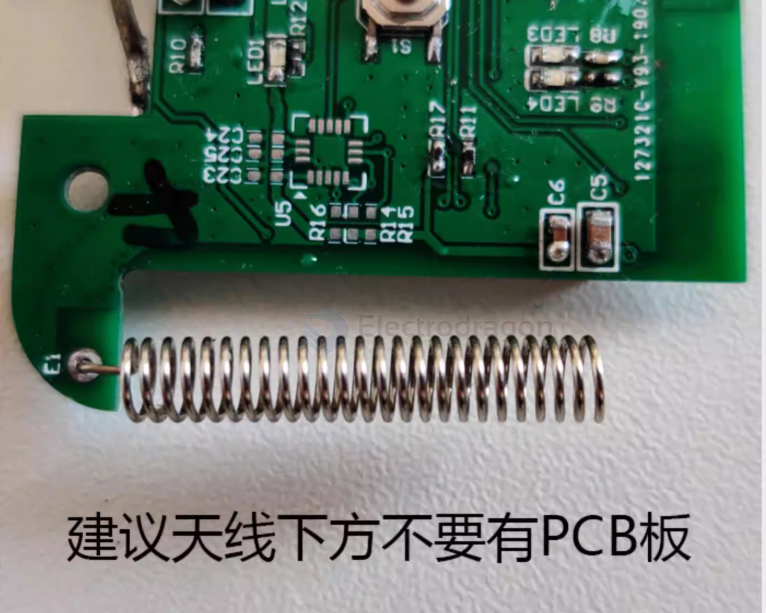

## external antenan 

- [[anteann-external-dat]]

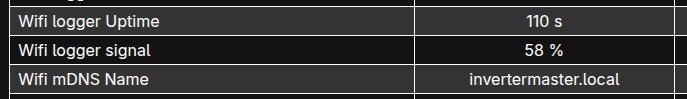

- [[antenan-PCB-dat]]

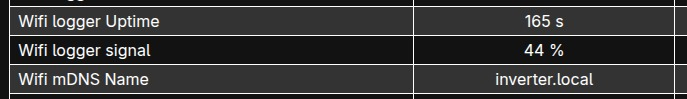

## multiple frequencies 

2.4G wifi + 5G wifi + 4G LTE / 8DBi / box-style

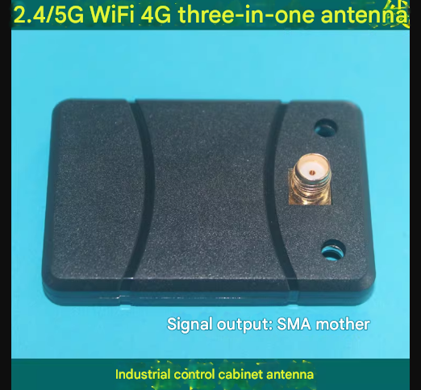

## dBi gain

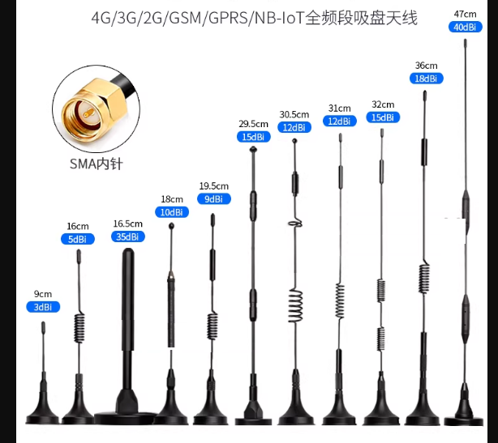

- [[GSM-dat]] - [[antenna-dat]]

## inside of the antenna 

copper tube oscillator 

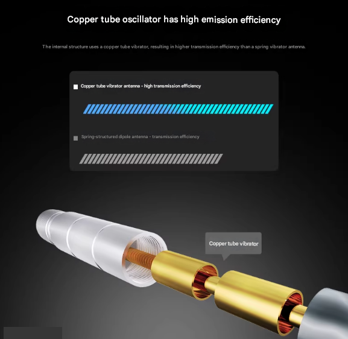

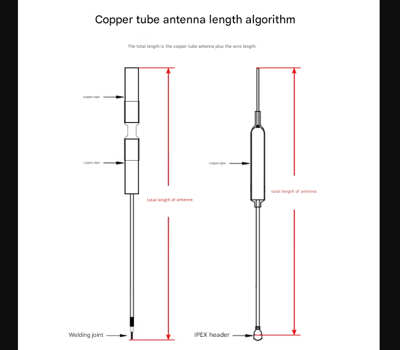

## antenna examples == high gain 

see more high gain antennna at [[antenna-wifi-dat]]

- [[antenna-FPC-dat]] - 12DBI 

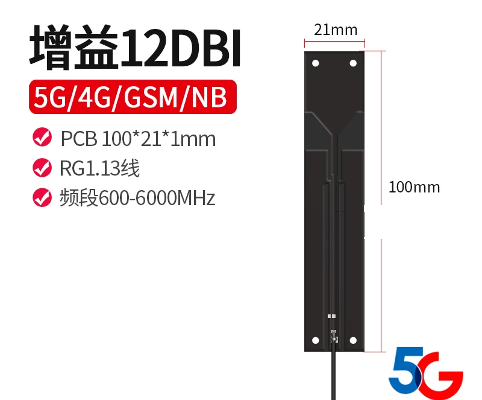

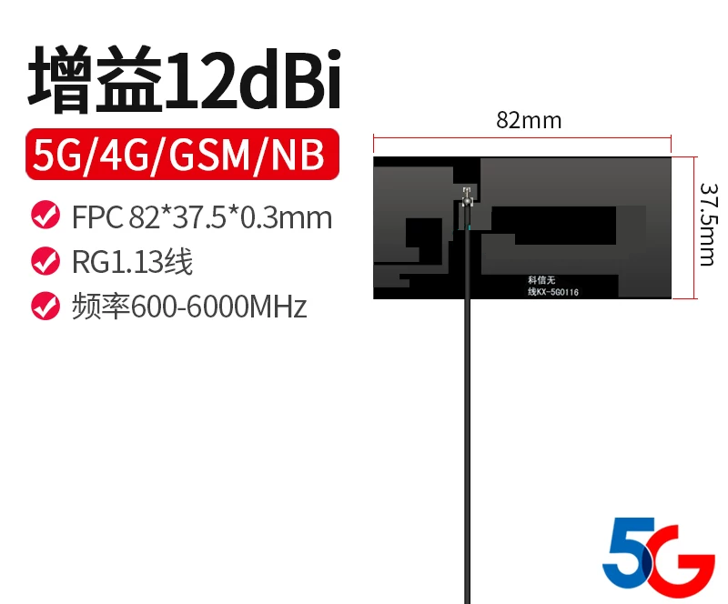

- [[antenna-Whip-dat]] - 12DBI 

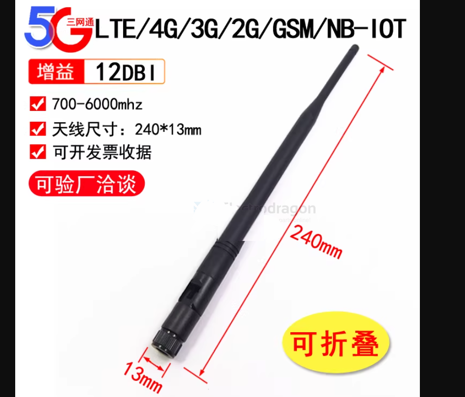

## ref

- [[M2M-dat]]

- [[antenna]]
