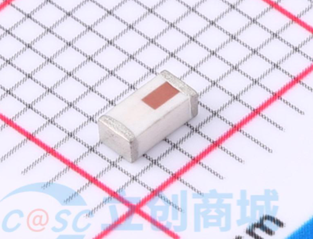

# antenna-dat

- [[antenna-type-dat]] - [[antenna-design-dat]]

type of antennas by shape == [[antenna-T-dat]] - [[antenna-Whip-dat]]

type of antennas by power == [[antenna-active-dat]] - [[antenna-passive-dat]]

type of antennas by frequency == [[antenna-location-dat]] - [[antenna-GNSS-dat]] - [[GSM-antenna-GPS-dat]] - [[antenna-RF-dat]] - [[antenna-2.4G-dat]]

type of antennas by connector == [[antenna-SMA-dat]] - [[antenna-IPEX-dat]] - [[antenna-UFL-dat]]

- [[3in1-antenna-dat]]

- [[antenna-lolipop-dat]]

# Antenna Comparison Table

| Feature                     | T-style Dipole Antenna                       | Whip Antenna (Monopole)                      |
|----------------------------|----------------------------------------------|---------------------------------------------|
| 📡 Type                    | Balanced dipole                              | Unbalanced monopole                         |
| 🔁 Radiation Pattern        | Omnidirectional in horizontal plane          | Omnidirectional but affected by mounting    |
| 📶 Signal Consistency       | More consistent in various orientations      | More directional; weaker at steep angles    |
| 📏 Range (Typical)          | Longer due to better polarization            | Shorter range in practice                   |
| ⚖️ Weight & Size           | Slightly heavier and bulkier                 | Lightweight and compact                     |
| 🔧 Installation             | Requires proper horizontal placement         | Very easy to install                        |
| 🛠️ Use Case Examples       | Ground/air modules, telemetry (RC, FPV)      | Tight spaces, onboard modules               |
| ⚡ Interference Resistance  | Better (less affected by ground plane)       | More sensitive to surrounding materials     |
| 🔌 Connector Type           | U.FL (same as whip)                          | U.FL                                        |

✅ Summary:
- Choose the **T-style Dipole** if you need better range and signal reliability across various orientations.
- Choose the **Whip Antenna** if space and weight are limited, and installation simplicity is a priority.

antenna connectors - [[ufl-dat]] - [[ipdex-dat]] - [[SMA-dat]]

SMA 

- Amphenol SMA6251A1-3GT50G-50

- [[antenna-location-dat]]

GSM
- [[NAN1003-dat]] - [[NAN1008-dat]]

SMA to IPEX converter cable 
- [[NAN1005-dat]]
  

- [[antenna-design-dat]]

## antenna shape, size and gain 

| type     | rod                          | paddle                       |
| -------- | ---------------------------- | ---------------------------- |
| style    |  |  |
| gain     | 2dbi                         | 8dbi                         |
| Features | -                            | foldable                     |

## Connection Type 

- Wire or Pin Soldering
- u.FL IPEX  - [[ipex-dat]]
- SMA inner-hole or inner-pin

该SMT型同轴带开关连接器

swtich connector - ECT ECT818011998 - datasheet [[ECT-ECT818011998_C437250.pdf]]

### 2.4 antenna: wifi, bluetooth

for sticking inside of enclosure
https://www.electrodragon.com/product/2-4g-soft-fpc-pcb-antenna-ipx-rohs/

for remote-control toys
https://www.electrodragon.com/product/5pcs-2-4g-cable-type-antenna/

### GSM antenna

https://www.electrodragon.com/product/pcb-build-antenna-4g-gsm-3g-wcdma-gprs/

SMA antenna 3 Meters
https://www.electrodragon.com/product/gps-magenatic-active-external-antenna-3m/

SMA small-size antenna - 2PCs Quad-band Cellular GSM Antenna SMA 2Dbi
https://www.electrodragon.com/product/quad-band-cellular-duck-antenna-sma/

### RF antenna:

- common apps: LORA, NBIOT
- common bands: 315Mhz, 433MHz, 470Mhz, 490Mhz, 868MHz, 915MHz

spring coil antenna
https://www.electrodragon.com/product/spring-coil-antenna-433-mhz/

### GPS antenna

- [[antenna-dat]]

- [[antenna-ceramic-dat]]

large outdoor antenna
https://www.electrodragon.com/product/gsm-magenatic-external-antenan-3m-5dbi/

## tech 

### Bias-T (Bias Tee)

A Bias-T (Bias Tee) is an electronic component used in radio frequency (RF) applications, like antennas, to supply DC power to devices while allowing RF signals to pass through. It's typically used to power active antenna components, such as low-noise amplifiers (LNAs), without the need for separate power cables.

A Bias-T consists of three ports:

- RF port: Where the radio signal passes without DC.
- DC port: Where the power supply is connected.
- RF+DC port: Where the combined signal (RF and DC) is outputted or inputted.

It works by using inductors and capacitors. The inductor blocks the RF signal but allows DC to pass, while the capacitor blocks DC but allows the RF signal to pass. This way, the antenna can operate without interference from the power supply.

## Antenna on PCB reference design 

Therefore, the layout of the module antenna location and routing is recommended as follows:
1. Place the antenna on the edge (corner) of the PCB. 
2. Make sure that there is no signal line or copper foil in each layer below the antenna. 
3. It is best to hollow out the antenna position in the following figure to ensure that the S11 of themoduleisminimally affected.

## ceramic antenna 

## impedence matching chipset 

BAL-NRF01D3

50 ohm balun transformer for 2G45 ISM matched Nordic’s chipset: nRF24LE1 QFN

- [[BAL-NRF01D3.PDF]]

## ref

- [[M2M-dat]]

- [[antenna]]
