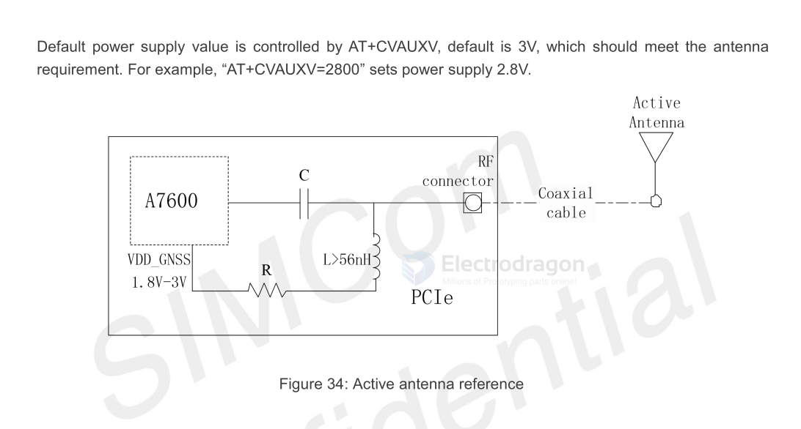
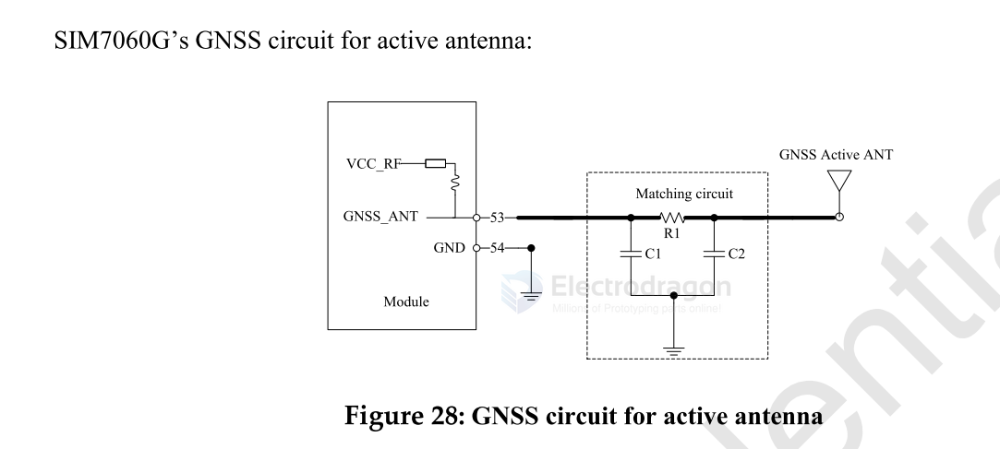
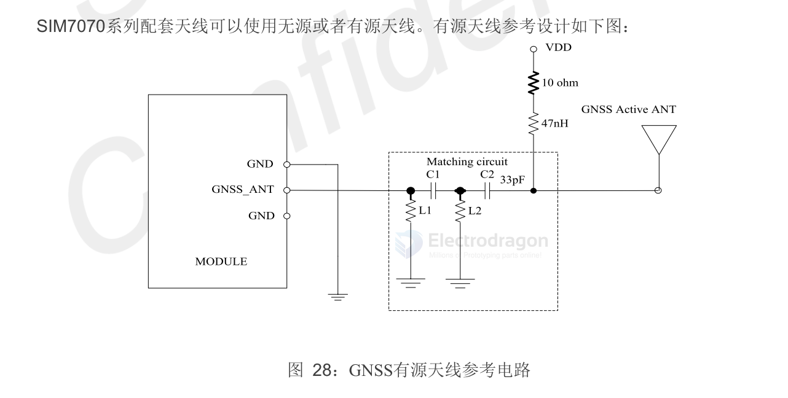

# antenna-active-dat

- [[antenna-active-dat]] - [[circuits-dat]] - [[LC-circuits-dat]] - [[bias-T-dat]] - [[gain-shaping-dat]] - [[LNA-dat]]

- [[antenna-location-dat]] - [[antenna-GNSS-dat]]

- [[antenna-active-amplifier-dat]] - [[MAX2659-dat]]

## Active Antenna for GNSS - [[A7670-dat]]

GNSS active antenna design is default solution. 

Passive GNSS antenna Note: 

Strongly suggest to cut off GNSS active antenna supply by AT+CVAUXS=0, if customer design is passive antenna for GNSS.

### VDD_GNSS 

Default power supply value is controlled by AT+CVAUXV, default is 3V, which should meet the antenna
requirement. For example, “AT+CVAUXV=2800” sets power supply 2.8V.

    AT+CVAUXV Set voltage value of the pin named VDD_AUX

    This command is used to set the voltage value of the pin which is named VDD_AUX.

## Active Antenna [[SIM7060-dat]]

## Active Antenna [[SIM7070-dat]] - [[SIM7080-dat]]

In the matching circuit of Figure 27:

- L1 and L2 are not populated by default.
- C1 is populated with a 0 Ohm resistor by default; the specific value will be provided by the antenna manufacturer after antenna tuning is complete.
- C2 is populated with a 33pF capacitor by default, which serves as a **DC blocking capacitor**. - [[capacitor-dat]]
- 
The VDD power supply for the active antenna needs to match the active antenna being used. 

It is recommended that customers use an LDO/DCDC converter to power the active antenna. This way, when the GNSS function is not in use, the LDO/DCDC can be turned off to reduce current consumption. - [[LDO-dat]]

## Boards 

- [[A7670-dat]] - [[SIM7600-dat]]

## ref 

- [[inductor-dat]]