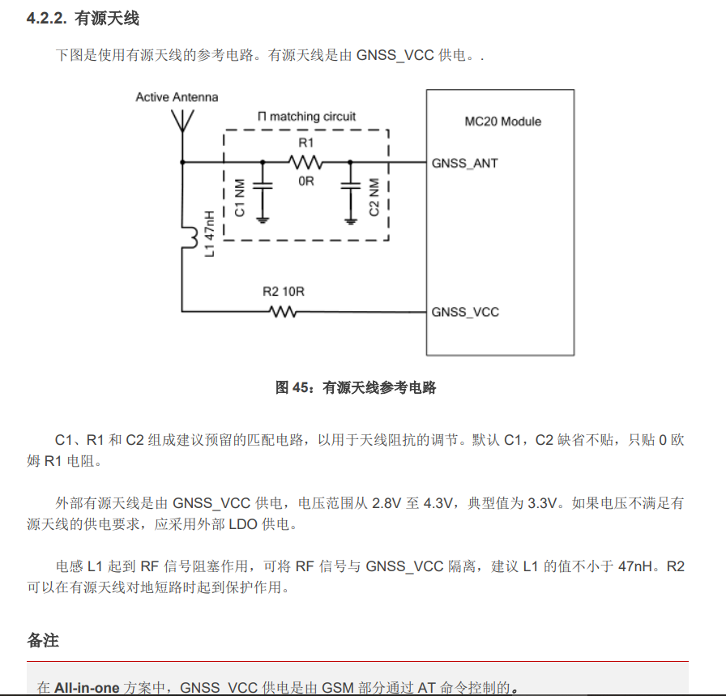

## active antenna 

C1 = 0R

C2 默认贴 33PF，是隔直电容。

RC = 10r / 47nH

有源天线供电 VDD 需和应用的有源天线匹配，且推荐客户使用 LDO/DCDC 给有源天线供电，这样在不使用 GNSS 功能时，可以通过关闭 LDO/DCDC 来达到减小耗流的作用。 

## MC20

## L76 

- [[L76-dat]]

## ref 