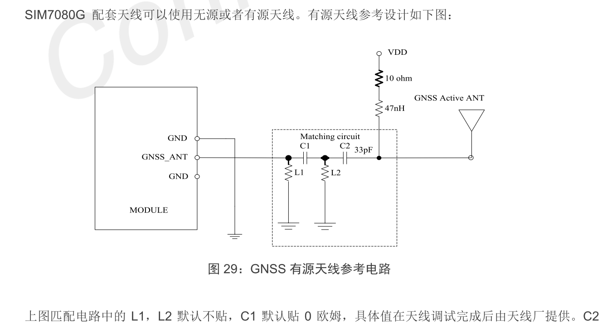
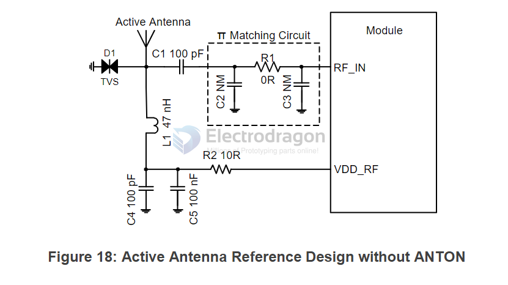

## active antenna 

- A passive antenna is recommended if the antenna can be placed close to the modules, for instance, when the distance between the modules and the antenna is less than 1 m. 
- Otherwise, use an active antenna, since the insertion loss of RF cable can decrease the CNR of GNSS signal.

## examples 

C1 = 0R

C2 默认贴 33PF，是隔直电容。

RC = 10r / 47nH

有源天线供电 VDD 需和应用的有源天线匹配，且推荐客户使用 LDO/DCDC 给有源天线供电，这样在不使用 GNSS 功能时，可以通过关闭 LDO/DCDC 来达到减小耗流的作用。 

外部有源天线是由GNSS_VCC供电，电压范围从2.8V至4.3V，典型值为3.3V。

## MC20

## L76 

- [[L76-dat]]

- [[inductor-dat]]

## ref 