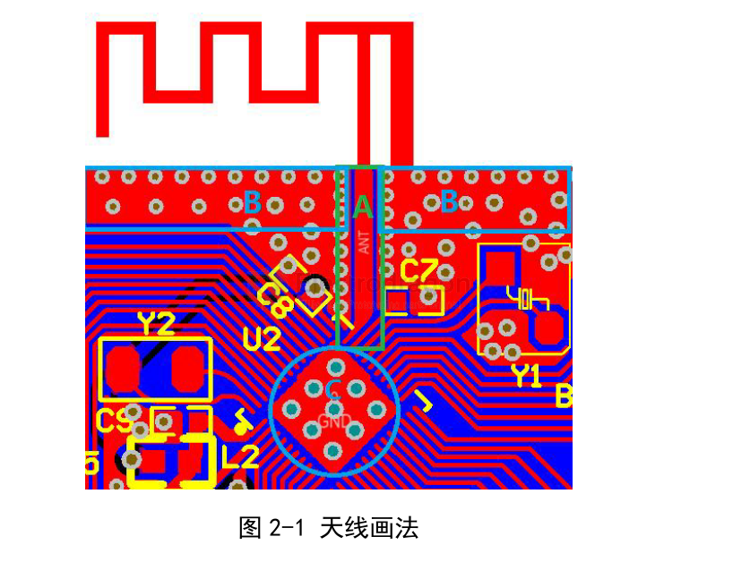
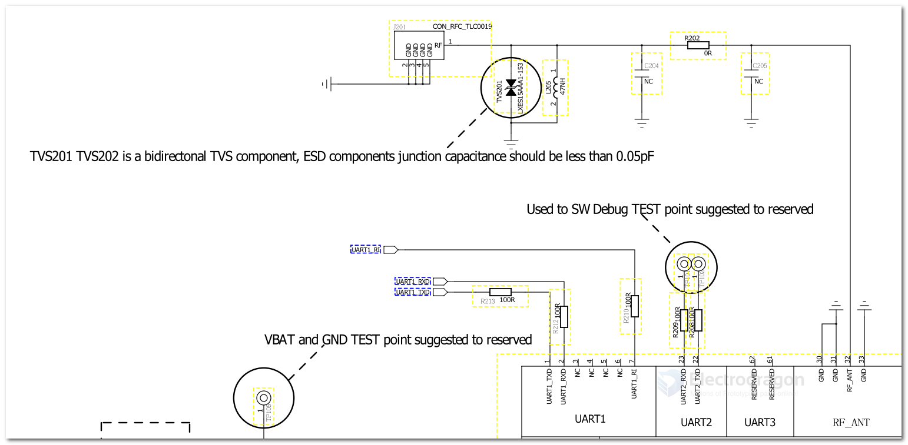

# antenna-design-dat

1.芯片引脚至天线馈点（上图 A 处区域）走线需进行 50 欧阻抗匹配。计数因子会涉及 A 区域走线宽度、A 与 B 的间距、板厚、板材介电常数、铜厚、绿油厚度等参量。 
2.上图 B 处区域是共面参考地，此区域要尽量保障足够面积和地孔数量。 
3.芯片底部接地焊盘（上图 C 处区域），在制造工艺允许下保障良好接地和散热（多地孔）。 
4.射频部分需要远离干扰源，如晶体、功率器件，开关电源等。 

图 2-1 为我司评估板天线样式，PCB 板厚 1.6mm，天线尺寸详情请联系我司技术提供。 

## RF antenna 

- [[GPS-antenna-design-dat]] 