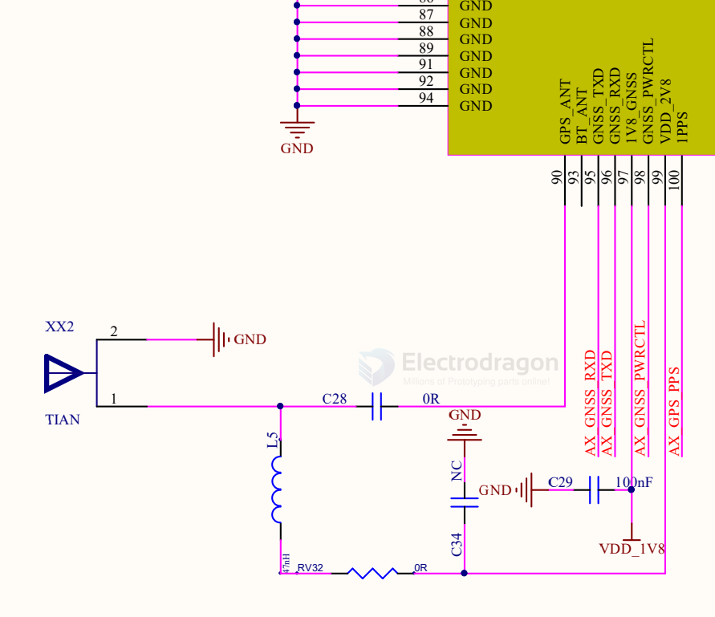

# antenna-GNSS-dat.md

- [[antenna-GNSS-dat]] - [[CONN-SMA-dat]] - [[CONN-IPEX-dat]]

## product 

- [[NAN1001-dat]]

## info 

GNSS antenna are commonly using [[antenna-active-dat]]

GNSS antenna of [[A7670-dat]]

## GNSS recommanded antenna specifications 

passive 

- Frequency Range: 1559–1609 MHz 
- Polarization: RHCP 
- VSWR: < 2 (Typ.) 
- Passive Antenna Gain: > 0 dBi

active 

- Frequency Range: 1559–1609 MHz 
- Polarization: RHCP 
- VSWR: < 2 (Typ.) 
- Passive Antenna Gain: > 0 dBi 
- Active Antenna Noise Figure: < 1.5 dB 
- Active Antenna Total Gain: < 18 d

表 28：GNSS 频率

| type             | frequencies     | units |
| ---------------- | --------------- | ----- |
| GPS/Galileo/QZSS | 1575.42 ±1.023  | MHz   |
| GLONASS          | 1597.5~1605.8   | MHz   |
| BeiDou           | 1561.098 ±2.046 | MHz   |

## ref 

- [[antenna-dat]]

