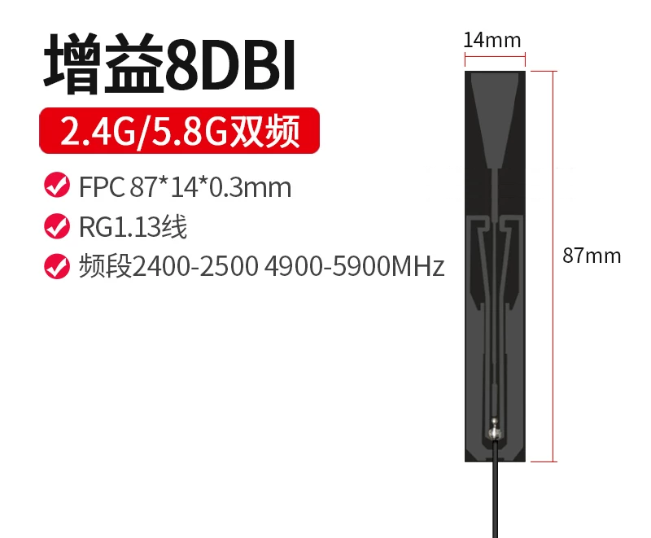
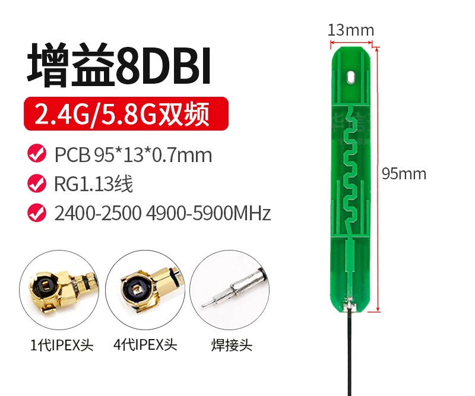
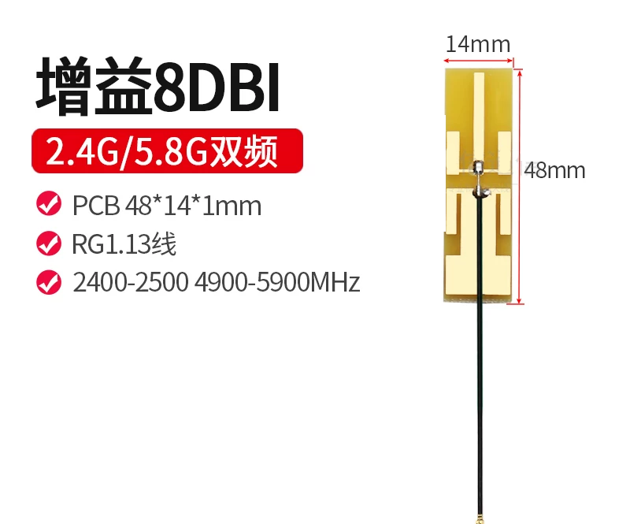
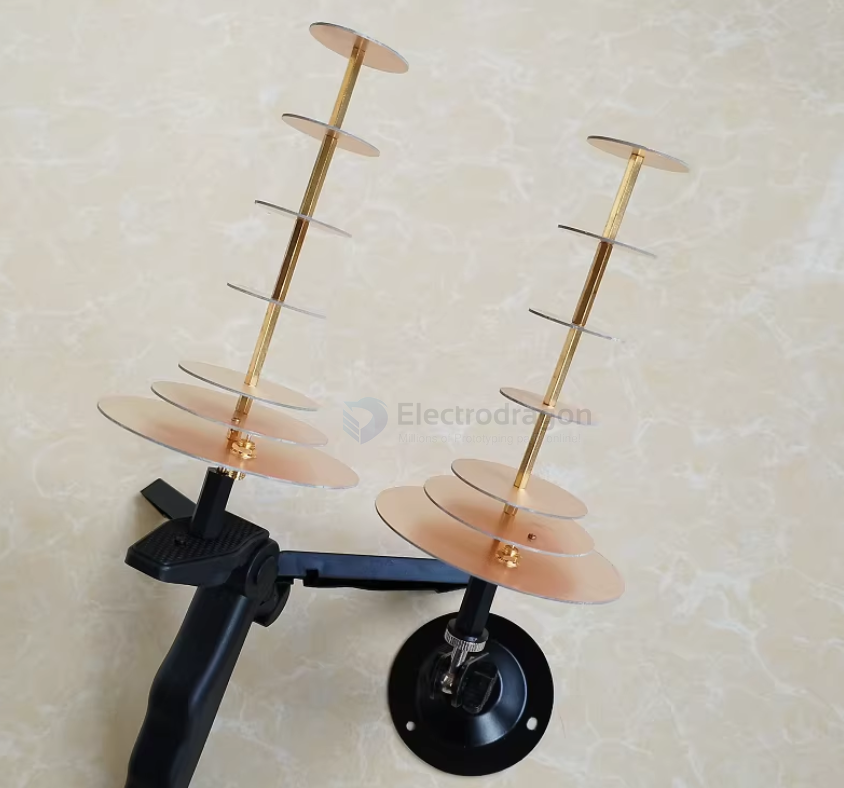
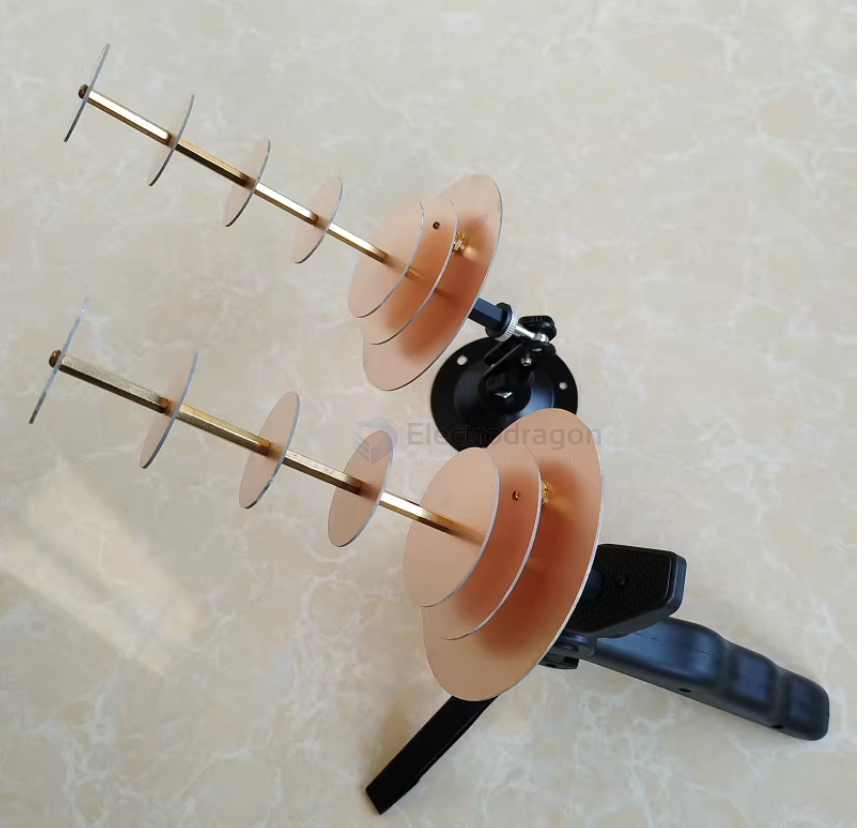
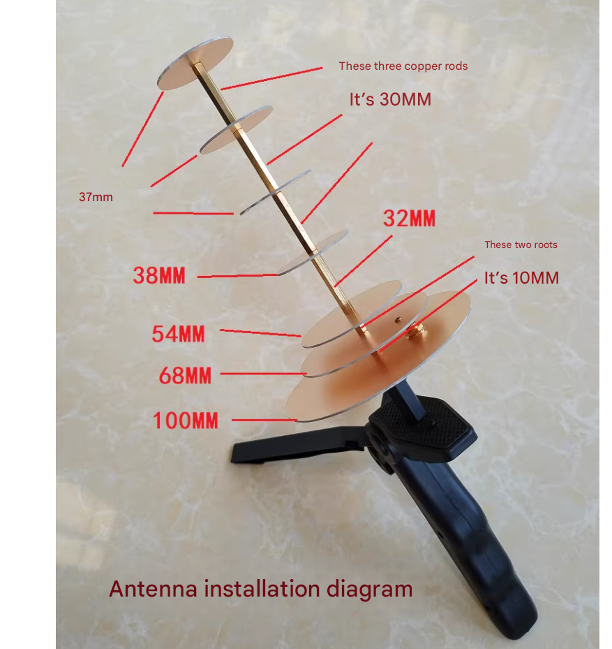
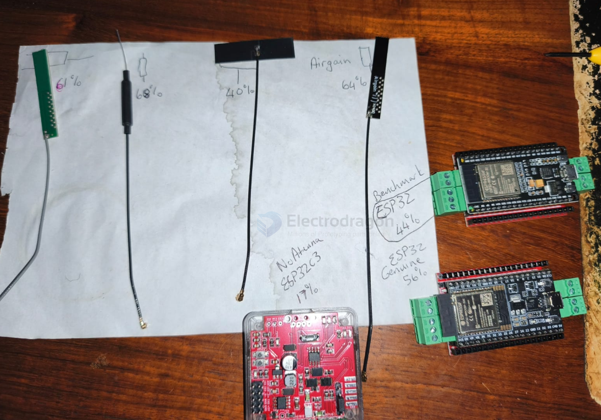

# antenna-wifi-dat

- [[antenna-dat]] - [[wifi-dat]] - [[antenna-wifi-dat]]

## high gain anntenna 

efficient high gain 8DBI wifi antenna 

## rank 

12dBi WIFI

When used with a repeater, a Wi-Fi antenna can connect to a desktop computer and can also be used with a phone. However, you need to know the router password and configure settings on the phone. 

It should not be too far from the router, generally no more than 3 meters. You can also connect directly to the router with an Ethernet cable. 

In obstacle-free conditions, the transmission distance can reach 200–300 meters. 

In other words, the receiving distance is short, while the transmitting distance is long.

When used with a USB Wi-Fi adapter, a Wi-Fi antenna is suitable for laptops or desktop computers (not suitable for phones) and can receive Wi-Fi signals over long distances. In obstacle-free conditions, the range can reach 200–300 meters.

## demo and references 

https://x.com/i/status/2025020047861723433

[[wifi-antenna-1.mp4]]

## user test antenna result 

## ref 

- [[antenna-dat]] - [[wifi-dat]] - [[antenna-wifi-dat]]

- [[antenna]] - [[wifi]] - [[antenna-wifi]]