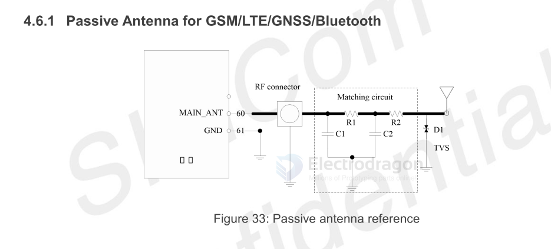

# antenna-passive-dat

Passive Antenna for GSM/LTE/GNSS/Bluetooth

In above figure, the component R1/R2/C1/C2 is reserved for antenna matching, the value of components
can only be got after the antenna tuning, usually provided by the antenna factory. 

Among them, R1 and R2 paste 0Ω, C1 and C2 do not paste by default. 

The component D1 is a Bidirectional ESD Protection device, which is suggested to add to protection circuit, the recommended Part Numbers of the TVS are listed in the following table:

0201 CE0201S05G01R SOCAY

0402 PESD0402-03 PRISEMI