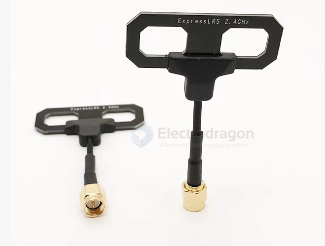
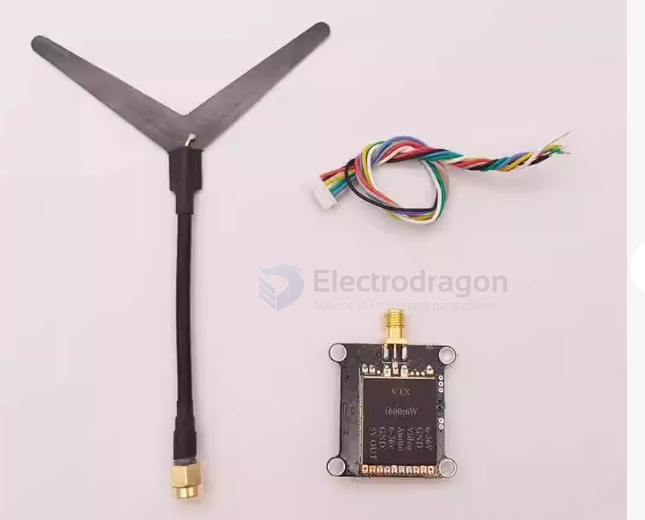
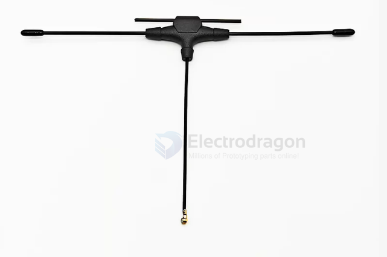

# antenna-dipole-dat

- [[antenna-dat]] - [[antenna-linear-dat]] - [[antenna-dipole-dat]]

- [[ELRS-TX-dat]] - [[antenna-dipole-dat]]

## Sleeve Dipole

- 频率(MHz):2400.0
- 效率(dBi):-2.94
- 增益(dBi):4.18
- 效率(%):50.77
- 方向性(dB):7.12
- 峰值增益位置(Theta):0.00
- 峰值增益位置(Phi):270.00
- 重量(克):5.83
- 长(mm)*宽(mm):69*45

**T-dipole / T-style dipole** • Note: most commonly used (FPV/RC circles) **"T" antenna** • Note: colloquial name **Sleeve dipole** • Note: technical name — describes a "T-shaped dipole made from coaxial cable" **Coaxial dipole** • Note: equivalent technical name **Half-wave dipole** • Note: name of the underlying principle

(The TBS Immortal T you know is the classic commercial version of the T-dipole)

🔬 Structural anatomy (how this antenna is built)

        ┌──────┬──────┐
        │upper │lower │   ← T-shaped radiator (two 1/4-wavelength arms)
        └──────┴──────┘
               │
        coaxial cable (feed line)
               │
          SMA connector

Construction principle (Sleeve Dipole):
1. The center conductor of the coax extends out = one arm
2. The cable's shield folds back (the sleeve) = the other arm
3. Total length of both arms = half wavelength, feed point at the center → forms a T shape

The type in your picture (dual-loop PCB version):
- Uses a PCB to etch a double rectangular loop structure (Moxon variant)
- ✅ Advantages: wider bandwidth (covers the entire 2.4G band), rigid structure that won't deform

📐 Working principle

**Polarization**
• Note: linear (the electric field runs along the axis of the element)

**Radiation pattern**
• Note: donut shape 🍩 — strongest perpendicular to the element; zero (null) along the element's axis

**Gain**
• Note: ~2 dBi (an ideal dipole is 2.15 dBi)

**Directivity**
• Note: omnidirectional (360° in the plane perpendicular to the element)

⭐️ What the donut pattern means in practice:
Antenna held vertically → strongest signal all around horizontally ✅
                       → straight above / straight below is the "null" (weakest signal) ⚠️

(So when the RC antenna is held vertically, the signal is actually weak when the aircraft is directly overhead)

📏 Dimensions (calculated by frequency)

**2.4GHz (ELRS)**
• 1/4 wavelength (per arm): ≈ 31mm
• Total length (half wave): ≈ 62mm

**5.8GHz (video link)**
• 1/4 wavelength (per arm): ≈ 13mm
• Total length (half wave): ≈ 26mm

(So a 5.8G T antenna is tiny, while a 2.4G one is noticeably longer)

✅❌ Pros and cons

Pros:
- Light (a few grams) · cheap (¥10-40) · simple and reliable
- Omnidirectional (no aiming needed)
- High efficiency (theoretical dipole efficiency is close to 100%)
- Wideband (the dual-loop PCB version covers the entire 2.4G band)

Cons:
- Linear polarization → -3dB with circular-polarized goggles; aircraft attitude changes cause mismatch
- Axial null (weak signal straight above/below)
- Low gain (2dBi, not great for long range)

🎯 Its role in FPV

**RC receiver antennas (the pair you have)**
• Note: standard on ELRS/CRSF RX (2.4G)

**Video VTX antennas (5.8G micro quads)**
• Note: lightweight choice (weight saving on racers/micros)

**Radio (transmitter) antennas**
• Note: ELRS TX modules (SMA connector)

Why the RC link loves them:
- The RC link doesn't demand the extreme latency/range that video does
- ELRS has frequency hopping + diversity → the system's fault tolerance masks the weak point of linear polarization
- Light / cheap / reliable → no heartbreak when you crash it

📌 One-sentence summary

 T-dipole (Sleeve Dipole) = a half-wave dipole made from coaxial cable: linear polarization, omnidirectional (donut), 2dBi — the most classic RC antenna in the RC world (standard on ELRS), and a lightweight choice for micro-quad video links.

## antenna-Y 

Y Dipole
Shape: the feed line splits into two elements at the end (forming a Y / V shape)
Type: linear polarization (a dipole = linear polarization)
Directivity: omnidirectional (dipole radiation pattern)

## Antenna-T-dat

✅ Features (why micro quads love them)

- Light (less than half the weight of a mushroom antenna)
- Cheap (¥10-40)
- Omnidirectional (no aiming needed)
- High efficiency (linear-polarized dipoles radiate efficiently, around 98%)
- Commonly found on: micro quads / racers (where weight saving comes first)

- [[NAN1011-dat]] - [[antenna-dipole-dat]]

- **Type:** T-style Dipole Antenna (a.k.a. T-antenna)

- **Features:**
  - Balanced dipole configuration with horizontal arms.
  - Provides an omnidirectional radiation pattern in the horizontal plane.
  - Commonly used in:
    - RC aircraft telemetry
    - Ground modules
  - Benefits:
    - Better signal uniformity
    - Enhanced range and consistency
  - Appearance:
    - Red heat shrink tubing
    - Horizontally extended elements

## dual frequency - double T 

915mhz / 2.4Ghz

- [[antenna-tech-dat]] - [[antenna-dipole-dat]] / dual frequency - double T 

## ref 

