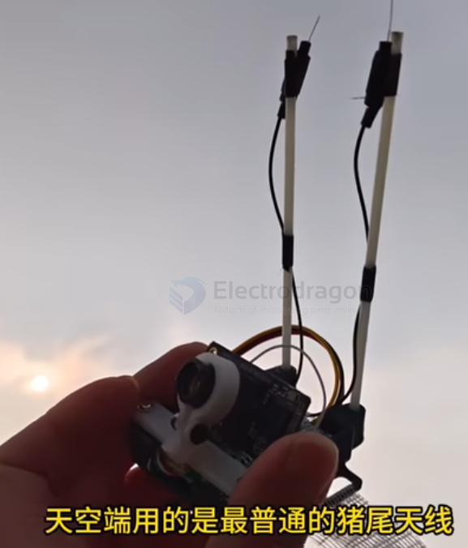

# antenna-linear-dat

- [[antenna-sword-dat]] - [[antenna-linear-dat]] - [[antenna-polarization-dat]] - [[antenna-dat]]

- [[antenna-linear-dat]] - [[anteann-linear-yagi-dat]] - [[antenna-T-dat]]

- [[antenna-dat]] Polarization == - [[antenna-RHCP-dat]] // [[antenna-patch-dat]] - [[antenna-linear-dat]] - [[antenna-polarization-dat]] - [[antenna-polarization-mixed-dat]] - [[antenna-helical-dat]] - [[antenna-lolipop-dat]]

type of antennas by shape == [[antenna-type-dat]] - [[antenna-T-dat]] - [[antenna-linear-dat]] - [[antenna-spring-dat]] 

## 双猪尾 天线

在 FPV（第一人称视角）无人机或图传系统中，**“天空端”**指的是搭载在无人机上的**图传发射端**（例如 DJI 晓、O3、Walksnail Avatar、各个开源模拟或数字图传的 VTX 等）。

而 **“猪尾天线”（Pigtail Antenna）** 则是指**带有一段柔软同轴电缆（线尾）的天线**，通常长这样：
* 一端是一个射频连接器（如 **IPEX / U.FL** 插头，用来直接卡扣在图传高频头上，或者 SMA / RP-SMA 螺纹头）；
* 中间是一段细软的高频射频同轴线（线缆）；
* 另一端连接着天线本体（如棒状胶棒、蘑菇头、棒状全向天线等）。

### 为什么说“用的是最普通的猪尾天线”？
这句话通常带有一定的**调侃、无奈或“凑合着用”**的意味，具体含义如下：

1. **结构廉价且常见：** 
   它不是那种直接焊接在 PCB 上的硬质天线，也不是昂贵的专业定制高增益天线，而是市面上几块钱、十几十块钱一把、随处可买的“大众货”。
2. **机械缓冲作用（猪尾巴的本意）：** 
   因为带有软线，当无人机发生炸机、碰撞时，天线受到撞击可以随之弯曲、缓冲，不容易直接把图传模块上的高频接口（如脆弱的 IPEX 座子）给扯断或撕裂。
3. **性能平平：** 
   “最普通”意味着它的增益（Gain）、驻波比（VSWR）和方向性表现中规中矩，没有针对极端远距离或复杂多路径干扰（Multipath Interference）做过特殊优化。

### 总结场景
如果在讨论图传信号不好、距离近、或者画面有雪花/卡顿时，别人说“天空端用的是最普通的猪尾天线”，潜台词通常是：
> **“当前的图传天线配置很基础、很凑合，可能是导致信号不佳、穿透力弱或者容易受干扰的短板，建议升级换成好一点的定向/高增益天线或原厂优质天线。”**

## ref 

- [[antenna-dat]]