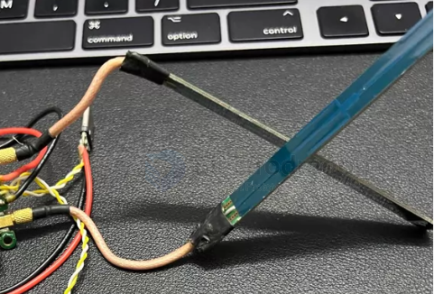

# antenna-sword-dat

- [[antenna-sword-dat]] - [[antenna-linear-dat]] - [[antenna-polarization-dat]] - [[antenna-dat]]

**5.8G Sword Antenna (剑型天线)** refers to a flat, narrow, blade- or sword-shaped **PCB (Printed Circuit Board) antenna** commonly used in FPV (First Person View) drones, remote-controlled aircraft, and wireless video transmission (VTX/VRX) systems. 

Here are its key characteristics and applications:

### 1. Design and Structure
* **PCB Construction:** The antenna pattern is etched directly onto a high-frequency circuit board, typically enclosed in a durable plastic housing or heat-shrink tubing, giving it a flat, long, "sword-like" profile.
* **Low Aerodynamic Drag:** Unlike traditional "mushroom" (circularly polarized) antennas, sword antennas have a very low wind profile, making them ideal for mounting flush against drone frames or arms.

### 2. Key Characteristics & Use Cases
* **Frequency Band (5.8 GHz):** Tuned specifically for the 5.8 GHz frequency band used by modern analog and digital FPV systems (such as DJI, Walksnail, or HDZero).
* **Gain and Directivity:** Many sword antennas are designed with specific directional or high-gain characteristics. When used on receiving stations (like ground stations, VRX modules, or goggles), they focus reception toward the flying direction to extend range and reduce signal dropouts.
* **Durability:** Without fragile stems or exposed lobes found on traditional mushroom antennas, sword antennas tend to survive crashes and impacts much better.

## ref 

