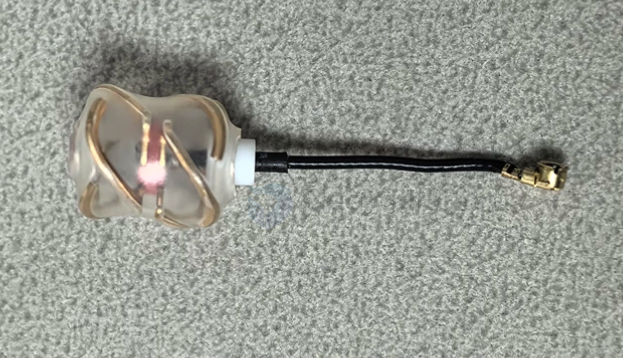
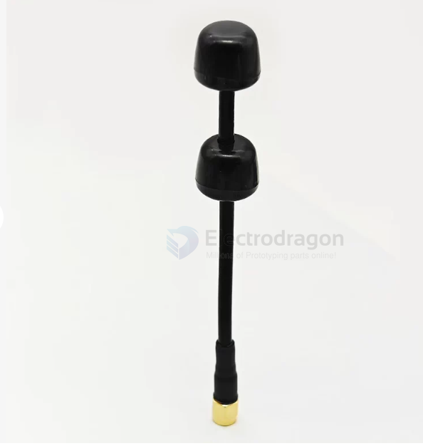
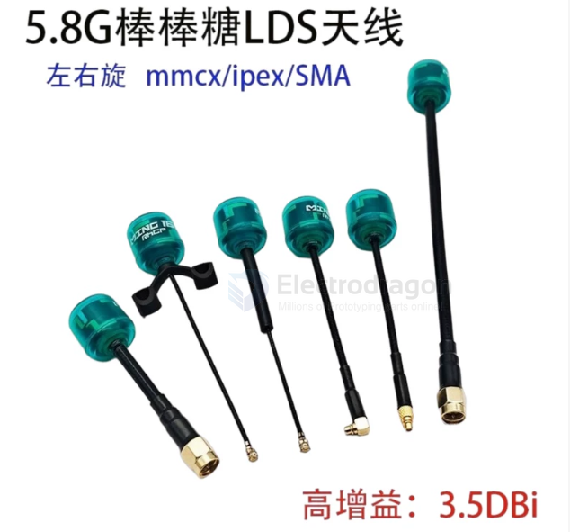
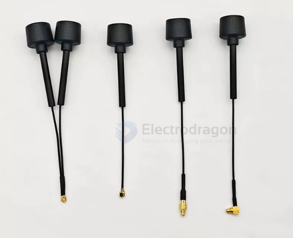
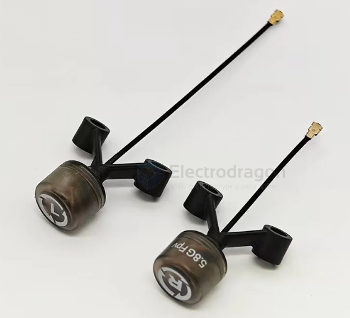

# antenna-lolipop-dat

- [[antenna-linear-dat]]

- [[antenna-polarization-mixed-dat]] - [[antenna-helical-dat]] - [[antenna-lolipop-dat]]

- [[CONN-SMA-dat]]

## lolipop inside 

## tech 

1️⃣ LDS = Laser Direct Structuring（激光直接成型） —— 一种制造工艺

"LDS"在国内 FPV 天线里算中高端工艺标签。

**3D 形状**  • 说明: 能贴曲面/复杂结构（不止平面）  **精度高**  • 说明: 激光定位 0.1mm 级

## double lolipop 

5dbi ~ 6dbi  

## high gain 3.5 dbi 

## info 

mushroom + lolipop == 3dbi 

"蘑菇 / 棒棒糖"的经典设计 = 圆极化天线：

- 蘑菇（Mushroom） = Skew Planar Wheel / Cloverleaf 类 → 多个倾斜叶片（相差 90°）→ 圆极化 ✅
- 棒棒糖（Lollipop） = Foxeer 的商品名，同为圆极化（有 RHCP / LHCP 版本）✅

棒状（直杆 dipole）→ 线极化（一根直振子）
蘑菇（花瓣状）      → 圆极化（多个倾斜叶片交错）

- 数字图传用左旋
- 模拟图传用右旋
- 频率范围/FrequencyBand:5.6-6.0GHz
- 输入阻抗/Impedance:50 ohm
- 驻波比/Vswr:2.0
- 极化方式/Polarization:线极化/linear
- 天线形式/StructuralStyle:偶极子/Dipole
- 方向性/RadiationPattern:全向性/Omni-Directional
- 增益/Gain:3dBi
- 连接器/Connector:ipex1/MMCX
- 线缆/Cable:RF-1.13/1.37
- 工作温度/OperationalTemperature:-40C~85C
- 储存温度/StorageTemperature:-30C~60C

## with installation hole 

- [[installation-antenna-dat]] - [[antenna-lolipop-dat]]

## ref 

