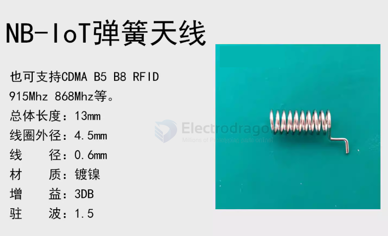
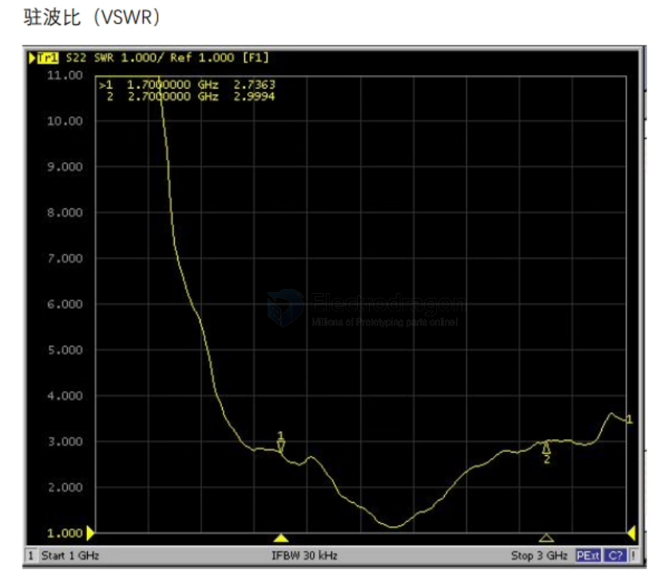
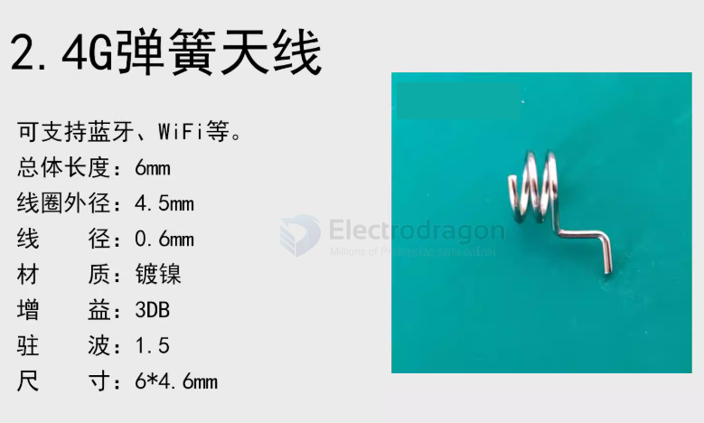

# antenna-spring-dat

- spring coil antenna 

- [[VSWR-dat]] - [[bands-dat]] - [[frequency-dat]]

- [[antenna-dat]]

## products 

- [[NAN1013-dat]]

## types 

433 

433M弹簧天线
总体长度：28mm线圈外径：4.6mm
线径：0.6mm
材质：不锈钢镀镍
增益：3DB（比铜材更抗氧化抗腐蚀）
驻波：1.5
尺寸：28*4.6mm

470 490 mhz == lora 

915 868 mhz == lora 

### 2200mhz 

### 900 + 1800 

- [[2G-dat]] - [[NBIOT-dat]] - [[GPRS-dat]]

### 2400 mhz 

## installation 

2400 installation 

- [[NAN1013-dat]]