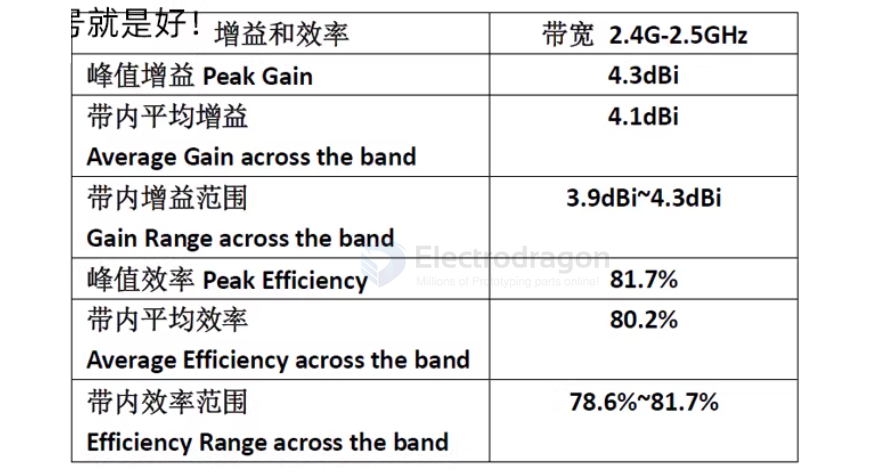
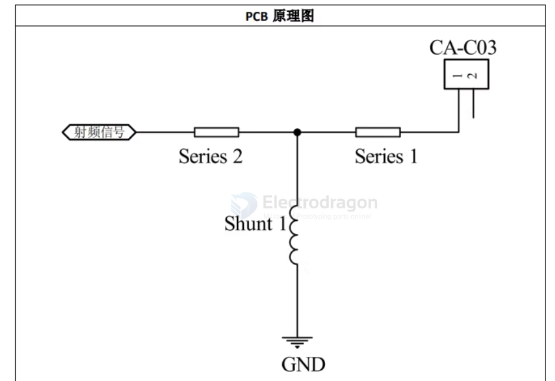
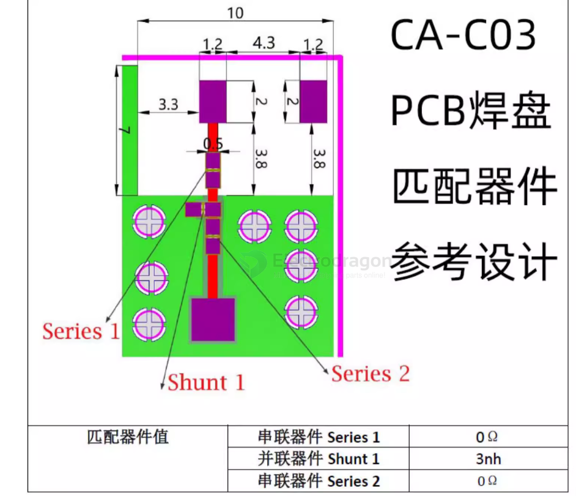
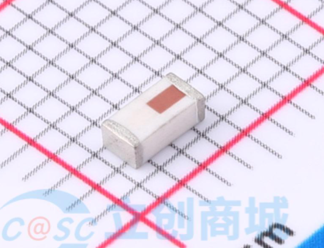
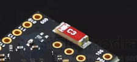
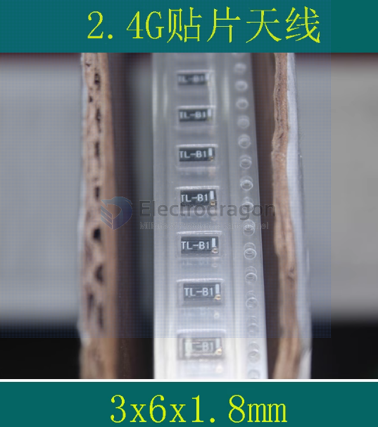
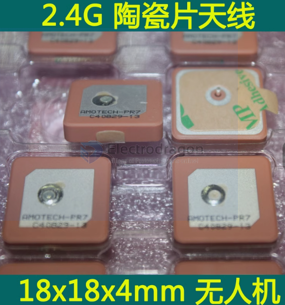

# antenna-ceramic-dat

normally gain == 4DBI 

- [[antenna-SMD-dat]] - [[antenna-PCB-dat]] - [[antenna-ceramic-dat]]

## ceramic antenna 

ceramic mini antenna
https://www.electrodragon.com/product/gps-ceramic-antenna-build/

7000AT18A1600E-AEC

JOHANSON(约翰逊)

## ceramic onboard antenna 

## PCB antenna 

## ref 

- [[antenna-dat]]