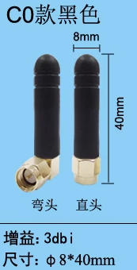
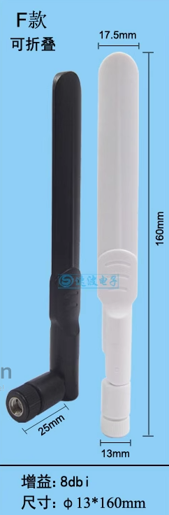

# antenna-whip-dat

type of antennas by shape == [[antenna-type-dat]] - [[antenna-T-dat]] - [[antenna-Whip-dat]] - [[antenna-spring-dat]] 

== antenna rod 

- **Type:** Whip Antenna (Monopole)

- **Features:**
  - Single element design (simpler than dipole)
  - Compact and lightweight
  - Commonly used in:
    - Receiver modules
    - Transmitters where space is limited
  - Benefits:
    - Easy to install
    - Cost-effective
  - Appearance:
    - Slim vertical rod inside heat shrink tubing

## antenna shape, size and gain 

| type     | rod                          | paddle                       |
| -------- | ---------------------------- | ---------------------------- |
| style    |  |  |
| gain     | 2dbi                         | 8dbi                         |
| Features | -                            | foldable                     |

## ref 

- [[antenna-dat]]