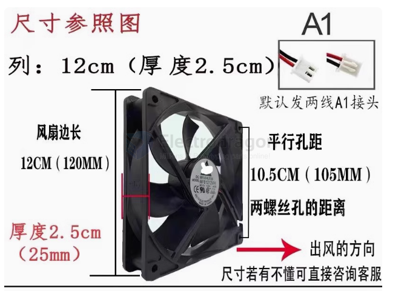
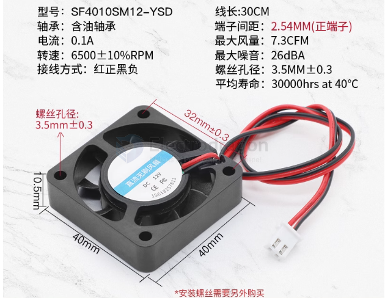
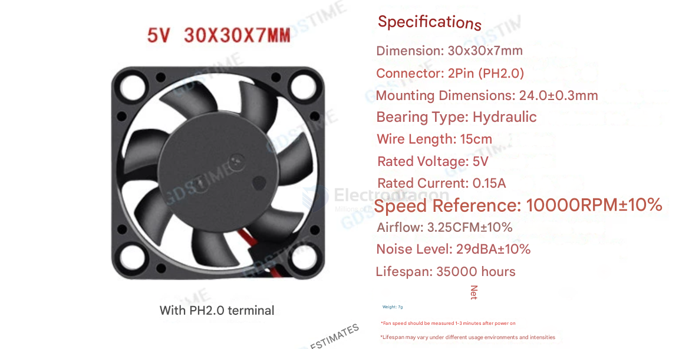

# fan-dat

## apps 

- [[hot-air-station-dat]]

## small fan control 

- [[RPI-CM4-expansion-board-dat]]

- [[microchip-dat]]

### Summary of PC Case Fan Types Based on Wiring

- **2-Pin Fans**: Fixed-speed fans without monitoring or control features. Used in basic or low-cooling scenarios and is the most affordable option.

- **3-Pin Fans**: Basic control via voltage adjustment; supports speed monitoring but lacks precise control. Cost-effective, suitable for budget setups.
  
- **4-Pin Fans**: Includes PWM for precise speed control; widely supported by modern motherboards, allowing automatic speed adjustments based on temperature.

- **6-Pin and Multi-Pin Fans**: Found in high-end or RGB fans; includes additional lines for RGB control and advanced synchronization. Requires special connectors or RGB-compatible motherboards.

This summary highlights the key differences in functionality and application based on fan wiring types.

## FAN 3007 

## order 

- https://www.electrodragon.com/product/dc-brushless-fan-50x50x10mm/

- [[MPC1108-dat]]

## Inspect Control Circuitry

- Fan Speed Controller (if applicable): If the fan uses a speed controller or PWM signal, ensure that the controller is functioning and providing a signal to the fan.
- Transistors or MOSFETs: Check for faulty transistors or MOSFETs in the control circuit using a multimeter.
- Check Capacitors: Inspect capacitors in the control circuit for bulging or leakage, as they might need replacement.

## failed blade 

### Stuck or Jammed Bearings

Symptom: The fan requires manual assistance to start and might run slower than usual.

Solution:
- Remove the fan from its mount and inspect the bearings for dust or debris.
- Clean the bearings and apply a small amount of lubricant, such as machine oil or WD-40.
- Check for signs of wear or damage to the shaft or bearings. Replace them if necessary.

### Insufficient Startup Torque

Symptom: The motor doesn’t generate enough force to overcome initial resistance.

Causes:
- Low input voltage.
- Damaged or worn-out motor windings.

Solution:
- Verify the power supply voltage matches the fan's specifications.
- Test the motor windings' resistance using a multimeter. Replace the motor if the resistance is out of range.

### Weak or Failing Capacitor

Symptom: The fan only starts when blades are pushed, especially in capacitor-start motors.

Solution:
- Locate the capacitor on the fan's circuit board.
- Use a multimeter with a capacitance setting to test the capacitor.
- Replace the capacitor if it shows low or no capacitance.

### Faulty Driver Circuit or PWM Signal

Symptom: The fan struggles to start, especially in speed-controlled or brushless DC fans.

Solution:
- Inspect the control circuit for damage (e.g., transistors, MOSFETs, or ICs).
- If a pulse-width modulation (PWM) signal controls the fan, ensure the signal is present and within the correct range.
- Bypass the control circuit and directly connect the fan to a power source to see if it runs without assistance.

## ref 

- [[BOM-dat]]