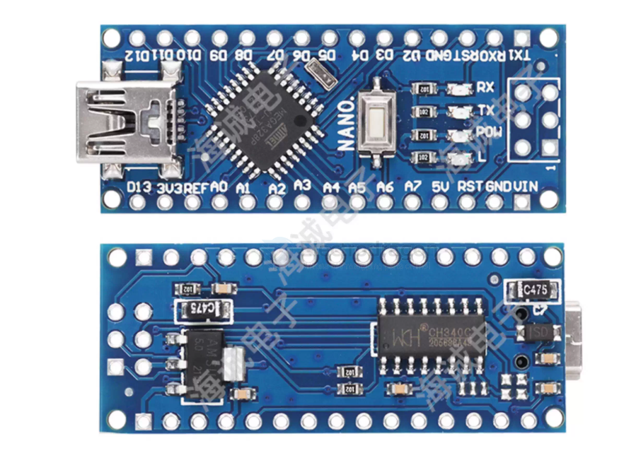

# arduino-nano-dat

https://store.arduino.cc/products/arduino-nano

SCH - https://docs.arduino.cc/resources/schematics/A000005-schematics.pdf

## tuto - self made arduino nano as UPDI programmer 

- https://www.instructables.com/Arduino-Nano-1/

- 1.14个数字输入/输出端口：TX，RX，D2~D13
- 2.8个模拟输入端口：A0~A7
- 3.1对TTL电平串口收发端口：RX/TX
- 4.6个PWM端口:D3,D5，D6，D9，D10,D11
- 5.采用AtmelAtmega328P单片机
- 6.支持USB下载及供电
- 7.支持外接5V~12V直流电源供电
- 8.支持9V电池供电
- 9.支持ISP下载
- 10.三种供电方式：USB，VIN，外部5V输入

## Boards 

- [[DAR1040-dat]] - [[DAR1053-dat]] - [[DAR1020-dat]] - [[DAR1026-dat]] - [[arduino-nano-dat]] - [[arduino-boards-dat]]

## ref 

- [[FT232-dat]] - [[UPDI-dat]] - [[avrdude-dat]]