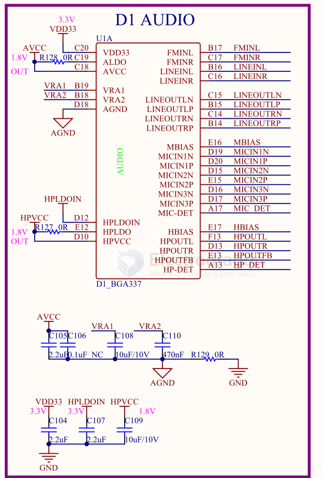
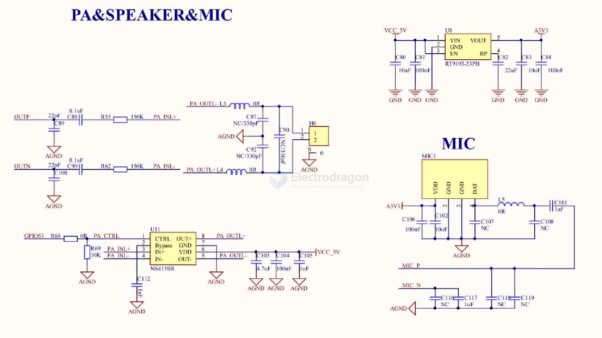
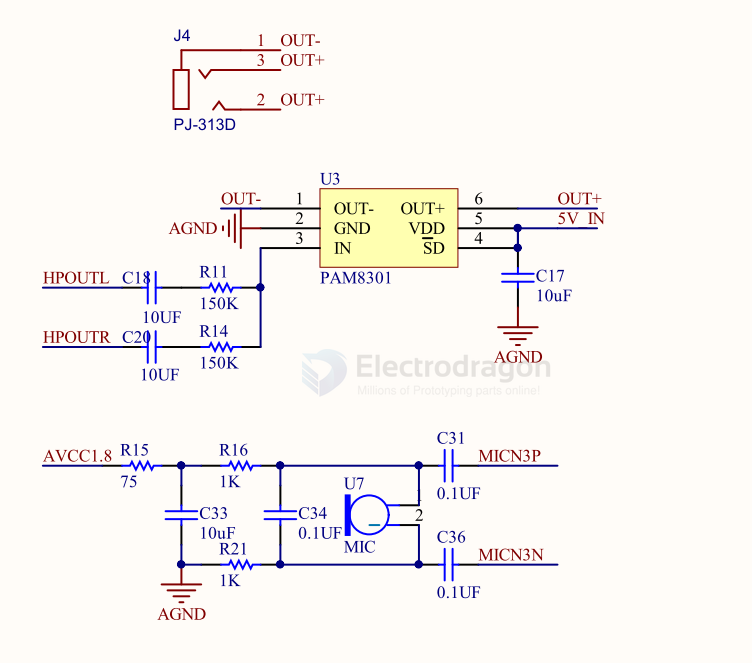

# audio-dat

- [[mp3-dat]] - [[wav-dat]] - [[mp3-decoder-dat]]

- [[amplifier-dat]] - [[dac-dat]] - [[amplifier-audio-dat]]

- [[I2S-dac-dat]] - [[I2S-microphone-dat]] - [[I2S-speaker-dat]] - [[I2S-amplifier-dat]]

- [[bt-audio-dat]]

- [[voice-detection-dat]]

## chip 

- [[TDA-dat]] - [[TI-audio-dat]] - [[VLSI-dat]] - [[cirrus-dat]] - [[ISD-dat]]

- [[Maxim-dat]]

## sound frequency 

    const int frequency = 600;    // Frequency of the square wave in Hz (600 cycles per second)
    const int amplitude = 500;    // Amplitude of the square wave (controls loudness)
    const int sampleRate = 4000;  // Sample rate in Hz (samples per second for accurate waveform)

Frequency (440 Hz):

- 440 Hz is a standard musical note (A4), which is very clear and noticeable to human ears.
- It’s neither too low nor too high, making it a great choice for testing.

Sample Rate (8000 Hz):

- The sample rate should be at least twice the frequency (Nyquist theorem). For 440 Hz, 8000 Hz ensures clear sound.
- It’s also lightweight for the ESP32 to process, leaving room for other tasks.

Amplitude Tuning: 

If 500 is too quiet, you can increase the amplitude up to 32767 (maximum for 16-bit audio).
Different Frequencies: If you'd like to test other audible frequencies, try values like:

- 523 Hz (C5) – A clear and bright tone.
- 880 Hz (A5) – A higher-pitched tone.
- 262 Hz (C4) – A lower-pitched tone.

## SCH 

wiring to [[D1-dat]] - [[F133-dat]]

SCH2 

- PA [[amplifier-audio-dat]] - [[speaker-dat]] - [[sensor-microphone-dat]]

## code library 

- https://github.com/kosme/arduinoFFT

## analog audio SCH 

- [[sensor-microphone-dat]]

- [[PAM8301-dat]]

## ref 

- [[video-dat]] - [[HDMI-dat]]

- https://www.arduino.cc/reference/en/libraries/arduinofft/