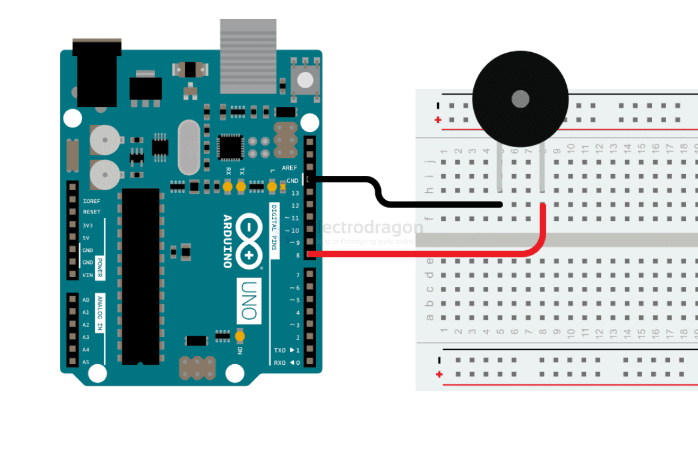

# tone-dat

## tone melody by arduino 

https://docs.arduino.cc/built-in-examples/digital/toneMelody/

    #include "pitches.h"

    // notes in the melody:
    int melody[] = {

    NOTE_C4, NOTE_G3, NOTE_G3, NOTE_A3, NOTE_G3, 0, NOTE_B3, NOTE_C4
    };

    // note durations: 4 = quarter note, 8 = eighth note, etc.:
    int noteDurations[] = {

    4, 8, 8, 4, 4, 4, 4, 4
    };

    void setup() {

    // iterate over the notes of the melody:

    for (int thisNote = 0; thisNote < 8; thisNote++) {

        // to calculate the note duration, take one second divided by the note type.

        //e.g. quarter note = 1000 / 4, eighth note = 1000/8, etc.

        int noteDuration = 1000 / noteDurations[thisNote];

        tone(8, melody[thisNote], noteDuration);

        // to distinguish the notes, set a minimum time between them.

        // the note's duration + 30% seems to work well:

        int pauseBetweenNotes = noteDuration * 1.30;

        delay(pauseBetweenNotes);

        // stop the tone playing:

        noTone(8);

    }
    }

    void loop() {

    // no need to repeat the melody.
    }

## simple tone by ESP32 

    #include <ESP_I2S.h>

    const int frequency = 400;    // frequency of square wave in Hz
    const int amplitude = 500;    // amplitude of square wave
    const int sampleRate = 8000;  // sample rate in Hz

    i2s_data_bit_width_t bps = I2S_DATA_BIT_WIDTH_16BIT;
    i2s_mode_t mode = I2S_MODE_STD;
    i2s_slot_mode_t slot = I2S_SLOT_MODE_STEREO;

    const int halfWavelength = (sampleRate / frequency);  // half wavelength of square wave

    int32_t sample = amplitude;  // current sample value
    int count = 0;

    I2SClass i2s;

    void setup() {
    Serial.begin(115200);
    Serial.println("I2S simple tone");

    //i2s.setPins(I2S_SCK/BCLK, I2S_WS/LRC, I2S_SDOUT, I2S_SDIN, I2S_MCLK);
    //i2s.setPins(12, 11, 13, -1, -1);
    i2s.setPins(5, 25, 26, -1, -1);
    
    // start I2S at the sample rate with 16-bits per sample
    if (!i2s.begin(mode, sampleRate, bps, slot)) {
        Serial.println("Failed to initialize I2S!");
        while (1);  // do nothing
    }
    }

    void loop() {
    if (count % halfWavelength == 0) {
        // invert the sample every half wavelength count multiple to generate square wave
        sample = -1 * sample;
    }

    i2s.write(sample);  // Right channel
    i2s.write(sample);  // Left channel

    // increment the counter for the next sample
    count++;
    }
