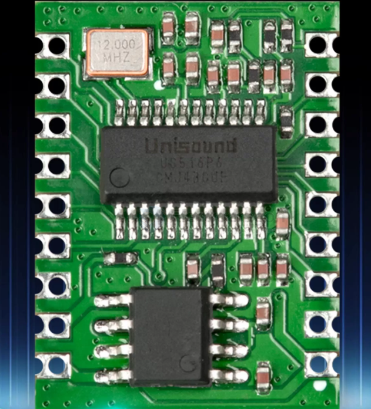
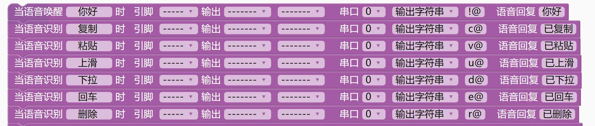

# voice-detection-dat

- [[AI-dat]] - [[Audio-dat]] - [[media-dat]]

- [[Voice-Synthesizer-dat]] - [[Voice-Recognition-dat]] - [[voice-detection-dat]] - [[audio-dat]]

## chip 

SU-03T 语音识别模块

- [[unisound-dat]] - [[US516P6-dat]]

·32BIT RISC内核，运行频率 240M·支持DSP指令集以及FPU浮点运算单元·FFT加速器:最大支持1024 点复数FFT/IFFT运算，或者是2048点的实数FFT/IFFT运算
·内置高速 SRAM，内置2MB FLASH
·内置2.4W、单声道AB类功放
·支持1路驻极体麦
·支持 12SINPUT/OUTPUT
·支持 5V 电源输入
·内置5V转3.3V，3.3V外部负载不超过150MA· RC 12MHZ 时钟源和 PLL锁相环时钟源·内置POR(POWERON RESET)，低电压检测和看门狗
·所有GPI0均可配置为外部中断输入和醒源·1个标准 SPIMASTER接口，最高速率 30MHZ•1个SPISLAVE 接口最高速率 30MHZ·1个全双工 UART最高速率3MBPS，串口电压3.3V
·1个12C主/从控制器最高速率 400KHZ· 2个 PWM 输出
· 1个12-BIT SAR-ADC最大 450KHZ采样率

- [[LD3320-dat]] - [[LD3320-dat]] - [[voice-detection-dat]]

### ASR-PRO 

ASR01

编程平台：

ASR-PRO基于天问Block图形化编程软件编写语音检测程序

CH552G基于Arduino框架编写USB控制程序

- [[ASR-pro-dat]]

## ref 

- [[audio-dat]]