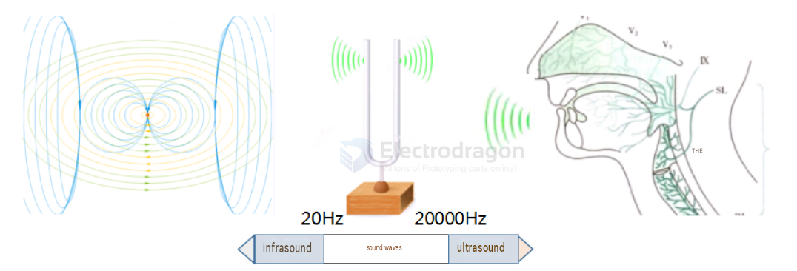
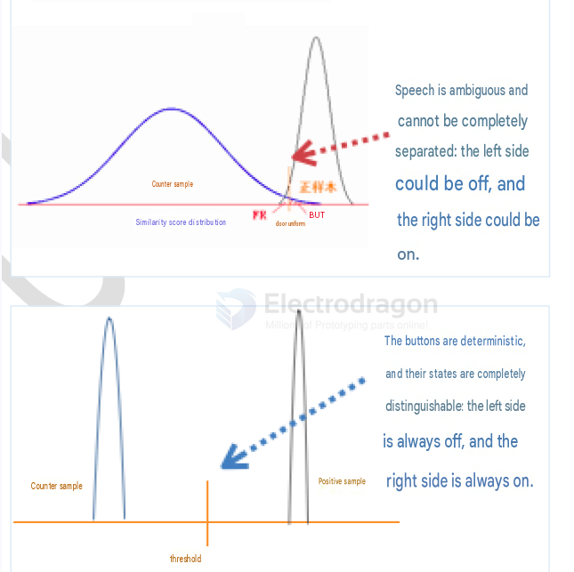
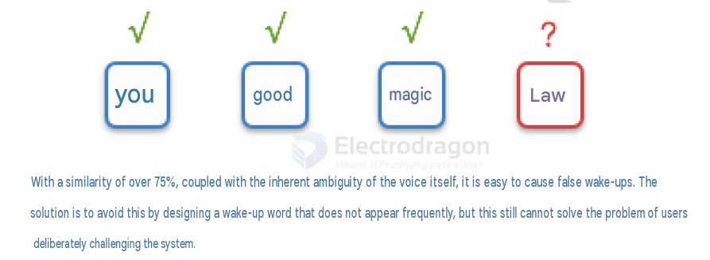

# voice-detection-dat

- [[AI-dat]] - [[Audio-dat]] - [[media-dat]]

- [[Voice-Synthesizer-dat]] - [[Voice-Recognition-dat]] - [[voice-detection-dat]] - [[audio-dat]]

- [[sdk-twen51-dat]] - [[asr-pro-dat]] - [[ESP32-C3-dat]]

## tech 

- [[DSP-dat]] - [[DMA-dat]] - [[audio-dat]] - [[FPU-dat]] - [[I2S-dat]] - [[sensor-microphone-dat]]

## chip 

- [[AIT-dat]] - [[AI-WB1-dat]] 

- [[8002-dat]] - [[unisound-dat]] - [[US516P6-dat]] - [[ASR-PRO-dat]] - [[voice-detection-dat]] - [[audio-dat]]

- [[voice-dat]]

·32BIT RISC内核，运行频率 240M·支持DSP指令集以及FPU浮点运算单元·FFT加速器:最大支持1024 点复数FFT/IFFT运算，或者是2048点的实数FFT/IFFT运算
·内置高速 SRAM，内置2MB FLASH
·内置2.4W、单声道AB类功放
·支持1路驻极体麦
·支持 12SINPUT/OUTPUT
·支持 5V 电源输入
·内置5V转3.3V，3.3V外部负载不超过150MA· RC 12MHZ 时钟源和 PLL锁相环时钟源·内置POR(POWERON RESET)，低电压检测和看门狗
·所有GPI0均可配置为外部中断输入和醒源·1个标准 SPIMASTER接口，最高速率 30MHZ•1个SPISLAVE 接口最高速率 30MHZ·1个全双工 UART最高速率3MBPS，串口电压3.3V
·1个12C主/从控制器最高速率 400KHZ· 2个 PWM 输出
· 1个12-BIT SAR-ADC最大 450KHZ采样率

- [[LD3320-dat]] - [[LD3320-dat]] - [[voice-detection-dat]]

## voice 

麦克风结构设计

语音及传播特点

产品结构声学设计

1. 振动的概念：物理学上对振动的广义定义：一切随时间作周期性重复变化的物理过程统称“振动”。简单地说，质点或物体来回运动叫”振动”，是能量传播的一种方式；
2. 声音的产生：一个或多个质点振动时，带动周围质点也发生振动，这种振动(物体振动)过程中，其中引起空气振动产生能量波（包括次声波，声波，超声波），能产生人类听觉的振动波被称为声波。其声波频率在约20-20000Hz频率范围之内；
3. 语音就是把人类语言使用声波进行传递。语言+声波=语音，语音识别就是从语音中恢复解调出语言。

- [[sensor-microphone-dat]] - [[speaker-dat]]

## ambiguous 

(1)  为什么语音唤醒不能像电源开关那样准确？ 

-  由于语音的模糊性（并不是非黑即白），正样本（真正的唤醒词）和反样本（杂音）得到的分数分布上如图所示是有交叠的 
-  好的算法和技术是最大限度地扩大两条曲线的距离，但两条曲线永远不可能完全分开而没有交叠 

(2)  为什么误识别会永远存在？ 

-  识别率不会到 100%的原因：识别词相似度分数小于门限；噪声、口音、混响等干扰导致失配 
-  噪音或其他人声导致误识别的原因：非识别词相似度分数大于门限；发音相近词、频谱类似背景语音或噪声 
-  人类也无法完全区分所谓『识别词』和『非识别词』，就好像人们永远无法确定所有案件的犯罪嫌疑人一样，所以才有了『无罪推定』和『有罪推定』一说。

(3)  为什么『挑战式地』尝试误识别是不科学的？ 

-  『挑战式地』尝试误唤醒的例子：唤醒词是：『你好魔方』，测试人员尝试『你好魔法』

## ref 

- [[audio-dat]]