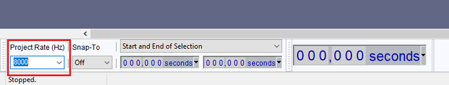
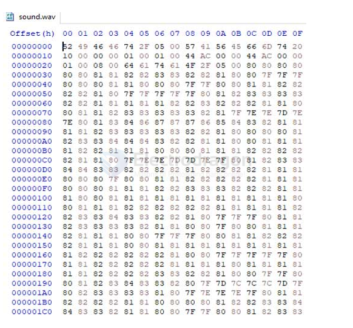
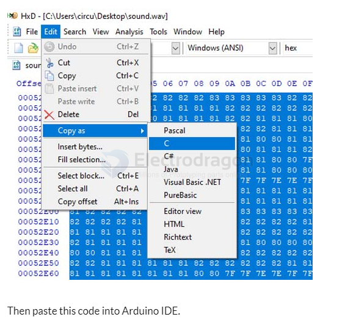

# wav-dat

- test wave [[test.wav]] = 1411 kbps

- [[arduino-wav.ino]] -[[SoundData.h]]

- [the dac audio library for arduino](https://www.xtronical.com/the-dacaudio-library-download-and-installation/)

## audio file .WAV to .h file for C programming 

getting the file that you want to play on ESP32. After that, download and install the [Audacity](https://www.audacityteam.org/) Audio Editor App. This app will be used to change the file type, Sample Rate, and other properties.

Once the installation is complete, open the Audacity app and then go to file > Open and select the audio file to edit.

After that, navigate to File > Export > Export as WAV to save the audio file in .wav format.

Now we need a Hex Editor app to generate Hex codes for the audio file. So download and install the [Hex Editor (HxD)](https://mh-nexus.de/en/hxd/) from the given link. After that, open the app, then go to File > open and open the .wav file. This will generate the Hex code for the .wav file.

Then use ctrl+A to select the complete code and then go to Edit > Copy as > C to copy the code in C Language format.

