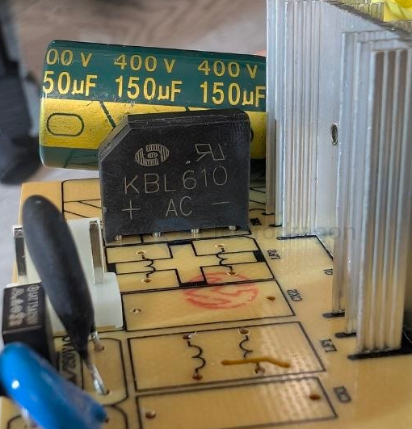

# bridge-rectifier-dat

## KBL610

- [[bridge-rectifier-dat]] - KBL610 - [[CR6842-dat]]

The KBL610 is a single-phase silicon bridge rectifier featuring a `6A maximum forward current` and a `1000V peak repetitive reverse voltage`. 

## LX10M

​The LX10M is a surface-mount device (SMD) bridge rectifier commonly used in [[ACDC-dat]] AC/DC power supplies and communication equipment. 

Manufactured by ASEMI, it features a glass passivated chip junction, ensuring good sealing reliability and resistance to electrical decline. 

The LX10M is designed to be halogen-free and complies with RoHS standards. 

## ref 

- [[ACDC-dat]]