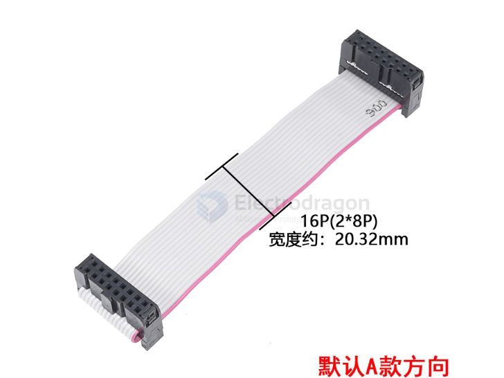
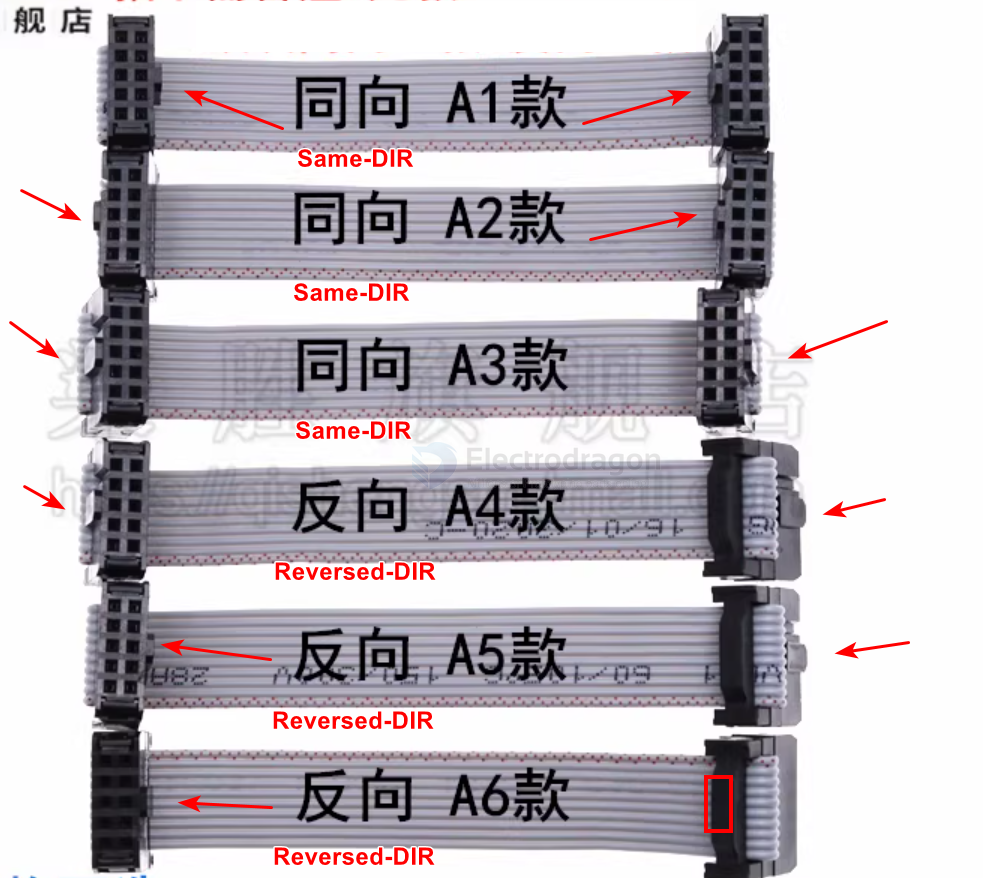

# cable-ribbon-dat

## 2-row 2*8 pins 

- [[hub75-dat]]

made for same direction 

## install methods 6 types 

cable types from A1~A6, same mapping from PCB to PCB, no matter the directions

see how it mapped here [[HUB75-dat]]

## ref 

- [[cable-dat]]