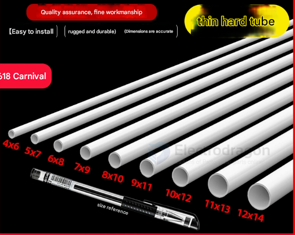
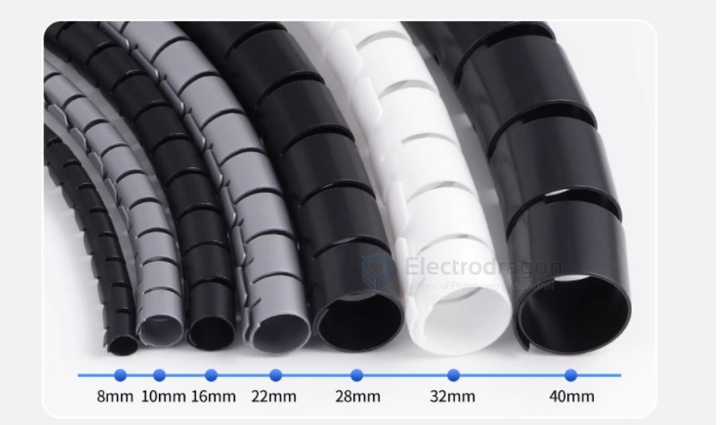
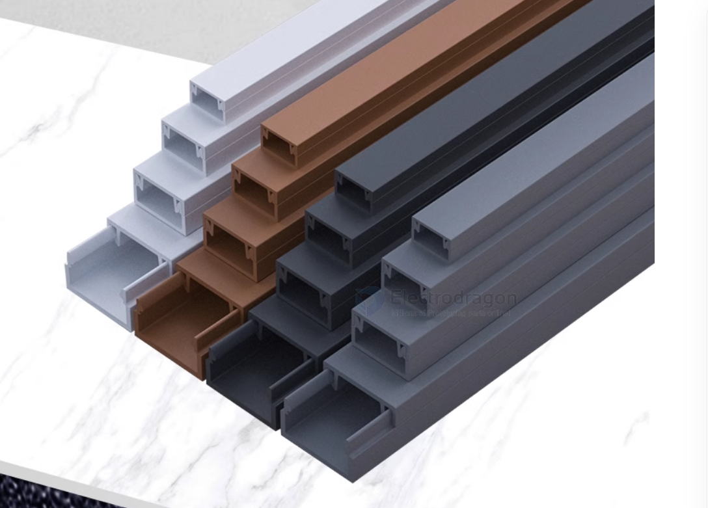

# cable-warp-dat

## plastic tube 

## spiral cable wrap

spiral cable wrap is used to protect the cable from abrasion and damage, it can also be used to organize cables in a neat manner.

## cable groove 

## ref 

- [[cable-dat]]