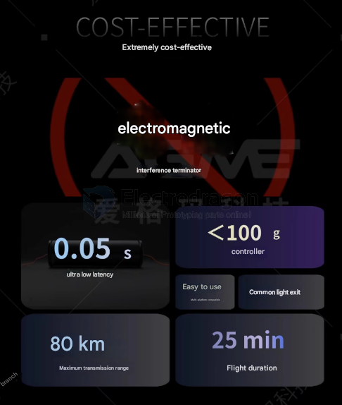

# fiber-optic-dat

- [[fiber-optic-transceiver-dat]]

- [[fiber-optic-app-dat]] - [[fiber-optic-solutions-dat]]

## note 

Gigabit optical-to-electrical modules must be used with Category 5e, Category 6, and Category 6e network cables

10G optical-to-electrical modules must be used with Category 7 and Category 8 10G network cables

## advantage 

## demo 

- https://t.me/electrodragon3/342

## Usage 

- [[self-loop-test-dat]]

## ref 

- [[RJ45-DAT]]

- [[fiber-optic]]