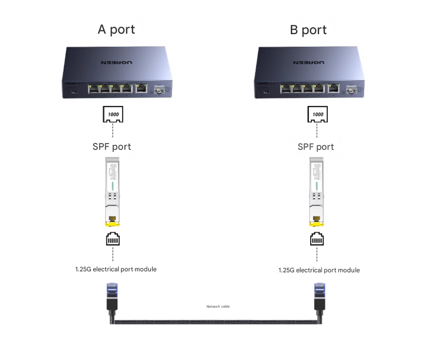

# fiber-optic-transceiver-dat

SFP to [[RJ45-dat]]

The optical-to-electrical module converts the SFP optical port of the device into an RJ45 network port/electrical port.

光转电模块是将设备SFP光口转成RJ45网口/即电口

##  sfp transceiver module

SFP stands for Small Form-factor Pluggable.

It is a compact, hot-pluggable fiber optic transceiver used for data transmission over fiber optic or copper cables.

SFP is short for Small Form-factor Pluggables, which is a small package pluggable optical transceiver module. SFP can be regarded as a pluggable version of SFF. Its electrical interface is 20pin gold finger, and the data signal interface is basically the same as the SFP module. The SFP module also provides an I2C control interface that is compatible with the optical interface diagnostics of the SFP-8472 standard.

万兆光口SFP+模块分为多模和单模 

SFP+ 多模: 850nm波长，最大可传550米

SFP+ 单模: 1310nm到1550nm波长，可传10~80千米。

### working scenario 

## customized analog-video plus serial data fiber-optic transceiver

## SC module 

SC stands for Subscriber Connector.

SC connectors are a type of fiber optic connector commonly used with fiber optic cables.

### Features:

Push-pull coupling mechanism: Allows easy insertion and removal of connectors.

Duplex design: Typically used in dual-core fiber optic cables (sending and receiving signals).

Durable and reliable, often used in telecommunications, data centers, and other long-distance fiber optic links.

Size: Relatively large compared to other connectors like LC.

## LC module 

LC stands for Lucent Connector.

LC connectors are smaller versions of SC connectors, commonly used in high-density fiber optic applications.

### Features:

Small form factor: Half the size of SC connectors, making them ideal for space-limited environments like data centers.

Latch mechanism: Uses a clip-on design for easy and secure connection.

High-density applications: Commonly used in network switches, routers, and patch panels.

Fiber types: Can be used with both single-mode and multi-mode fibers.

## demo video 

- https://t.me/electrodragon3/341

## ref 

- [[fiber-optic-transceiver]]

- [[fiber-optic-dat]]