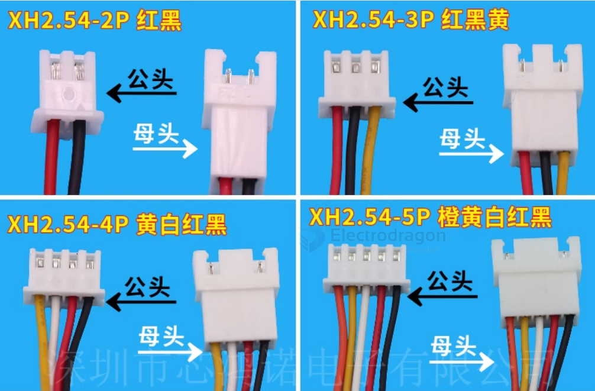
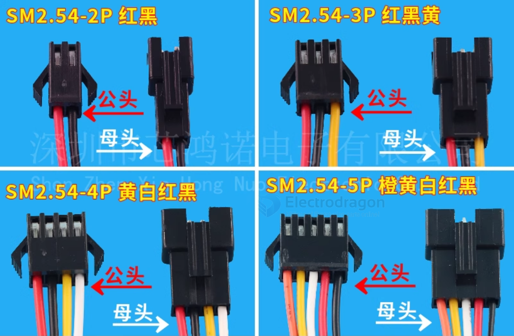
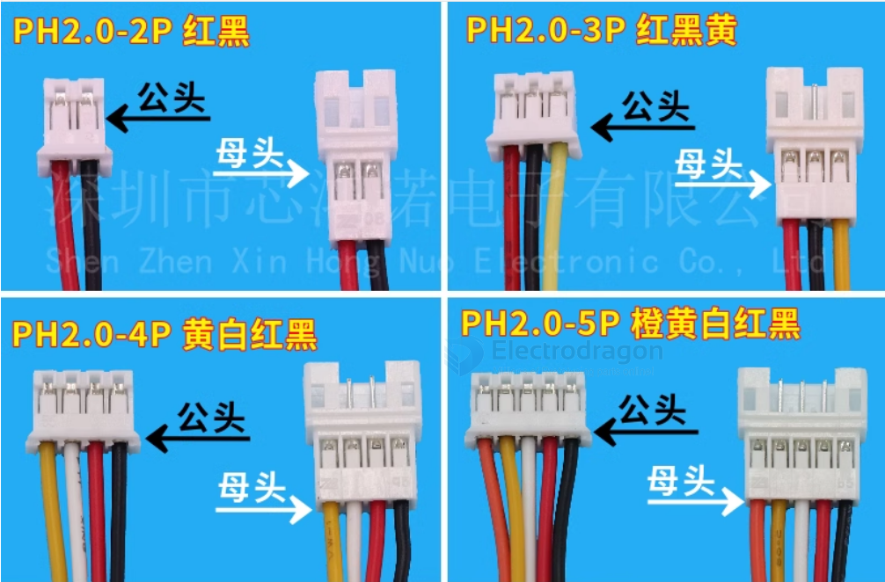
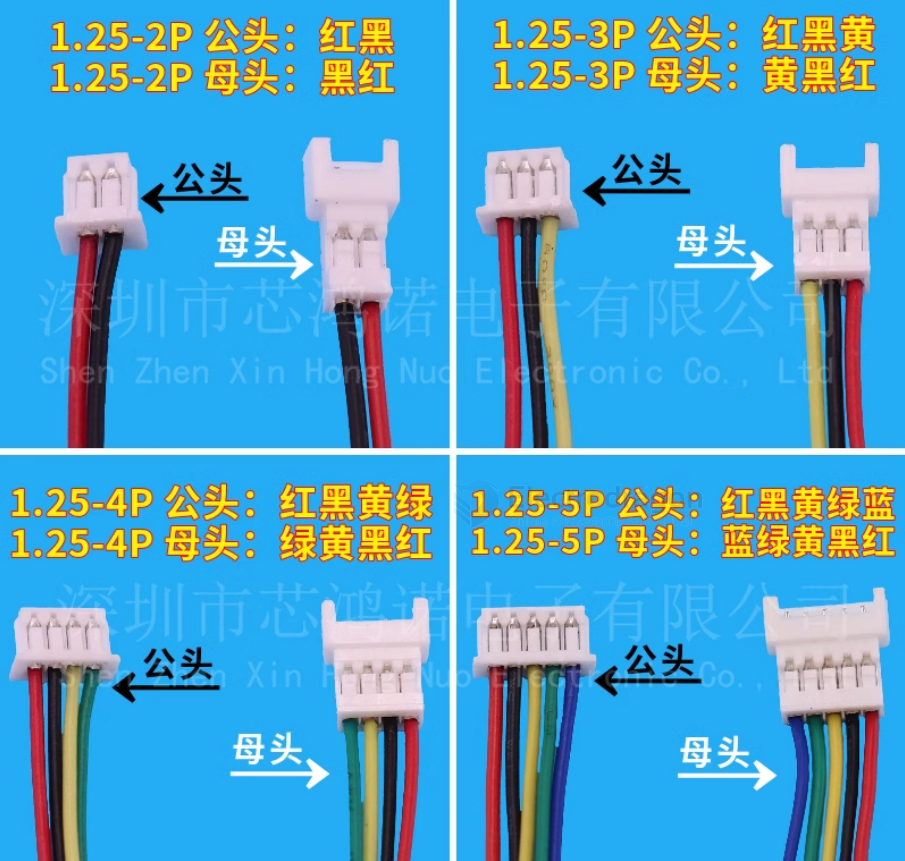
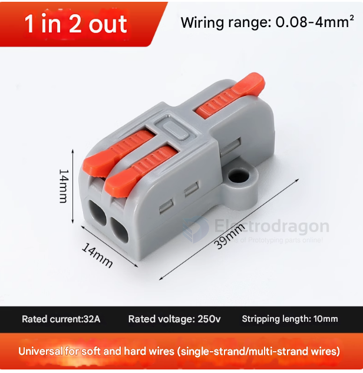

# wire-2-wire-dat

| **Connector Type**         | **Description**                                                                                  |
|----------------------------|--------------------------------------------------------------------------------------------------|
| **Butt Connectors**         | Used to join two wires together in a straight line, typically crimped on both ends.              |
| **Barrel Connectors**       | Used in automotive and electrical applications, where two wires are inserted into the barrel and crimped. |
| **Splice Connectors**       | Designed to splice two or more wires together, often used for repairing or extending wires.      |
| **Terminal Blocks**         | Used for connecting multiple wires to a common terminal, providing a secure connection.          |
| **Push-in Connectors**      | Allow wire insertion without the need for crimping or screwing, offering easy and fast installation. |
| **Quick Disconnect Connectors** | Feature a tab or clip that allows for quick separation of the wire connection.                  |
| **Ring Terminals**          | The wire is inserted into a terminal ring that is then crimped, often used for connections to screws or bolts. |
| **Pin and Socket Connectors** | Used for creating a detachable connection, where a pin on one wire connects to a socket on another. |
| **JST Connectors**          | A compact connector type commonly used in electronics and robotics for secure connections.       |
| **Molex Connectors**        | Widely used in computers and electronic devices for internal wiring connections.                 |
| **XLR Connectors**          | Typically used in audio applications, but also in power and data connections.                    |
| **Fishtail Connectors**     | Designed to connect two wires in a variety of configurations, typically with a flat, fork-like shape. |

[[JST-dat]]

- [[XH2.54-dat]]

- [[SM2.54-dat]]

- [[PH2.0-dat]]

- [[ZH1.5-dat]]

- [[1.25-dat]]

## fast wire to wire connectors

