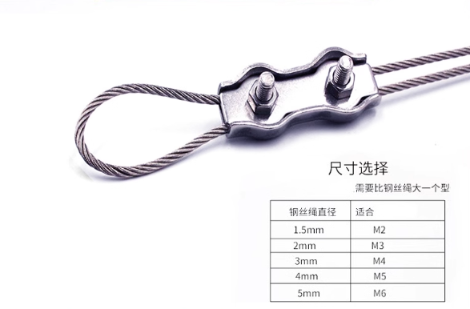
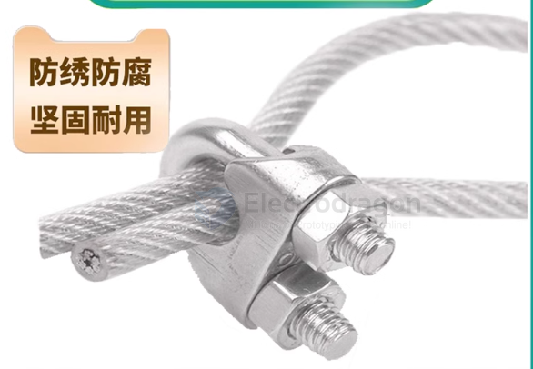

# wire-steel-fitting-dat

Steel wire ropes have various fittings (end terminals, hooks, connectors, etc.). Common types are categorized below:

| Type         | size | Suitable Wire Rope Diameter |
| ------------ | ---- | --------------------------- |
| Single Clamp | M2   | 0.8mm / 1mm / 1.2mm / 1.5mm |
| Single Clamp | M3   | 2mm / 2.5mm                 |
| Single Clamp | M4   | 3mm                         |
| Single Clamp | M5   | 4mm                         |
| Single Clamp | M6   | 5mm                         |
| Single Clamp | M8   | 6mm                         |
| Single Clamp | M10  | 8mm                         |
| Double Clamp | M2   | 0.8mm / 1mm / 1.2mm / 1.5mm |
| Double Clamp | M3   | 2mm / 2.5mm                 |
| Double Clamp | M4   | 3mm                         |
| Double Clamp | M5   | 4mm                         |
| Double Clamp | M6   | 5mm                         |
| Double Clamp | M8   | 6mm                         |
| Double Clamp | M10  | 8mm                         |

## Wire Rope Clip / Clamp

## category 

---

### 1. End Terminals / Rope Ends
| English                | Use                                                          |
| ---------------------- | ------------------------------------------------------------ |
| Ferrule / Sleeve       | Secures the wire rope end, usually by crimping               |
| Wire Rope Clip / Clamp | Temporary or adjustable fixing of wire rope, often for loops |
| Eye / Loop             | Creates a loop or hook at the rope end                       |

---

### 2. Hooks / Lifting Fittings
| English                 | Use                                           |
| ----------------------- | --------------------------------------------- |
| Hook                    | Lifting and hoisting applications             |
| Snap Hook / Spring Hook | Quick connection                              |
| Swivel / Eye Bolt       | Prevents twisting, connects lifting equipment |

---

### 3. Connecting / Swivel Fittings
| English             | Use                                           |
| ------------------- | --------------------------------------------- |
| Swivel              | Prevents wire rope from twisting              |
| Shackle / D-Shackle | Connects wire rope to other fittings or loads |

---

### 4. Other Accessories
| English    | Use                                       |
| ---------- | ----------------------------------------- |
| Turnbuckle | Adjusts tension in the wire rope          |
| Thimble    | Reinforces wire rope loops, prevents wear |

---

**Tips:**
- **Ferrule / Sleeve** is usually permanent, while **Wire Rope Clip** can be removed and reused.
- **Thimble** is often used with an **Eye Loop** to protect the rope from wear.

## accessories

- U型夹头
- 铝套
- 单双夹头
- 膨胀螺丝
- 花篮螺丝
- 鸡心环

## ref 

- [[safety-dat]]