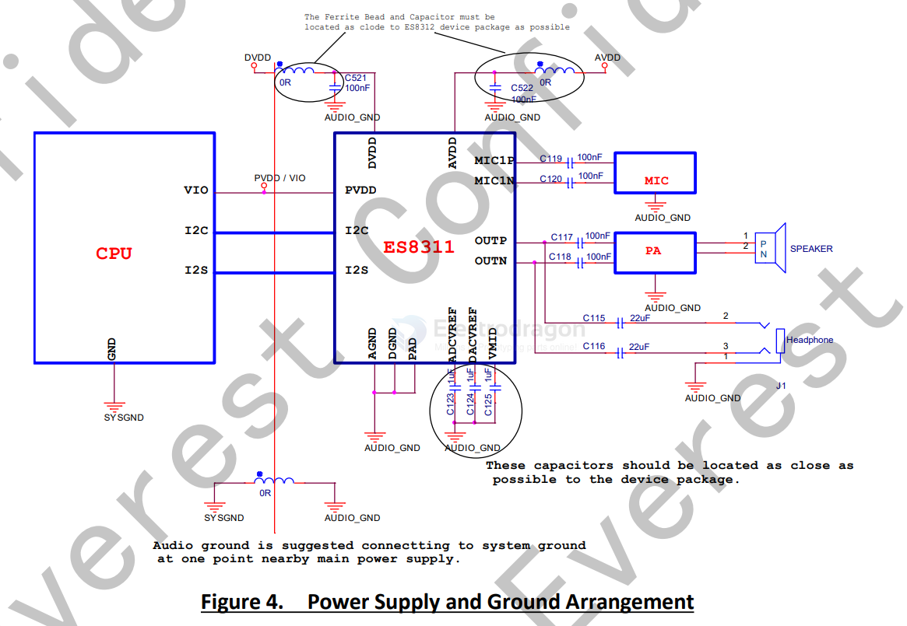
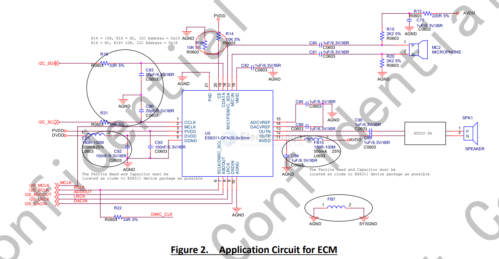
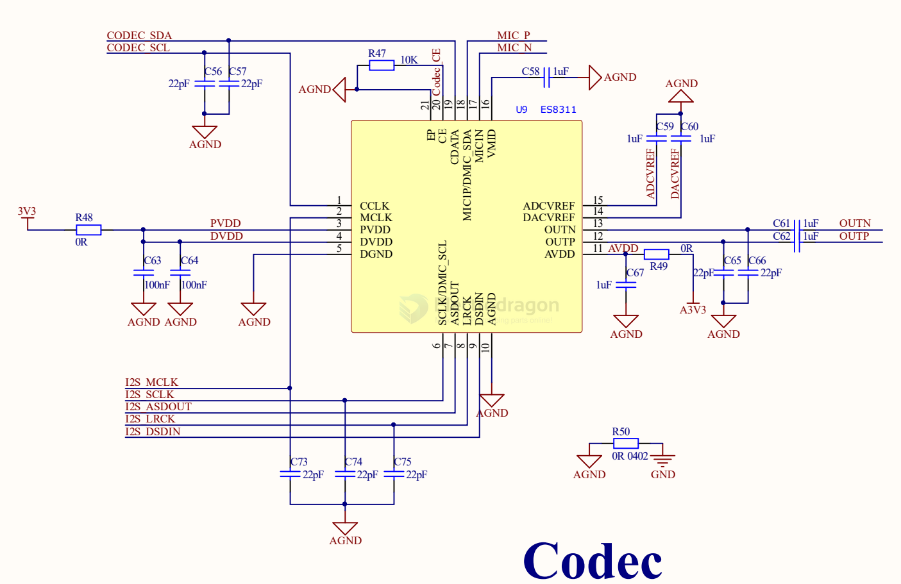

# codec-audio-dat

- [[codec-audio-dat]] - [[codec-dat]] - [[I2S-dat]]

- [[ADC-dat]] - [[ADC-RECORD-dat]] - [[DAC-dat]] - [[DAC-PLAYBACK-dat]]

`ES8311` - 

The ES8311 is a low-power mono audio codec with fully differential output and headphone amplifier, as well as analog inputs that are programmable in fully differential configurations.

The record path of the ES8311 contains one fully differential input, analog digitally controlled mono microphone preamplifier,and automatic gain control (ALC). Programmable filters are available during record which can remove audible noise.

The playback path includes a mono DAC, through programmable volume controls, to the fully differential output. The fully differential output of ES8311 has a capability to drive 16Ω or 32Ω headphone load.

ES8311 is optimized for voice playback/record, so that it is very suitable for surveillance and voice application, such as car DV, IPCAMERNA, DVR, NVR, Baby monitor, intelligent toy, intelligent Robert, etc.

ADC RECORD FUNCTIONS

3. 100dB SNR, -88dB THD+N
4. Differential analog input
5. Low noise PGA for analog line in or microphone in
6. Noise reduction filters
7. ALC with Noise gate
8.  Supports analog and digital microphone interface

DAC PLAYBACK FUNCTIONS

9. 110dB SNR, -85dB THD+N
10. Dynamic Range Compression for analog output
11. Differential Line Out with 16 Ω/32 Ω headphone driver
12. Pop and click noise suppression
13. ADC data can be routed to DAC.
14. DAC data can be routed to Digital Serial Output Port

## diagram 

## SCH 

## APP 1. 

## ref 

- datasheet == [[ES8311.user.Guide.pdf]]

