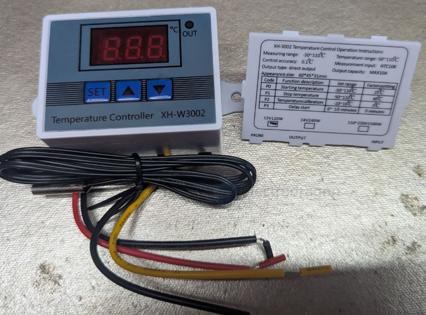
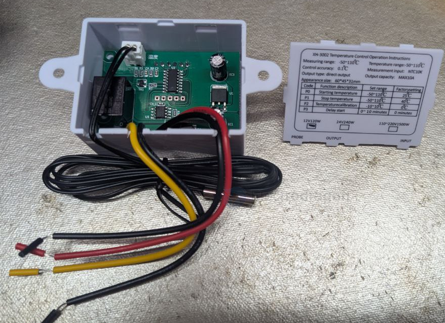
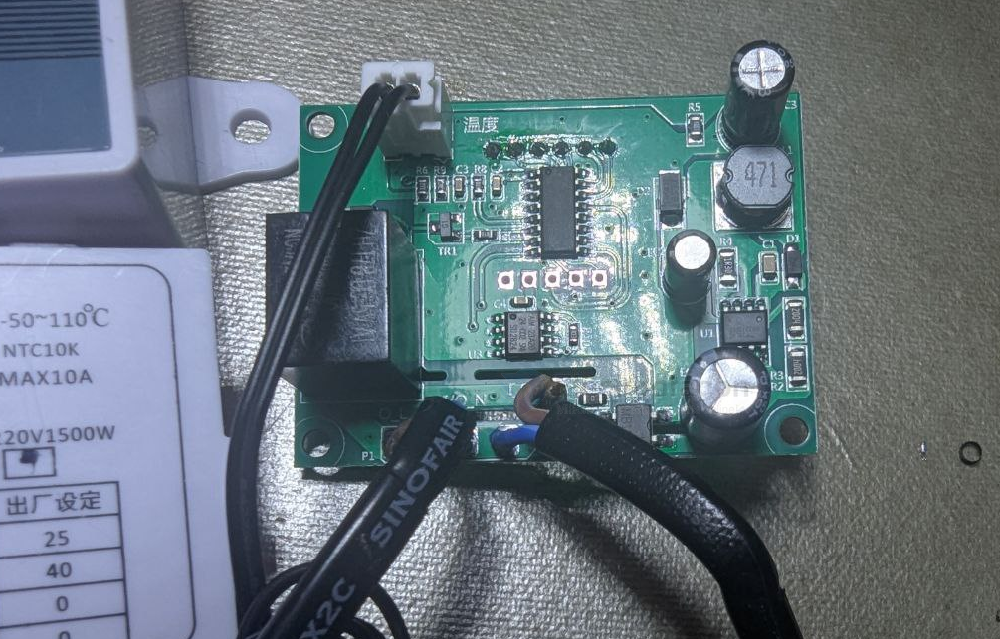
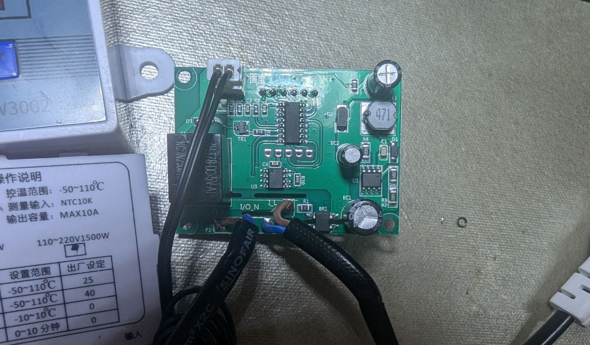
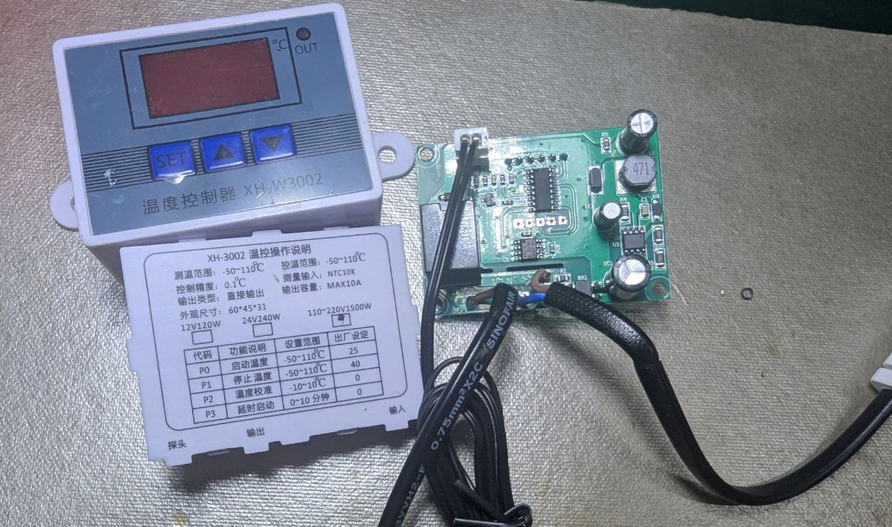

# control-system-dat

- [[RPI-dat]] - [[PS2-console-dat]]

- [[relay-dat]] - [[MCU-dat]]

- [[RC-dat]]

- [[DCDC-dat]] - [[ACDC-dat]] - [[power-dat]]

## DCDC control system 

- [[temperature-sensor-dat]] - [[sensor-dat]] - [[78L05-dat]]

- [[NTC-sensor-dat]] 

- [[memory-dat]] == AT24C02 

## ACDC control system 

## ref 

- [[tech-dat]]

- [[control-system]]