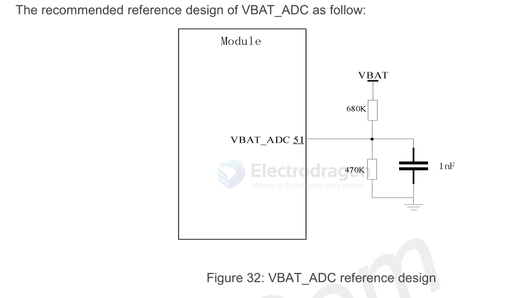

# ADC-bat-monitor-dat

- [[voltage-divider-dat]] - [[battery-charger-dat]]

## ADC and VBAT ADC 

## ESP8266 ~ scale up to 1V 

## APP SCH 

build 1 

## M2M control 

AT command `‘AT+CBC’` can be used to monitor VBAT voltage.

AT command `‘AT+CVALARM’` can be used to set high/low voltage alarm, When the actual voltage exceeds the preset range, a warning message will be reported through the AT port.

AT command `‘AT+CPMVT’` can be used to set high/low voltage power off, When the actual voltage exceeds the preset range, the module will shut down automatically.

## ref 

- [[battery-dat]] - [[ADC-dat]]